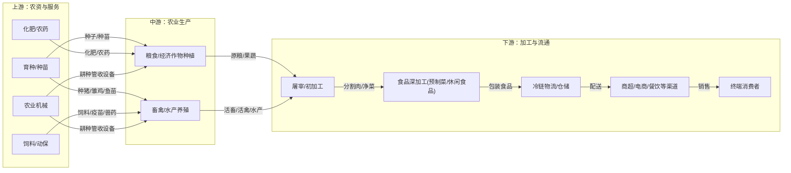

# 农林牧渔行业一页纸

> 生成时间: 2026-05-27 17:48
> 数据来源: Alpha派 Agent Mode 11（行业一页纸）
> 覆盖期货品种: AP, C, CF, CJ, CS, JD, LH, M, OI, P, PK, RM, SR, Y

---

[Agent 回答]
# 1. 核心投资逻辑

农林牧渔行业的核心投资逻辑正在从传统的“周期博弈”向“科技赋能”与“结构升级”双轮驱动转变。供给端的效率革命与需求端的结构性增长共同构成了行业未来价值提升的基础。

*   **供给端：科技创新驱动“新质生产力”，重塑成本曲线与竞争格局。** 传统农业依赖资源消耗的增长模式已近天花板，以人工智能、生物技术为核心的科技创新正成为破局关键[1]。
    *   **育种革命：** 生物育种（转基因、基因编辑）产业化提速，是保障国家粮食安全和提升农业竞争力的核心[2]。突破性品种能显著提升单产、抗病抗逆，拥有核心技术储备的种业龙头将获得技术溢价，重塑行业格局。
    *   **智慧养殖/种植：** AI、物联网、大数据等技术正从“概念”走向“应用”，通过精准饲喂、智能环控、无人机植保等手段，实现降本增效[3][4]。在养殖业进入微利甚至亏损的“反内卷”时代，技术驱动的成本领先成为企业穿越周期的最强护城河[d502d46bcac65c5c0fcba78592fd25ca_1]。
*   **需求端：消费升级与新兴市场打开“第二增长曲线”。**
    *   **国内结构升级：** 随着人均收入提升，国内农产品消费正从“吃饱”向“吃好、吃健康”转变，高品质、品牌化的肉、蛋、奶、水产品需求持续增长[5]。同时，宠物经济作为新兴消费赛道，展现出独立于传统农业周期的强劲增长弹性[d502d46bcac65c5c0fcba78592fd25ca_1]。
    *   **海外市场扩张：** 国内饲料、养殖等领域已进入存量竞争，而亚非拉等新兴市场空间广阔，养殖业尚处发展初期，为中国农牧龙头企业出海提供了“降维打击”的机会[6]。凭借在国内市场锤炼出的技术、管理和成本优势，龙头企业出海有望开启高成长的“大航海时代”[7]。

综上，行业的投资逻辑在于把握两条主线：一是投资于具备核心技术壁垒、能够引领产业效率变革的科技型龙头企业；二是投资于能够抓住国内外结构性需求增长、成功开辟第二增长曲线的平台型公司。

# 2. 行业全景分析
## 2.1 行业定义和存在价值

农林牧渔业是关系国计民生的基础性、战略性产业，涵盖种植业、林业、畜牧业、渔业四大领域及其相关的服务业。

*   **专业名词解释**
    *   **新质生产力 (New Quality Productive Forces):** 在农业领域，特指由技术革命性突破、生产要素创新性配置、产业深度转型升级而催生的当代先进生产力，如人工智能、生物制造、智慧农业等[1]。
    *   **生物育种 (Biological Breeding):** 利用现代生物技术（如转基因、基因编辑、分子标记等）培育农作物和畜禽新品种的技术体系，是提升种源自主可控和农业生产效率的关键[2]。
    *   **猪周期 (Hog Cycle):** 指猪肉价格因供需变化而产生的周期性波动。通常表现为：肉价上涨 → 母猪存栏量增加 → 生猪供给增加 → 肉价下跌 → 母猪存栏量减少 → 生猪供给减少 → 肉价上涨[8]。

*   **细分领域**
    *   **种植产业链：** 包括上游的种子、化肥、农药、农机，中游的粮食、经济作物种植，以及下游的农产品加工、流通[9]。
    *   **养殖产业链：** 包括上游的饲料、兽药（动保），中游的畜禽、水产养殖，以及下游的屠宰、肉/水产品加工[9]。
    *   **新兴领域：** 宠物食品及用品、预制菜、智慧农业解决方案等。

*   **重要时间节点**
    *   **2023年起：** 中国转基因玉米、大豆商业化种植逐步推进，标志着生物育种产业化进入新阶段[10]。
    *   **2026-2028年：** 海南省发布《推动“人工智能+”行动方案》，计划打造“人工智能+南繁种业”特色场景，数据驱动育种创新成为重点[2]。
    *   **“十五五”期间：** 强化原始创新与关键核心技术攻关，破解产业“卡脖子”难题成为重点工作[11]。

*   **核心痛点与价值**
    该行业的核心价值在于保障国家粮食安全和重要农产品的稳定供给。它解决了人类最基本的生存需求，是社会稳定的“压舱石”。同时，通过技术进步，行业致力于解决成本高、效率低、资源环境约束趋紧、产品同质化严重等核心痛点，为社会提供更安全、优质、多元的农产品[10]。

## 2.2 行业发展历程

中国农林牧渔业的发展经历了从传统小农经济到现代化、智能化农业的深刻变革。
*   **起步与变革阶段 (1949-1995):** 农业生产从无到有，逐步建立起工业基础，主要满足基本的温饱需求。农机以小型化为主，适应小规模经营[12]。
*   **规模化与产业化阶段 (1996-2015):** 随着市场经济发展，规模化养殖和种植开始兴起，产业链概念形成。龙头企业通过“公司+农户”等模式扩张，行业集中度初步提升[8]。
*   **环保与质量驱动阶段 (2016-2022):** 环保政策趋严，大量不合规的中小散户被清退，推动了行业规模化、标准化的进程[13]。同时，消费升级趋势显现，市场对农产品质量和安全提出更高要求。
*   **科技赋能与高质量发展阶段 (2023至今):** 行业进入“新质生产力”驱动的新时期。人工智能、生物育种等前沿科技成为核心驱动力，行业竞争从量的扩张转向质的提升和成本效率的比拼[8]。同时，国内市场竞争加剧，龙头企业开启全球化布局的“大航海时代”[7]。

## 2.3 商业模式解析

农林牧渔行业的商业模式呈现出典型的“微笑曲线”特征，即产业链两端的研发（上游）和品牌营销（下游）环节附加值高，而中间的生产制造（中游）环节附加值最低[14]。

*   **成本结构与利润驱动**
    *   **成本结构：** 中游种养殖环节成本主要由上游农资（种子、饲料、化肥、农药）和生产要素（土地、人工）构成。其中，饲料成本可占养殖总成本的80%-90%。
    *   **利润驱动：**
        *   **上游（农资）：** 利润主要来自技术壁垒和专利授权，如高产抗病的种子、高效低毒的农药等。利润率相对稳定且较高[15]。
        *   **中游（种养殖）：** 利润高度依赖于成本控制和规模效应，受产品价格周期性波动影响巨大，议价能力弱，利润率最低[16]。
        *   **下游（加工与流通）：** 利润来自品牌溢价、渠道控制和深加工带来的附加值。将农产品转化为消费品，是价值实现的关键环节，利润空间最大[17]。

*   **商业模式图**
    ```mermaid
    flowchart LR
        subgraph "上游：技术与资源驱动 (利润率 12%-18%)"
            A1["种业/育种"]
            A2["饲料/动保"]
            A3["化肥/农药"]
            A4["农机装备"]
        end

        subgraph "中游：规模与成本驱动 (利润率 5%-8%)"
            B["种植/养殖环节"]
        end

        subgraph "下游：品牌与渠道驱动 (利润率 8%-25%)"
            C1["农产品加工/屠宰"]
            C2["食品制造/预制菜"]
            C3["品牌营销/冷链流通"]
            C4["终端消费者"]
        end

        A1 --"种子"--> B
        A2 --"饲料/疫苗"--> B
        A3 --"化肥/农药"--> B
        A4 --"机械/服务"--> B

        B --"原料农产品"--> C1
        C1 --"初加工产品"--> C2
        C2 --"品牌消费品"--> C3
        C3 --"商品"--> C4

        C4 --"消费支付"--> C3
        C3 --"渠道利润"--> C2
        C2 --"采购成本"--> C1
        C1 --"采购成本"--> B
        B --"采购成本"--> A1
        B --"采购成本"--> A2
        B --"采购成本"--> A3
        B --"采购成本"--> A4
    ```

## 2.4 行业政策

近年来，国家围绕粮食安全、科技自强和产业升级出台了一系列重要政策，为行业发展指明了方向。


 
| 政策名称/文件             | 发布时间     | 核心内容                                                                                                           | 影响范围与解读                                                                    |
| :------------------ | :------- | :------------------------------------------------------------------------------------------------------------- | :------------------------------------------------------------------------- |
| **2026年中央一号文件**     | 2026年2月  | 强调粮食产量稳定在1.4万亿斤左右；**强化**生猪产能综合调控；深入实施种业振兴行动，推进**生物育种产业化**；促进**人工智能与农业发展相结合**。 | 政策基调从“做好”调控转向“强化”调控，预示着对生猪等产业的行政干预力度可能加大。将AI和生物育种提升到“新质生产力”的高度，利好相关科技龙头企业。 |
| **新修订《植物新品种保护条例》**  | 2025年4月  | 引入并细化**实质性派生品种（EDV）制度**，延长品种权保护期限，有效加强品种权保护，激励育种原始创新。                        | 打击“改头换面”式的模仿育种，保护拥有核心种质资源的育种企业利益，提高行业创新门槛，利好研发驱动型种企。                       |
| **《生猪产能调控实施方案》**    | 2024年    | 建立以能繁母猪存栏量为核心的调控指标体系，设置绿、黄、红三级预警区间，对产能过度扩张的省份进行调控[18]。                              | 旨在平抑“猪周期”的剧烈波动，引导行业理性扩张。政策的严格执行将加速落后产能的出清，利好成本控制能力强的头部企业。                  |
| **新修订《中华人民共和国渔业法》** | 2025年12月 | 将“绿色发展”确立为基本原则，对养殖水域污染防控、生态安全风险管控等作出系统规定，支持环境友好型养殖模式[19]。                       | 推动水产养殖业从粗放式向绿色、高效、生态可控转型，对企业的环保和技术水平提出更高要求，智慧渔业迎来发展机遇。                     |


# 3. 产业链深度解析
## 3.1 产业链图谱



## 3.2 上游：技术与资源密集，寡头格局初现

上游是整个产业链的技术和成本源头，技术壁垒和资源禀赋决定了其竞争格局。

*   **种业：** 这是农业的“芯片”，技术壁垒极高。随着生物育种产业化推进，拥有核心性状和品种储备的龙头企业将通过技术授权和市场推广建立新的护城河。转基因玉米性状领域CR4已超过60%，寡头格局初现[20]。未来，具备“生物技术+AI育种”能力的公司将持续领先。
*   **饲料：** 规模效应和成本控制是核心竞争力。行业集中度较高，CR7市占率达到47%。国内市场进入存量竞争，龙头企业纷纷出海，将国内成熟的配方技术、服务体系和高效运营模式复制到海外，寻求第二增长曲线。
*   **动物保健（动保）：** 行业竞争激烈，下游养殖业的周期性波动和集约化趋势对动保企业提出更高要求。研发创新是核心竞争力，多联多价疫苗、基因工程疫苗是未来方向[21]。同时，部分企业正积极向高增长的宠物动保领域转型。

## 3.3 中游：规模化与效率是生存之本

中游是产业链价值最低、竞争最分散的环节，但也是保障供给的基础。

*   **种植业：** 土地资源是核心壁垒，但我国土地碎片化导致行业极度分散，CR10不足15%[20]。小农户抗风险能力弱，盈利空间被上下游挤压[22]。未来，通过土地流转实现规模化经营，并利用良种、良法、良机提升单产和效率，是该环节企业脱颖而出的唯一路径。
*   **畜禽养殖：** 呈现明显的周期性特征。近年来，在环保政策和疫病（如非洲猪瘟）的双重压力下，行业规模化率持续提升[23]。头部企业凭借在育种、生物安全、精细化管理等方面的优势，成本显著低于行业平均水平，能够在周期底部实现盈利甚至逆势扩张，从而不断提升市占率。

## 3.4 下游：品牌与渠道构筑价值高地

下游通过加工、流通和品牌化，实现了农产品从“原料”到“商品”的价值跃迁，是产业链的利润核心。

*   **农产品加工：** 加工深度决定附加值。初加工（如屠宰、分拣）利润率较低，而精深加工（如预制菜、功能性食品）能实现数倍的价值提升[17]。随着冷链物流的完善和消费习惯的改变，预制菜等深加工领域迎来快速发展机遇。
*   **宠物食品：** 是下游增长最快的细分赛道之一。行业正从早期的代工出口（OEM）模式，转向打造自主品牌的阶段。线上渠道是主要战场，国产品牌凭借对本土消费趋势的快速反应（如烘焙粮、高鲜肉含量产品）和新媒体营销，正在加速实现对国际品牌的替代，市场集中度有望持续提升[24]。

## 3.5 核心技术路线、演进趋势

行业技术正处于从“机械化、化学化”向“生物化、智能化”跨越的成长期。

*   **核心技术拆解**
    *   **生物技术：** 以**基因编辑**和**转基因**为代表的生物育种技术是核心。它能从基因层面改良动植物性状，实现高产、抗病、优质等目标。此外，**合成生物学**在饲料添加剂（如氨基酸）和生物农药领域的应用也日益广泛[8]。
    *   **信息技术：** **人工智能、物联网（IoT）、大数据**是智慧农业的基石。AI用于育种决策、病虫害识别、动物行为分析；IoT通过传感器实时采集环境和体征数据；大数据平台则对海量数据进行分析，形成智能决策方案[3]。
    *   **装备技术：** **自动驾驶农机、农业机器人、无人机**等智能装备是实现精准作业和“机器换人”的载体[7]。

*   **技术演进趋势**
    当前技术整体处于**成长期**。未来迭代方向将是**多技术融合**与**系统化应用**。例如，将生物育种技术与AI大数据结合，构建“智能育种”平台，大幅缩短育种周期[25]；将物联网感知、AI决策与智能农机执行相结合，形成“感知-决策-执行”的闭环，实现全流程无人化或少人化作业[3]。技术研发的重点在于算法模型的精准度和适用性，以及硬件的可靠性和成本。

## 3.6 行业护城河分析


 
| 维度          | 行业壁垒与护城河分析                                                                                                                                            |
| :---------- | :---------------------------------------------------------------------------------------------------------------------------------------------------- |
| **技术壁垒**    | **极高。**尤其体现在**种业**和**动保**领域。生物育种涉及复杂的基因技术、长达8-10年的研发周期和海量数据积累[20]。新型疫苗的研发同样需要深厚的生物学和免疫学知识。先发企业通过专利和技术诀窍构筑了后来者难以逾越的壁垒。 |
| **资本壁垒**    | **高。**现代农业是重资产行业。上游研发投入巨大；中游规模化种养殖需要大量资金用于土地、厂房、设备建设；下游加工和冷链物流同样需要密集的资本开支。缺乏雄厚资本实力的企业难以参与全产业链竞争。                                                      |
| **市场/渠道壁垒** | **中高。**农资产品需要庞大的分销网络触达终端农户。品牌农产品和宠物食品则需要通过商超、电商等渠道建立品牌认知，营销费用高昂。客户对成熟品牌有较强的使用惯性和信任度，新品牌进入市场需要较长的培育期。                                                  |
| **规模壁垒**    | **高。**在饲料、养殖、大宗农产品加工等环节，规模效应显著。龙头企业通过集中采购降低原料成本，通过摊薄固定资产和管理费用来降低单位生产成本，从而在价格竞争中获得优势。                                                                  |
| **政策/资质壁垒** | **高。**种子、农药、兽药等产品的生产和销售需要获得国家严格的审定和许可，如品种审定证书、农药登记证等，审批周期长、门槛高[20]。转基因等特殊领域更是受到国家层面的严格监管。                             |
| **替代路径**    | 传统农业模式正被技术驱动的现代农业模式所替代。在食品领域，细胞培养肉、植物基食品等是对传统畜牧业的潜在替代路径，但目前仍处于萌芽期，成本和消费者接受度是主要障碍。                                                                     |


# 4. 市场空间测算
## 4.1 供需现状、核心假设

*   **需求端：** 国内市场对基础农产品的需求总量趋于稳定，但结构性机会显著。高品质蛋白（肉、奶、水产）和宠物消费是两大核心增长点。海外市场，特别是亚非拉等发展中地区，随着人口增长和经济发展，对动物蛋白的需求以及对工业化饲料的渗透率提升，将带来巨大的增量市场[6]。
*   **供给端：** 国内供给受资源和环保约束，未来增产主要依靠科技进步提升单产[2]。龙头企业通过技术和管理优势，正在整合分散产能，提升供给效率和质量。
*   **核心假设：**
    1.  **海外市场是核心增量：** 假设中国农牧龙头企业凭借其在国内市场验证的竞争力，能够成功开拓海外市场。
    2.  **技术渗透率提升：** 假设工业饲料在亚非拉地区的渗透率将逐步提升，对标中国或更成熟市场的发展路径。
    3.  **消费结构升级：** 假设新兴市场的人均动物蛋白消费量将随着经济发展而稳步增长。
    4.  **数据来源：** 测算基础数据主要来源于Alltech全球饲料调查报告、券商研报及相关国际组织预测[26][27]。

## 4.2 市场规模测算

以海外饲料市场为例，测算中国企业面临的潜在市场空间。根据数据，2024年全球饲料产量约13.96亿吨，其中亚太（除中国）、拉美、非洲合计产量为4.74亿吨，是主要的增量市场[26]。

我们基于人口、人均蛋白消耗量和料肉比（单位动物制品消耗的饲料）三个维度，对东南亚、南亚及非洲市场到2050年的饲料需求空间进行测算。


 
| 区域      | 测算维度                | 2023年（基准） | 2050年（预测） | 复合年增长率 (CAGR) | 核心假设与说明                          |
| :------ | :------------------ | :-------- | :-------- | :------------ | :------------------------------- |
| **东南亚** | 人口（亿）               | 约7.0      | 约8.5      | 0.7%          | 基于联合国人口预测。                       |
|         | 人均日动物制品消耗（克）        | 约100      | 约150      | 1.5%          | 对标当前中国和日本人均水平，消费升级趋势。            |
|         | 料肉比（饲料/肉）           | 约2.0      | 约2.2      | 0.4%          | 工业饲料渗透率和规模化养殖水平提升。               |
|         | **饲料总需求（亿吨）**       | **约0.51** | **约1.24** | **3.3%**      | **市场空间扩容约1.4倍。**                 |
| **南亚**  | 人口（亿）               | 约19.0     | 约22.0     | 0.6%          | 印度、孟加拉等国人口基数大，增长潜力足。             |
|         | 人均日动物制品消耗（克）        | 约50       | 约90       | 2.2%          | 当前蛋白摄入量远低于世界平均水平，提升空间大。          |
|         | 料肉比（饲料/肉）           | 约1.8      | 约2.1      | 0.6%          | 粮食安全压力驱动养殖效率提升的需求更为迫切。           |
|         | **饲料总需求（亿吨）**       | **约0.62** | **约1.53** | **3.4%**      | **市场空间扩容约1.5倍。**                 |
| **非洲**  | 人口（亿）               | 约14.0     | 约25.0     | 2.2%          | 全球人口增长最快的地区。                     |
|         | 人均日动物制品消耗（克）        | 约40       | 约70       | 2.1%          | 经济发展带动基础消费需求。                    |
|         | 料肉比（饲料/肉）           | 约1.5      | 约1.9      | 0.9%          | 养殖业现代化进程加速，饲料工业化空间巨大。            |
|         | **饲料总需求（亿吨）**       | **约0.31** | **约1.16** | **5.0%**      | **市场空间扩容约2.7倍，增速最快。**            |
| **合计**  | **三大新兴市场饲料总需求（亿吨）** | **约1.44** | **约3.93** | **3.8%**      | **总增量空间约2.5亿吨，是中国当前饲料产量的80%左右。** |

*数据来源：基于[27]、[6]、[26]中的数据和逻辑进行综合测算。*

**结论：** 仅海外新兴市场的饲料增量空间就接近再造一个中国市场，为国内龙头企业提供了广阔的成长天地。

# 5. 市场竞争格局
## 5.1 核心玩家梯队

农林牧渔行业各细分领域竞争格局差异巨大，整体呈现上游和下游集中度较高，中游极度分散的特点。

*   **生猪养殖：** 竞争格局分散，但头部化趋势明显。前10大企业市场份额低于20%[28]。
    *   **第一梯队（超大型企业）：** 牧原股份、温氏股份，凭借成本和规模优势，市占率遥遥领先。
    *   **第二梯队（大型企业）：** 新希望、德康农牧等，在特定区域或模式上具备优势。
    *   **第三梯队（中小型企业及散户）：** 数量众多，是行业产能波动的主要来源。
*   **饲料行业：** 寡头竞争格局，“一超多强”态势稳固。行业CR10远高于发达国家，但仍有提升空间[29]。
    *   **第一梯队（全国性龙头）：** 海大集团、新希望，在技术、规模、产业链布局上全面领先。
    *   **第二梯队（区域性或专业性龙头）：** 通威股份（水产料）、粤海饲料（水产料）等，在细分领域具备强大竞争力。
*   **种业：** 市场集中度快速提升，尤其在生物育种领域。
    *   **第一梯队（综合性龙头）：** 先正达（中国）、隆平高科，在研发、品种储备和渠道上优势显著。
    *   **第二梯队（特色品种龙头）：** 登海种业（玉米）、大北农（转基因性状）。
*   **宠物食品：** 国内外品牌激烈竞争，国产品牌加速崛起。
    *   **国际品牌梯队：** 玛氏（皇家）、雀巢，在超高端市场和专业渠道（如处方粮）仍具优势。
    *   **国产品牌第一梯队：** 乖宝宠物（麦富迪）、中宠股份（顽皮），通过产品创新和线上渠道实现快速增长，市占率持续提升。
    *   **国产品牌第二梯队：** 网易严选、诚实一口等众多新锐品牌，竞争激烈。

## 5.2 核心对比分析


 
| 公司名称     | 所属领域     | 核心优势                                                                                                                 | 市场地位与策略                                                                              | 综合评价                                                      |
| :------- | :------- | :------------------------------------------------------------------------------------------------------------------- | :----------------------------------------------------------------------------------- | :-------------------------------------------------------- |
| **牧原股份** | 生猪养殖     | **极致的成本控制：** 全产业链自繁自养模式，有效控制成本和疫病风险。**强大的执行力：** 标准化、工厂化养殖体系复制能力强。                                                    | 国内生猪出栏量第一的绝对龙头。在行业低谷期仍能维持成本优势，并利用资本优势进行逆周期扩张。     | 养殖行业的成本标杆，具备穿越周期的能力，但重资产模式也使其在猪价下行期面临较大的现金流压力。            |
| **温氏股份** | 生猪、黄羽鸡养殖 | **“公司+农户”轻资产模式：** 撬动社会资源，实现快速扩张，有效分散养殖风险[8]。**黄羽鸡领域龙头：** 在黄羽鸡育种和养殖方面具备深厚积累。               | 国内黄羽鸡市场绝对龙头，生猪养殖规模位居行业第二。近年来致力于提升养殖效率，降低“公司+农户”模式下的管理成本。                             | 轻资产模式使其在扩张上更具灵活性，但对合作农户的管理能力要求极高。公司正通过技术赋能和精细化管理弥补成本短板。   |
| **海大集团** | 饲料、水产    | **技术服务体系：** 以“服务”为核心，通过为养殖户提供技术解决方案带动饲料销售，客户粘性强。**全球化布局领先：** 在东南亚等海外市场布局早，已形成先发优势。 | 国内饲料销量龙头之一，尤其在水产料和禽料领域优势显著。海外业务是其未来核心增长点，正将国内成功模式快速复制到全球。                            | 具备强大的产品力和服务体系，是国内农牧企业出海的典范。其成长逻辑已从国内份额提升转向全球市场扩张。         |
| **隆平高科** | 种业       | **研发实力与品种储备：** 拥有国内领先的种质资源库和育种技术平台，在水稻和玉米种子领域优势突出。转基因品种储备丰富[30]。                       | 国内种业龙头企业，水稻种子市占率第一。深度受益于国家种业振兴和生物育种产业化政策，是核心标的。                                      | 研发壁垒高，是种业振兴政策的核心受益者。业绩兑现与转基因商业化推广的节奏和规模密切相关。              |
| **乖宝宠物** | 宠物食品     | **品牌塑造与产品创新能力：** 旗下“麦富迪”品牌知名度高，善于把握消费趋势，推出烘焙粮等爆款产品。**全渠道运营：** 线上线下渠道布局均衡，尤其在线上新媒体营销方面能力突出。                           | 国内宠物食品市场领导者之一，国产品牌市占率领先。通过多品牌矩阵覆盖不同消费层级，并向高端市场拓展。 | 抓住了国内宠物消费升级和国产品牌崛起的浪潮，品牌力是其核心护城河。未来需在供应链和研发上持续投入，以应对激烈竞争。 |


# 6. 重点投资标的分析
## 6.1 海大集团（002311.SZ）：从国内王者到全球扩张的饲料巨头

公司是国内饲料行业的领军企业，以水产料和禽料为核心，业务涵盖饲料、种苗、动保、养殖等全产业链。其核心竞争力在于构建了“产品+服务”的双轮驱动模式，通过强大的技术服务团队深入养殖一线，为客户提供综合解决方案，从而带动高毛利产品的销售。当前，公司战略重心正转向海外市场，凭借在国内验证的成功模式，在东南亚、南美等高增长市场快速复制，有望打开远超国内市场的成长空间[6]。

## 6.2 牧原股份（002714.SZ）：一体化模式铸就的养猪成本之王

牧原股份是全球最大的生猪养殖企业，其核心特点是坚持“全自养、全链条、智能化”的一体化模式。该模式覆盖了饲料加工、种猪选育、商品猪饲养、屠宰等所有环节，实现了对成本和生物安全的极致管控，使其养殖成本长期处于行业领先水平。在猪周期下行、全行业亏损的阶段，牧原的成本优势构成了其最深的护城河，使其能够承受更长时间的低价并实现逆势扩张，是周期反转时最具业绩弹性的标的之一。

## 6.3 隆平高科（000998.SZ）：生物育种时代的种业核心资产

作为以“杂交水稻之父”袁隆平院士命名的种业龙头，隆平高科在水稻、玉米等主粮种子领域拥有深厚的研发底蕴和市场基础。公司最大的看点在于其在生物育种领域的领先布局。随着国家大力推进生物育种产业化，公司储备的多个转基因玉米品种有望进入商业化推广阶段，这将带来产品单价和毛利率的大幅提升[30]。公司具备稀缺的研发平台和品种资源，是分享种业技术变革红利的核心标的。

## 6.4 乖宝宠物（301498.SZ）：国货崛起的宠物食品品牌龙头

乖宝宠物是国内宠物食品行业的领军者，旗下“麦富迪”等品牌在线上渠道拥有极高的知名度和市场份额。公司成功抓住了国内宠物消费升级和“国潮”兴起的机遇，通过持续的产品创新（如推出烘焙粮）和精准的品牌营销，快速提升了市场份额。相较于其他仍以代工为主的企业，乖宝宠物在自主品牌建设上已建立起显著的先发优势，其成长性更多来自于品牌溢价和市场份额的持续提升，是宠物经济赛道中的稀缺品牌标的。

## 6.5 投资价值综合对比


 
| 环节     | 公司名称     | 股票代码      | 是否具备稀缺性 | 行业布局深度与收益弹性                                                 | 预计受益弹性 |
| :----- | :------- | :-------- | :------ | :---------------------------------------------------------- | :----- |
| **上游** | **隆平高科** | 000998.SZ | **是**   | 深度布局生物育种，是国家种业振兴战略的核心载体。未来收益主要来自转基因品种商业化带来的价值重估和市场份额提升。     | **超额** |
| **上游** | **海大集团** | 002311.SZ | **是**   | 国内饲料龙头，率先进行全球化布局，海外业务已成为核心增长引擎。能分享全球农牧业增长的广阔空间，成长天花板高。      | **超额** |
| **中游** | **牧原股份** | 002714.SZ | **是**   | 独创的全产业链一体化模式构筑了行业内难以复制的成本优势护城河。在周期底部展现出强大的生存能力，周期反转时业绩弹性最大。 | **超额** |
| **中游** | **温氏股份** | 300498.SZ | 否       | “公司+农户”模式的开创者和集大成者，规模优势显著。未来收益取决于其在精细化管理和成本控制上的持续改善。        | **持平** |
| **下游** | **乖宝宠物** | 301498.SZ | **是**   | 在高增长的宠物食品赛道中，率先建立起强大品牌力的国内企业。未来将持续受益于消费升级和国产品牌市占率提升。        | **超额** |
| **下游** | **中宠股份** | 002891.SZ | 否       | 国内外产能布局均衡，代工业务稳健，自主品牌快速增长。双轮驱动模式使其经营更为稳健，但品牌力相较于乖宝稍弱。       | **持平** |


[引用来源 54 条]
  1. [内资研报] 农林牧渔行业点评：中央一号文件发布，锚定农业农村现代化目标 (2026-02-04)
  2. [内资研报] 农林牧渔行业2026年第9周周报：本轮猪价创新低，重视产能去化主升浪！ (2026-03-01)
  3. [social_media] 【知识科普】智慧农业十大关键技术介绍 (2026-05-18)
  4. [social_media] 【智能养殖】畜牧养殖业现代化的关键在于科技创新 (2026-02-11)
  5. [内资研报] 农林牧渔行业2026年度策略报告：左手“猪拐点”，右手“它经济” (2026-01-12)
  6. [social_media] 【2026投资展望-农林牧渔】迎接产业变革新时代 | 智库 (2026-02-25)
  7. [机构点评] 行至中局、强者谋新「农林牧渔2026年展望」【中金农业 王思洋】 (2025-12-17)
  8. [内资研报] 农林牧渔行业点评：中央一号文件发布，锚定农业农村现代化目标 (2026-02-04)
  9. [内资研报] 农林牧渔行业2026年第9周周报：本轮猪价创新低，重视产能去化主升浪！ (2026-03-01)
  10. [公司公告] 温氏股份(300498.SZ):2025年年度报告 (2026-04-22)
  11. [内资研报] 农林牧渔行业3月行业动态报告：猪价持续下跌&亏损加剧，产能去化进行中 (2026-03-24)
  12. [内资研报] 农林牧渔行业3月行业动态报告：猪价持续下跌&亏损加剧，产能去化进行中 (2026-03-24)
  13. [内资研报] 农林牧渔行业4月行业动态报告：养殖亏损加剧，宠食出口价格环比企稳 (2026-04-27)
  14. [内资研报] 农林牧渔行业2026年第9周周报：本轮猪价创新低，重视产能去化主升浪！ (2026-03-01)
  15. [social_media] 全国人大代表宋宝安院士：强化原始创新、攻关核心技术、破解产业“卡脖子”难题 (2026-03-06)
  16. [内资研报] 农林牧渔行业4月行业动态报告：养殖亏损加剧，宠食出口价格环比企稳 (2026-04-27)
  17. [social_media] 2025年中国农业机械行业报告（极简版） (2026-04-10)
  18. [公司公告] 温氏股份(300498.SZ):2025年年度报告 (2026-04-22)
  19. [内资研报] 农林牧渔行业专题：如何看当前的猪周期配置机会？ (2026-04-02)
  20. [公司公告] 温氏股份(300498.SZ):2025年年度报告 (2026-04-22)
  21. [机构点评] 行至中局、强者谋新「农林牧渔2026年展望」【中金农业 王思洋】 (2025-12-17)
  22. [social_media] 28万亿种植产业链｜价值分布：18:35:47 (2026-04-14)
  23. [social_media] 28万亿种植产业链｜价值分布：18:35:47 (2026-04-14)
  24. [social_media] 农业种植中游的效率困局｜35%产值 vs 5%利润 (2026-04-16)
  25. [social_media] 为什么农业产业链下游能拿走47%的利润？ (2026-04-17)
  26. [机构点评] 要求各省份优化生猪产能调控机制 (2025-12-03)
  27. [social_media] 2026智慧渔业整体建设解决方案(36页 PPT) (2026-04-07)
  28. [social_media] 种植产业链集中度分析：哪些环节正在形成寡头格局？ (2026-04-20)
  29. [公司公告] 瑞普生物(300119.SZ):2025年年度报告 (2026-03-31)
  30. [social_media] 种植产业链集中度分析：哪些环节正在形成寡头格局？ (2026-04-20)
  31. [social_media] 行业研究 | 农作物种植行业现状及发展趋势 (2026-03-10)
  32. [social_media] 品牌农业的全产业链，到底有多长？ (2026-05-18)
  33. [social_media] 为什么农业产业链下游能拿走47%的利润？ (2026-04-17)
  34. [内资研报] 农林牧渔行业悦己消费产业链研究专题：从刚需渗透到情感叙事，宠物消费下半场如何展开 (2026-02-24)
  35. [公司公告] 温氏股份(300498.SZ):2025年年度报告 (2026-04-22)
  36. [social_media] 【知识科普】智慧农业十大关键技术介绍 (2026-05-18)
  37. [机构点评] 行至中局、强者谋新「农林牧渔2026年展望」【中金农业 王思洋】 (2025-12-17)
  38. [social_media] 赵程云：以服务赋能行业新发展 (2026-02-11)
  39. [social_media] 【知识科普】智慧农业十大关键技术介绍 (2026-05-18)
  40. [social_media] 种植产业链集中度分析：哪些环节正在形成寡头格局？ (2026-04-20)
  41. [social_media] 【2026投资展望-农林牧渔】迎接产业变革新时代 | 智库 (2026-02-25)
  42. [内资研报] 农林牧渔行业2026年第9周周报：本轮猪价创新低，重视产能去化主升浪！ (2026-03-01)
  43. [social_media] 中金：中国农牧业大航海时代 (2026-03-25)
  44. [路演纪要] 长江农业 | 海大集团深度报告：天空海阔，大有可为 (2026-05-12)
  45. [social_media] 中金：中国农牧业大航海时代 (2026-03-25)
  46. [social_media] 【2026投资展望-农林牧渔】迎接产业变革新时代 | 智库 (2026-02-25)
  47. [social_media] 中金：中国农牧业大航海时代 (2026-03-25)
  48. [路演纪要] 长江农业 | 海大集团深度报告：天空海阔，大有可为 (2026-05-12)
  49. [social_media] 对话陈太中：猪周期底部博弈与高端白酒的提价逻辑 (2026-04-17)
  50. [social_media] 【脱水速通】海大集团分析及评估报告-中公司中（好）价格 (2026-04-20)
  51. [公司公告] 温氏股份(300498.SZ):2025年年度报告 (2026-04-22)
  52. [内资研报] 农林牧渔行业投资策略：种植链，农产品供应链重构加速，重视生物育种产业化机遇！ (2026-02-01)
  53. [social_media] 【2026投资展望-农林牧渔】迎接产业变革新时代 | 智库 (2026-02-25)
  54. [内资研报] 农林牧渔行业投资策略：种植链，农产品供应链重构加速，重视生物育种产业化机遇！ (2026-02-01)
