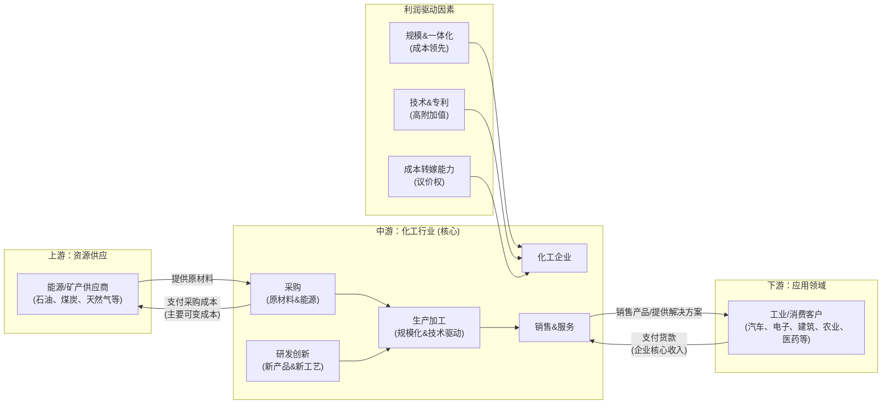
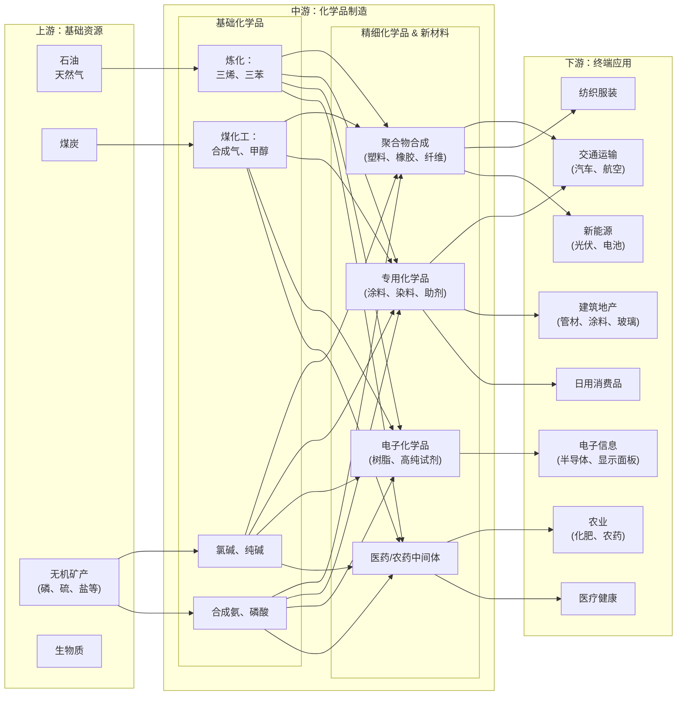

# 化工行业一页纸

> 生成时间: 2026-05-27 17:54
> 数据来源: Alpha派 Agent Mode 11（行业一页纸）
> 覆盖期货品种: BR, EB, EG, FG, L, MA, NR, PF, PP, PX, RU, SA, SH, TA, UR, V

---

[Agent 回答]
# 1. 核心投资逻辑

化工行业的投资逻辑正在发生深刻转变，从过去依赖宏观经济和产能扩张的强周期模式，转向由供给侧改革、技术创新和需求结构升级共同驱动的成长性逻辑。核心驱动力源于以下几个层面：

1.  **供给端持续优化，竞争格局重塑**：
    *   **国内政策强约束**：在“双碳”目标和“反内卷”政策导向下，化工行业新增产能受到严格控制[7a9744eb44b95b492873d238c598d08d_9]。能耗双控向碳排放双控的转变，以及对高耗能高排放项目的严格审批，大幅提升了行业准入门槛，加速了落后产能的出清[1][2]。这从根本上改变了过去“一哄而上、价格战”的恶性循环，为龙头企业提供了更健康的竞争环境[3]。
    *   **全球“东升西落”趋势**：欧洲、日韩等传统化工强国因能源成本高企（天然气、电价为中国/美国的数倍）和严苛的环保法规，正经历系统性的产能退出和竞争力削弱[4][5]。欧盟化工产能利用率已远低于长期平均水平[6]。这为具备显著成本优势、规模效应和完整产业链的中国龙头企业抢占全球市场份额创造了历史性机遇。

2.  **需求端结构性增长，新动能涌现**：
    *   **传统需求企稳**：虽然房地产等传统下游需求承压，但随着稳增长政策落地，需求已现边际修复迹象。
    *   **新兴需求爆发**：投资逻辑的核心正转向由战略性新兴产业驱动的新需求。新能源（光伏、储能电池）、人工智能（AI服务器、数据中心液冷）、生物医药、航空航天等领域成为化工新材料的核心增长引擎[7][5ed9f0a4af0f3cdd6b6605b568eb9cce_14]。例如，AI服务器对高频高速覆铜板的需求，直接拉动了上游PPO、碳氢树脂等高端电子树脂材料的爆发式增长[8]。

3.  **技术创新驱动价值重估，迈向高端化**：
    *   **国产替代加速**：行业发展的核心矛盾已从“总量不足”转为“结构性短缺”，即高端产品自给率低[9]。在国家强化关键核心技术攻关的战略下，高端聚烯烃、电子化学品、特种工程塑料等“卡脖子”材料的国产化进程正在加速，为具备研发实力的企业打开了巨大的进口替代空间[10]。
    *   **从“周期品”到“成长品”**：随着技术壁垒的建立，部分化工产品正摆脱纯粹的商品属性，其盈利能力更多地取决于技术附加值而非简单的供需波动。这使得相关企业的估值逻辑从低位的市净率（PB）向更体现成长性的市盈率（PE）切换。

综上，化工行业的投资机会在于，供给收缩与格局优化提供了盈利能力的“安全垫”和提升空间，而新兴需求的爆发和技术突破则打开了长期成长的“天花板”。具备**一体化成本优势、核心技术壁垒和前瞻性布局新兴赛道**的龙头企业，将在这轮产业升级浪潮中实现盈利和估值的“戴维斯双击”。

# 2. 行业全景分析
## 2.1 行业定义和存在价值

**专业名词与意义**
化工行业，即化学工业，是国民经济的基础性和支柱性产业[7]。它利用化学方法改变物质结构、成分或形态，将石油、煤炭、天然气、矿石、生物质等初级原料加工成各种化学品、材料和制品的工业部门。其产品广泛应用于国民经济的各个领域，被誉为“工业的粮食”和“材料的源头”。

**产业归属与细分领域**
化工行业属于大工业体系中的中游制造业，承接上游能源、矿产资源，向下游几乎所有工业和消费领域提供原材料[11]。其主要细分领域包括：
*   **基础化学品**：以石油、煤炭、天然气为原料生产的大宗化学品，如“三烯三苯”（乙烯、丙烯、丁二烯和苯、甲苯、二甲苯）、合成氨、甲醇、纯碱、氯碱等。这是整个化学工业的基础。
*   **精细化学品与专用化学品**：在基础化学品上进行深加工，具有特定功能、技术密集、附加值高的特点。包括医药中间体、农药、染料、涂料、电子化学品、食品添加剂、表面活性剂等[12]。
*   **化工新材料**：指新出现或正在发展中的，具有优异性能和特殊功能的化工材料。主要包括高性能树脂、特种工程塑料、高性能纤维（如碳纤维）、功能性膜材料、先进复合材料等[13]。

**未来重要时间节点**
*   **2026-2029年**：工信部等七部门部署的石化化工行业老旧装置更新改造行动方案的实施期，将加速行业产能结构优化[14]。
*   **2027年**：石化化工行业预计将正式纳入全国碳排放权交易市场，碳成本将内化为企业运营成本，驱动行业绿色转型[15]。
*   **“十五五”期间（2026-2030年）**：行业发展的关键转型期，将从“跟随型”创新转向“引领型”创新，并力争在关键核心技术上取得突破[13]。
*   **2030年前**：中国实现碳达峰的目标节点，将对煤化工等高碳排放领域的未来发展路径产生深远影响[16]。

**核心痛点与价值创造**
化工行业解决的核心痛点是**“物质转化与创造”**。它将自然界有限的初级资源，通过化学的“魔力之手”，转化为性能各异、功能丰富、满足现代社会生产和生活所需的各种功能材料和化学品。从保障粮食安全的化肥农药，到构成现代建筑的PVC管材和涂料；从驱动汽车的轮胎橡胶和轻量化塑料，到支撑信息技术革命的半导体芯片所用的超纯试剂和电子气体，化工行业为人类社会的发展提供了不可或缺的物质基础。

## 2.2 行业发展历程

中国化工行业的发展大致可分为三个阶段：

1.  **规模扩张与“内卷”阶段（21世纪初 - 约2020年）**：
    *   **特征**：以扩大产能、追求规模为主要特征。中国凭借成本优势和巨大的市场需求，迅速成为全球最大的化工产品生产国，2024年产值已占全球近一半[5]。
    *   **问题**：技术突破后迅速陷入同质化竞争和价格战，行业素有“被中国人做烂了”的说法，导致全行业盈利能力低下，大而不强[3]。产品多集中在中低端领域，高端产品严重依赖进口。

2.  **供给侧改革与环保风暴阶段（约2020年 - 2025年）**：
    *   **拐点**：“碳达峰、碳中和”目标的提出以及日益严格的安全、环保法规，成为行业发展的关键拐点[17]。
    *   **特征**：政策驱动的供给侧改革开始发力。能耗双控、安全环保督查导致一批落后、不合规的中小产能被淘汰，新项目审批门槛显著提高。行业从野蛮生长转向规范化发展。

3.  **高质量发展与全球重塑阶段（2026年至今）**：
    *   **特征**：行业进入“减油增化”、向高端化、智能化、绿色化全面转型的全新阶段[18]。投资重点从单纯扩大产能转向技术创新、产业链延伸和价值链提升。
    *   **趋势**：一方面，国内“反内卷”政策深化，龙头企业凭借技术、规模和一体化优势，市场集中度持续提升，呈现“强者恒强”格局[19]。另一方面，在全球化工格局“东升西落”的大背景下，中国优势企业开始系统性地承接海外退出的市场份额，从本土龙头走向全球巨头[4]。

## 2.3 商业模式解析

化工行业的核心商业模式是典型的**B2B（企业对企业）**模式，即采购上游原材料，通过规模化、技术化的生产加工，制造出具有更高附加值的化学品或材料，销售给下游工业客户。

**成本结构与利润驱动**
*   **成本结构**：
    *   **可变成本**：占比最高，主要包括**原材料**（原油、煤炭、矿石等）和**能源**（电力、蒸汽）成本。这部分成本受大宗商品价格波动影响极大。
    *   **固定成本**：主要包括设备折旧、人工成本、研发投入和管理费用。化工行业是重资产行业，固定资产投资巨大，折旧是重要的成本项。
*   **利润核心驱动因素**：
    *   **规模与一体化效应**：对于大宗化学品，通过建设大型一体化生产基地（如炼化一体化、煤化工一体化），可以实现资源高效利用、降低单位生产成本和物流成本，是构筑成本护城河的关键[4]。
    *   **技术领先与专利壁垒**：对于精细化工和新材料，利润主要来源于核心技术、专利配方和专有工艺（Know-How）。技术壁垒越高，产品的定价权和毛利率就越高。例如万华化学凭借其自研的MDI生产技术，在全球市场占据主导地位并享有高盈利能力[4]。
    *   **成本转嫁能力**：在原材料价格上涨时，能否顺利将成本压力传导至下游，是决定企业盈利能力的重要因素。这取决于企业在产业链中的地位、产品差异化程度和竞争格局。

**行业利润率趋势**
行业整体利润率呈现典型的周期性波动。在景气上行期，产品价格涨幅超过成本涨幅，利润率扩大；在下行期则相反。近年来，随着行业向高端化转型，不同子领域的利润率出现分化：大宗品领域利润微薄甚至亏损，而技术壁垒高的新材料和专用化学品领域则能维持较高的利润水平。

**商业模式图**

## 2.4 政策环境分析

近年来，中国化工行业的政策环境发生了根本性转变，从鼓励规模扩张转向强力引导高质量发展。

 
| 政策方向       | 核心政策文件/提法                         | 主要内容与目标                                          | 对行业的影响                                       | 引用来源                                                                   |
| ---------- | --------------------------------- | ------------------------------------------------ | -------------------------------------------- | ---------------------------------------------------------------------- |
| **绿色低碳转型** | “双碳”目标、碳排放双控制度、《节能降碳工作意见》         | 严控高耗能高排放项目，推动能效提升和能源结构调整，将石化化工行业纳入碳交易市场。         | 抬高准入门槛，倒逼企业进行节能降碳改造，淘汰落后产能，利好绿氢耦合、CCUS等低碳技术。 | [18][20] |
| **产业结构优化** | 整治“内卷式”竞争、老旧装置更新改造行动方案(2026-2029) | 综合运用产能调控、标准引领等手段规范竞争秩序；对运行超20年的老旧装置分类实施改造、新建或淘汰。 | 加速行业集中度提升，改善供需格局，利好管理规范、技术先进的龙头企业。           | [21][14]    |
| **技术创新驱动** | 关键核心技术攻关、新型举国体制、《精细化工产业创新发展实施方案》  | 聚焦高端新材料、专用化学品等“卡脖子”领域，加强基础研究和中试平台建设，推动产学研深度融合。   | 引导资本和人才流向高附加值领域，加速进口替代进程，为具备研发实力的企业创造发展机遇。   | [22][23]       |
| **安全环保监管** | 《危险化学品安全法》、《染料工业污染物排放标准》          | 全链条强化危化品安全管理，大幅收紧污染物排放限值，提高违法成本。                 | 提升行业整体安全环保水平，不合规的中小企业将被迫退出市场，进一步优化竞争格局。      | [24][23]      |
| **园区化管理**  | 《化工园区评价认定管理办法》                    | 规范化工园区的设立、复核、扩园和项目入园标准，危险化学品项目必须进入合规园区。          | 推动产业集聚，提升基础设施共享效率和综合管理水平，非园区企业生存空间受挤压。       | [25]                                   |

# 3. 产业链深度解析
## 3.1 产业链图谱

化工产业链本质上是一个从基础资源到终端应用的层层加工、不断增值的过程。

## 3.2 上游：基础资源分析

*   **核心环节**：上游主要为石油、煤炭、天然气等化石能源的开采和初级加工，是整个化工产业链的成本基础[26]。其价格波动通过产业链层层传导，直接影响中下游企业的盈利能力[27]。
*   **竞争格局**：国内上游资源领域由大型央企和地方国企主导，如中石油、中石化、中海油、国家能源集团等，市场集中度高[28]。企业议价能力强，尤其在原油等高度依赖进口的品类上，国内企业基本是价格接受者。
*   **未来趋势与影响**：
    *   **成本敏感性**：国际油价是影响石化路线成本的核心变量。油价高企时，煤化工、乙烷裂解等替代路线的成本优势凸显[29]。
    *   **供应稳定性**：地缘政治风险（如中东局势）对原油供应的扰动，会迅速传导至国内化工市场，造成成本冲击和供应紧张[30]。
    *   **政策约束**：在国内“双碳”背景下，作为原料的煤炭和石油消费受到总量和强度的双重控制，这从源头上限制了高耗能化工产能的无序扩张[1]。

## 3.3 中游：制造与整合分析

*   **核心环节**：中游是产业链的核心，负责将基础化学品转化为各类中间体、精细化学品和新材料[12]。这是技术、资本和管理能力竞争最激烈的环节。
*   **竞争格局**：呈现显著分化。
    *   **大宗化学品**：市场正从分散走向集中。具备“炼化一体化”或“煤化工一体化”布局的龙头企业，如万华化学、恒力石化、宝丰能源等，凭借规模、成本和产业链协同优势，不断挤压高成本产能，市场份额持续提升，呈现“强者恒强”的马太效应[4][31]。
    *   **精细化工与新材料**：部分领域仍是“大行业、小公司”格局，但技术驱动的创新型企业正在快速崛起[32]。例如在AI服务器所需的高频高速树脂领域，东材科技、圣泉集团等已切入核心供应链，打破海外垄断[33]。
*   **未来趋势与壁垒**：
    *   **一体化与园区化**：向上游延伸控制原料，向下游发展高附加值产品的一体化战略成为龙头企业的共同选择。同时，产业向专业化工园区集聚，便于统一管理、处理废弃物和降低成本，非园区企业生存压力巨大[25]。
    *   **数字化与智能化**：利用AI、大数据、工业互联网等技术对生产流程进行优化（如智能配煤、工艺参数优化），是提升效率、降低能耗、保障安全的重要方向。“AI+化工”正从概念走向落地。中控技术等工业自动化龙头深度受益[34]。
    *   **绿色化**：在碳排放双控压力下，采用绿色工艺（如生物制造）、耦合绿电绿氢、配套CCUS技术，将成为企业的核心竞争力，而不再是简单的成本项[2]。

**结论**：未来，**拥有“一体化（成本）+技术（附加值）+绿色化（合规）+数字化（效率）”综合能力的企业将构筑越来越高的壁垒**。它们不仅能在周期底部保持盈利，还能在景气上行时获得超额利润，并持续侵蚀国内外竞争对手的份额。

## 3.4 下游：应用与渠道分析

*   **核心环节**：下游是化工产品的最终消费端，覆盖衣食住行、电子、医疗、新能源等所有领域[11]。下游需求的景气度和结构变化，是决定中游化工品类增长潜力的关键。
*   **需求结构演变**：
    *   **传统需求**：房地产、传统基建等相关的化工品（如PVC、涂料、纯碱）需求增速放缓，进入存量博弈时代[35]。
    *   **新兴需求**：成为拉动行业增长的核心引擎。
        *   **新能源**：电动汽车的轻量化趋势带动改性塑料、特种工程塑料需求；锂电池带动磷酸铁锂、电解液、隔膜等材料需求；光伏产业需要大量EVA、POE等封装膜材料[36]。
        *   **AI与半导体**：AI服务器和数据中心建设拉动对高频高速覆铜板及其上游树脂（PPO、碳氢树脂）、电子级硅粉、冷却液等材料的需求[8]。半导体国产化则驱动光刻胶、高纯试剂、电子特气等电子化学品的需求增长[37]。
        *   **高端制造与生物医药**：航空航天需要高性能纤维和复合材料；生物医药的发展则需要高品质的生物可降解材料和医药中间体[38]。
*   **议价能力分析**：下游行业通常竞争激烈，对成本敏感。因此，中游化工企业向下的成本传导能力普遍弱于上游资源企业。只有那些提供具有技术壁垒、难以替代的关键材料供应商，才能拥有较强的议价权。

## 3.5 核心技术路线、演进趋势

*   **支撑行业的核心技术**：
    *   **催化技术**：是化学工业的“芯片”。无论是石油裂解、聚合物合成还是精细化学品制造，催化剂的选择和性能都至关重要。例如，茂金属催化剂是生产高端聚烯烃（POE）的关键，其技术长期被海外巨头垄断[39]。
    *   **分离与纯化技术**：化工生产常伴随复杂的混合物，高效、低成本地分离提纯目标产物是核心工艺之一，尤其在电子化学品等要求ppt级纯度的领域。
    *   **聚合工程技术**：将小分子单体聚合成具有特定结构和性能的高分子材料（塑料、橡胶、纤维）的工程技术，是新材料开发的基础。
    *   **过程强化与系统集成**：通过微反应、连续流等技术提升反应效率和安全性，并通过系统工程优化整个生产流程的能耗和物耗。

*   **技术演进趋势**：
    *   **生命周期**：传统大宗化工技术多处于**成熟期**，竞争焦点是工艺优化和规模效应。而化工新材料、生物基化学品、高端电子化学品等领域的技术则处于**成长期**，技术迭代快，是研发投入的重点。
    *   **迭代方向**：
        1.  **从宏观到微观**：从传统的工艺优化，转向“分子化学工程”，即在分子尺度上定向设计和智能制造化学产品，实现性能的精准调控[40]。
        2.  **从“试错”到“智造”**：应用AI、大数据和“材料基因工程”等方法，建立“数据驱动”的研发新范式，加速新材料的发现和新工艺的开发，缩短研发周期[38]。
        3.  **从“黑色”到“绿色”**：大力发展生物制造、废塑料化学回收、二氧化碳资源化利用等绿色低碳技术，从源头减少对化石资源的依赖和环境影响[13]。
    *   **研发难点**：关键难点在于基础理论的突破、核心催化剂的自主开发、以及将实验室成果高效、稳定地进行工业化放大的“中试”环节[13][22]。

## 3.5 行业护城河分析

化工行业的壁垒正在不断加高，呈现出多维度、复合化的特征。

 
| 壁垒类型        | 具体表现                                             | 核心逻辑                                                          |
| :---------- | :----------------------------------------------- | :------------------------------------------------------------ |
| **技术壁垒**    | 核心专利（如MDI技术、催化剂配方）、专有工艺（Know-How）、高额且持续的研发投入。    | 高端产品性能直接由技术决定，先发企业通过专利布局和技术秘密形成垄断或代差优势，后进入者难以在短期内追赶。          |
| **资本壁垒**    | 巨大的初始投资（大型一体化项目动辄数百亿）、持续的技改和环保投入。                | 化工是典型的重资产行业，规模效应显著。高昂的资本开支构成了天然的进入门槛，将潜在的小型竞争者排除在外。           |
| **政策/资质壁垒** | 严格的项目审批（环评、安评、能评/碳评）、危险化学品生产经营许可、碳排放配额限制。        | 在“双碳”和高压安全环保监管下，合规成本急剧上升。新产能的获取变得极为困难，存量合规产能的价值凸显。            |
| **规模/成本壁垒** | 炼化一体化、煤化工一体化带来的原料、能源、物流综合成本优势。                   | 龙头企业通过极致的规模化和产业链整合，将单位生产成本降至最低，在价格战中具备强大的生存能力，可以“熬死”竞争对手。     |
| **市场/渠道壁垒** | 漫长的客户认证周期（尤其在汽车、电子、医疗领域）、已建立的品牌信誉和全球销售网络。        | 下游高端客户对材料供应商的选择极为谨慎，一旦进入其供应链体系，合作关系通常稳固，后发者难以切入。              |
| **替代路径**    | 存在不同技术路线的替代（如石油化工 vs. 煤化工 vs. 生物化工），但各路线均面临上述壁垒。 | 虽然存在替代路径，但每条路径都需要克服同样巨大的技术、资本和政策壁垒。对于已在某路径建立优势的龙头，其地位短期难以被颠覆。 |

# 4. 市场空间测算
## 4.1 供需现状、核心假设

**供需现状**
*   **供给端**：整体趋紧。国内受“双碳”政策和“反内卷”措施影响，新增产能审批严格，落后产能加速淘汰[7a9744eb44b95b492873d238c598d08d_9]。海外（尤其欧洲）高成本产能持续退出，为中国优势产品出口腾出空间[4]。
*   **需求端**：结构分化。传统下游（地产、纺服）需求平稳或弱复苏，但以新能源、AI、半导体为代表的新兴下游需求正高速增长，成为拉动化工新材料市场的核心动力[35][7]。产业链库存普遍处于低位，下游存在补库需求[644079ee1c6c322fef719c11a5f61fe6_13]。

**核心假设**
1.  **新兴需求持续高景气**：假设AI、新能源汽车、高端制造等战略性新兴产业在未来3-5年保持较高增速，对上游关键化工新材料的需求将同步甚至超前增长。
2.  **国产替代进程加速**：假设在国内政策支持和本土企业技术突破的背景下，高端化工材料的国产化率将稳步提升。
3.  **价格保持相对稳定或温和上涨**：假设在供给优化的背景下，具备技术壁垒的高端材料价格能维持在较高水平，避免恶性价格战。
4.  **测算聚焦高增长细分领域**：为体现行业弹性，测算将聚焦于资料中数据明确、增长逻辑清晰的细分赛道，如AI服务器相关的高频高速树脂、工业AI解决方案等。

## 4.2 市场规模测算

我们将从三个高增长的细分领域测算其市场空间，以展示化工行业内部的结构性机遇。

**1. AI服务器用高频高速树脂市场空间测算**

高频高速树脂是AI服务器PCB板的核心材料，其性能直接影响数据传输速率。随着AI算力需求爆发，对M8、M9等级别的高端树脂需求激增。

 
| 指标                 | 2025年    | 2026年   | 2027年       | 2028年 (预测) | 测算依据与说明                                                                         |
| :----------------- | :------- | :------ | :---------- | :--------- | :------------------------------------------------------------------------------ |
| 高阶CCL树脂总需求(吨)      | -        | -       | 7,500-8,000 | 15,000     | 2027年需求量来自[41]。假设2028年AI服务器出货量翻倍，带动树脂需求翻倍。       |
| 均价 (万元/吨)          | 20       | 20      | 20          | 20         | 采用[41]中的均价假设，高端产品价格相对稳定。                         |
| **高阶树脂市场空间 (亿元)**  | **~30+** | **~80** | **~120+**   | **~300**   | 2025-2027年数据来自[8]。2028年预测值为需求量*均价。              |
| 国产化率               | <30%     | -       | -           | ~50%       | 2025年国产化率低于30%[8]。假设到2028年，国内龙头企业产能释放，份额提升至50%。 |
| **国内企业可触达空间 (亿元)** | **<10**  | **~30** | **~50**     | **~150**   | 市场空间乘以国产化率估算。显示出巨大的进口替代和增长潜力。                                                   |

**2. 工业AI解决方案市场空间测算**

工业AI通过大数据和算法模型优化化工生产流程，实现降本增效，正从项目试点进入规模化复制阶段。

 
| 指标              | 2025年       | 2026年 (Q1) | 2028年 (预测) | 2030年 (预测) | 测算依据与说明                                                                                         |
| :-------------- | :---------- | :--------- | :--------- | :--------- | :---------------------------------------------------------------------------------------------- |
| 行业龙头收入 (亿元)     | 2.34 (H1*2) | 1.84       | 15         | 50         | 2025H1收入1.17亿，2026Q1收入1.84亿，显示加速放量趋势[42]。假设龙头企业持续渗透，年复合增长率约80%。 |
| 国内流程工业装置存量 (万套) | 28          | 28         | 28         | 28         | 存量装置数量来自[42]。                                                   |
| 单套装置年服务费 (万元)   | 100         | 100        | 100        | 100        | 采用[42]中的中性假设。                                                   |
| **潜在市场空间 (亿元)** | **2,800**   | **2,800**  | **2,800**  | **2,800**  | 存量装置乘以单套服务费，代表可触达的理论市场天花板。                                                                      |
| 渗透率 (龙头市占率)     | <0.1%       | ~0.26%     | ~0.54%     | ~1.79%     | 以龙头收入除以潜在市场空间估算。渗透率极低，成长空间巨大。                                                                   |

**3. 半导体用二氯二氢硅市场空间测算**

二氯二氢硅是半导体硅片制造的关键前驱体材料，技术壁垒高，此前高度依赖进口。

 
| 指标                | 2024年               | 2026年 (预测) | 2028年 (预测) | 测算依据与说明                                                                                   |
| :---------------- | :------------------ | :--------- | :--------- | :---------------------------------------------------------------------------------------- |
| 中国大陆需求量 (吨)       | 450                 | 600        | 800        | 需求量来自[43]。假设随国内半导体产业发展，年均需求增长约15-20%。                        |
| 进口依赖度             | 80%                 | 40%        | 20%        | 2024年依赖度为80%[43]。假设反倾销调查后，国内产能逐步替代进口。                        |
| 市场均价 (万元/吨)       | 20 (进口) / 40 (日本本土) | 35         | 35         | 价格修复至日本售价与国内售价之间，假设为35-40万元/吨[43]。                           |
| **中国市场空间 (亿元)**   | **~1.8**            | **~2.1**   | **~2.8**   | 市场空间 = 需求量 * 均价。                                                                          |
| **国内企业利润空间 (亿元)** | **~0**              | **~0.54**  | **~1.12**  | 国内企业在20万/吨售价下无法盈利，价格修复后单吨利润约15-20万/吨[43]。利润空间 = 国内产量 * 单吨利润。 |

**结论**：从上述测算可以看出，虽然化工行业整体增速放缓，但在**新材料**和**产业数字化**等细分领域，正涌现出百亿甚至千亿级别的蓝海市场。这些领域的共同特点是**技术壁垒高、国产化率低、成长性强**，是未来化工行业投资弹性的主要来源。

# 5. 市场竞争格局
## 5.1 核心玩家梯队

中国化工行业的竞争格局呈现出典型的金字塔结构，不同梯队的玩家战略定位和竞争优势迥异。

*   **第一梯队：一体化综合巨头**
    *   **代表企业**：中石化、中石油、中海油等“国家队”，以及万华化学、恒力石化、荣盛石化等民营龙头。
    *   **特征**：拥有超大规模的“炼化一体化”或“煤化一体化”装置，产业链完整，规模和成本优势极其显著。通常在大宗基础化学品领域占据主导地位，并凭借平台优势向新材料和精细化工领域延伸。例如，万华化学是全球MDI寡头，成本优势碾压同行[44]；恒力、荣盛则主导PTA-涤纶产业链[45]。

*   **第二梯队：细分领域冠军**
    *   **代表企业**：宝丰能源（煤制烯烃）、卫星化学（C2/C3产业链）、华鲁恒升（煤化工平台）、东材科技（电子材料）、圣泉集团（酚醛树脂/电子材料）、中控技术（工业自动化）。
    *   **特征**：在特定的细分赛道上建立了强大的技术、成本或市场壁垒，成为该领域的“隐形冠军”。它们通常机制灵活，研发高效，能快速响应新兴市场需求。例如，宝丰能源在煤制烯烃领域成本领先[46]；中控技术在国内化工DCS市场占据绝对优势[34]。

*   **第三梯队：专业产品供应商**
    *   **代表企业**：大量从事特定精细化学品、中间体或助剂生产的上市及非上市公司。如联盛化学（医药/农药中间体）、建新股份（染料中间体）等。
    *   **特征**：规模相对较小，专注于一两种或几类产品。其生存之道在于工艺的独特性、客户的粘性或成本的精细化管理。面临的竞争压力较大，受上下游波动影响显著。

*   **第四梯队：传统及待出清产能**
    *   **代表企业**：众多规模小、技术落后、环保安全不达标的中小企业。
    *   **特征**：主要生产低端、同质化的大宗产品，缺乏议价能力。在当前产业升级和强监管的背景下，正面临被整合或淘汰的巨大压力[31]。

## 5.2 核心对比分析

 
| 公司名称          | 所属梯队      | 核心产品/业务                       | 市场地位与份额                                                                                 | 核心优势与评价                                                                                                                                                |
| :------------ | :-------- | :---------------------------- | :-------------------------------------------------------------------------------------- | :----------------------------------------------------------------------------------------------------------------------------------------------------- |
| **万华化学**      | 第一梯队      | MDI、TDI、聚醚、石化产品、精细化学品、新材料     | MDI产能全球第一，占全球约1/3[4]。                                     | **技术驱动的全球寡头**。拥有自主知识产权的MDI制造技术，构筑了极高的技术和成本壁垒。一体化产业链和卓越的工程化能力使其成本全球最低。公司正从聚氨酯巨头向综合性化工新材料平台转型，成长空间广阔。                                                    |
| **恒力石化/荣盛石化** | 第一梯队      | PTA、乙二醇、聚酯纤维、炼化产品、化工新材料       | 全球最大的PTA和聚酯纤维生产商之一。浙江石化（荣盛控股）是全国最大的民营炼厂[47]。            | **规模与一体化的极致代表**。通过构建“原油-PX-PTA-聚酯”全产业链，实现了成本的极致控制。核心优势在于无与伦比的规模效应和产业链协同。正积极向上游炼化和下游新材料延伸，对冲单一产品周期性。                                                    |
| **宝丰能源**      | 第二梯队      | 煤制烯烃（聚乙烯、聚丙烯）、焦炭、精细化工品        | 国内煤制烯烃行业龙头，拥有全球最大单厂规模的煤制烯烃项目[46]。                         | **资源禀赋与成本优势的典范**。依托宁夏的煤炭资源，构建了“煤-焦-气-甲醇-烯烃-新材料”循环经济产业链。通过绿氢耦合、AI智能配煤等技术进一步降低成本，毛利率显著高于同行。在油价高位时，其成本优势尤为突出。                                             |
| **中国化学**      | (特殊) 工程服务 | 化工工程总承包（EPC），尤其在煤化工领域         | 承担了中国90%以上的煤化工设计施工任务，掌握国际先进的煤化工核心技术[16]。                | **化工行业的“卖铲人”**。作为工程技术服务商，其业绩与化工行业的资本开支周期正相关。在现代煤化工大发展的背景下，其订单确定性高。公司不仅提供工程服务，还持有核心工艺技术，并向实业和新材料领域拓展。                                                   |
| **中控技术**      | 第二梯队      | 工业自动化控制系统（DCS, SIS）、工业软件、工业AI | 国内DCS市场连续14年第一，市占率40.4%；在化工、石化领域DCS市占率分别达63.2%和56.2%[34]。 | **工业自动化与智能化的国产核心**。深度卡位化工、石化等流程工业的“大脑”——控制系统，客户粘性极强。正从自动化设备供应商向“AI+”解决方案服务商转型，推出TPT时序大模型，市场空间从百亿级设备市场向万亿级运营优化市场拓展[42]。 |
| **东材科技/圣泉集团** | 第二梯队      | 高频高速树脂（PPO, 碳氢）、电子级硅粉、酚醛树脂    | 国内高频高速树脂及先进电子材料的领军企业，已切入全球核心CCL厂商供应链[33]。                | **新兴赛道的“破局者”**。精准卡位AI、5G等新兴产业对上游关键材料的需求，技术壁垒高，国产替代空间巨大。这类公司成长性强，直接受益于下游新兴产业的爆发，是分享技术红利的典型代表。                                                           |

# 6. 重点投资标的分析

## 6.1 万华化学(600309.SH)：技术驱动的全球聚氨酯寡头与新材料平台

*   **业务与行业布局**：万华化学是全球领先的MDI生产商，主营业务覆盖聚氨酯、石化、精细化学品及新材料三大板块。在聚氨酯领域，公司凭借第六代MDI自主技术，构建了从核心原料到下游应用的完整产业链，成本优势全球领先[4]。公司正依托其强大的研发和工程化能力，大力发展高端聚烯烃、PC、尼龙12、香料、可降解塑料等一系列高附加值新材料，致力于成为世界一流的综合性化工新材料巨头。

## 6.2 宝丰能源(600989.SH)：低成本煤制烯烃龙头，绿氢耦合先锋

*   **业务与行业布局**：宝丰能源是国内煤化工领域的领军企业，核心业务是以煤为原料生产聚乙烯、聚丙烯等聚烯烃产品。公司在宁夏拥有大型一体化生产基地，实现了“煤、焦、气、化、电、氢”多联产，资源利用效率和成本控制能力行业领先[46]。公司前瞻性地布局了全球最大的绿氢生产及耦合化工项目，利用光伏发电制氢替代部分煤炭原料，进一步降低成本和碳排放，卡位未来绿色化工发展方向。

## 6.3 中控技术(688777.SH)：流程工业“大脑”的国产核心，迈向工业AI新纪元

*   **业务与行业布局**：中控技术是国内流程工业自动化领域的绝对龙头，为化工、石化、电力、制药等行业提供核心的集散控制系统（DCS）、安全仪表系统（SIS）和工业软件。公司产品是保障化工厂安全、稳定、高效运行的“中枢神经系统”，客户粘性极高[34]。近年来，公司基于海量的工业数据和深厚的行业知识，大力发展工业AI，推出TPT时序大模型等产品，帮助客户实现生产运营的智能优化，商业模式正从“卖产品”向“卖服务、卖效果”升级，打开了全新的成长空间[42]。

## 6.4 中国化学(601117.SH)：化工行业的“总设计师”与“建设者”

*   **业务与行业布局**：中国化学是全球领先的化工工程公司，主营业务为工程总承包、技术研发和实业。公司在煤化工、石油化工等领域拥有顶尖的设计和建设能力，承担了国内绝大部分大型煤化工项目，并掌握了多项国际领先的核心工艺技术[16]。公司不仅受益于化工行业的资本开支，还通过技术授权和参与投资等方式分享行业发展红利。同时，公司正积极向下游化工新材料实业领域延伸，如己二腈、气凝胶等，寻求“工程+实业”双轮驱动。

## 6.5 东材科技(601208.SH)：卡位AI算力核心赛道的高端电子树脂龙头

*   **业务与行业布局**：东材科技是一家专注于新材料研发和制造的企业，产品覆盖绝缘材料、光学膜材料和电子材料。公司近年来精准卡位AI服务器对高频高速覆铜板的需求，成功研发并量产了M8、M9等级所需的碳氢树脂、PPO等核心电子树脂材料，并已稳定供应全球头部的台系覆铜板厂商[33][48]。公司是目前国内少数能够在该领域与海外巨头竞争并实现批量供货的企业之一，稀缺性强。

## 6.n 投资价值综合对比

 
| 产业链环节       | 公司名称     | 股票代码      | 稀缺性/卡位特征                             | 行业布局与受益逻辑                                                                                           | 预计受益弹性          |
| :---------- | :------- | :-------- | :----------------------------------- | :-------------------------------------------------------------------------------------------------- | :-------------- |
| **中游-平台型**  | **万华化学** | 600309.SH | 全球MDI技术寡头，具备全球定价权。                   | 凭借技术和成本优势持续抢占全球份额；新材料平台多点开花，平滑周期波动，提供长期成长性。                                                         | **超额**          |
| **上游-一体化**  | **宝丰能源** | 600989.SH | 煤制烯烃成本全球领先，绿氢耦合模式具备前瞻性。              | 在高油价背景下，煤化工路线成本优势显著；绿氢项目降低碳排放，符合政策导向，巩固长期竞争力。                                                       | **超额**          |
| **中游-数字化**  | **中控技术** | 688777.SH | 国内流程工业控制系统（DCS）绝对龙头，国产替代核心标的。        | 存量市场国产替代+增量市场深度绑定；从自动化向工业AI智能化升级，商业模式变革带来市场空间数量级提升。                                                 | **超额**          |
| **中游-工程服务** | **中国化学** | 601117.SH | 煤化工工程领域绝对霸主，掌握核心工艺技术。                | 受益于国家能源安全战略下的现代煤化工投资；“工程+实业”双轮驱动，新材料布局提供新增长点。                                                       | **与行业资本开支同步**   |
| **中游-新材料**  | **东材科技** | 601208.SH | 国内少数能量产AI服务器用M9级高端树脂的厂商，技术稀缺。        | 直接受益于AI算力基础设施建设的爆发式增长，产品处于产业链价值高端，国产替代空间巨大。                                                         | **超额**          |
| **中游-新材料**  | **海利得**  | 002206.SZ | 车用丝（安全带/气囊丝）细分龙头，积极布局LCP、PEEK等特种新材料。 | 传统业务深度绑定全球汽车安全巨头，提供稳定现金流；LCP等新材料项目自主研发，卡位5G、消费电子等新兴领域，有望培育新增长极[49]。 | **无超额 -> 潜在超额** |
| **下游-工程服务** | **东华科技** | 002140.SZ | 在煤化工、磷化工、新材料领域具备较强工程设计能力。            | 受益于化工行业结构调整和技术改造需求；积极布局可降解材料、新能源等领域，自有技术转化有望提升附加值[7]。                    | **与行业资本开支同步**   |

[引用来源 88 条]
  1. [路演纪要] 中金公司 | 联合解读政治局会议 (2026-04-28)
  2. [social_media] 化工行业政府工作报告学习体会 (2026-03-06)
  3. [social_media] 迫近历史新高的化工板块，底层逻辑究竟是什么？ (2026-03-12)
  4. [内资研报] 基础化工行业专题：东升西落，全球化工竞争格局的重塑 (2025-12-01)
  5. [路演纪要] 长江金工 | 驭势攻守，布局2026——周期与成长共振：化工ETF投资机会解析 (2026-02-25)
  6. [内资研报] 基础化工行业专题：东升西落，全球化工竞争格局的重塑 (2025-12-01)
  7. [公司公告] 东华科技(002140.SZ):2025年年度报告 (2026-03-31)
  8. [路演纪要] 中泰建材&化工孙颖团队 | 建材&化工行业近期观点汇报 (2026-02-23)
  9. [内资研报] 石油化工行业12月动态报告：油价重心下探，聚焦化工投资主线 (2025-12-29)
  10. [social_media] “十五五”期间，中国化工行业有哪些发展趋势？ (2026-04-22)
  11. [公司公告] 东华科技(002140.SZ):2025年年度报告 (2026-03-31)
  12. [路演纪要] 国海化工｜2026年化工策略与化工框架培训会 (2026-01-22)
  13. [social_media] 精细化工产业链解析！ (2026-03-20)
  14. [公司公告] 中国化学(601117.SH):中国化学2025年年度报告 (2026-03-25)
  15. [机构点评] 【国盛环保杨心成】日报-2026.4.3 (2026-04-03)
  16. [路演纪要] 天风基础化工 | 双碳和节能减排化工影响 (2026-03-05)
  17. [公司公告] 中国化学(601117.SH):中国化学2025年年度报告 (2026-03-25)
  18. [路演纪要] 西部建筑建材 | 深度拆解煤化工产业链及中国化学优势 (2026-03-12)
  19. [路演纪要] 长江金工 | 驭势攻守，布局2026——周期与成长共振：化工ETF投资机会解析 (2026-02-25)
  20. [social_media] 迫近历史新高的化工板块，底层逻辑究竟是什么？ (2026-03-12)
  21. [social_media] 迫近历史新高的化工板块，底层逻辑究竟是什么？ (2026-03-13)
  22. [social_media] 聚焦2026全国两会：化工行业数字化转型的五大要点 (2026-03-09)
  23. [social_media] 精细化工行业：从成本竞争到生态竞争，跃升全球价值链中高端的关键五年 (2026-02-27)
  24. [内资研报] 基础化工行业专题：东升西落，全球化工竞争格局的重塑 (2025-12-01)
  25. [内资研报] 基础化工行业专题：东升西落，全球化工竞争格局的重塑 (2025-12-01)
  26. [内资研报] 基础化工行业专题：东升西落，全球化工竞争格局的重塑 (2025-12-01)
  27. [机构点评] 【国盛环保杨心成】日报-2026.4.3 (2026-04-03)
  28. [social_media] 聚焦2026全国两会：化工行业数字化转型的五大要点 (2026-03-09)
  29. [路演纪要] 上证X海证 | 大类资产每周谈（第140期）- 中东地缘对资本市场的冲击或边际减弱 (2026-04-28)
  30. [内资研报] 化工行业政府工作报告学习体会 (2026-03-06)
  31. [social_media] 政府工作报告：化工行业发展有五大要点 (2026-03-06)
  32. [公司公告] 建新股份(300107.SZ):2025年年度报告 (2026-04-18)
  33. [social_media] 泰舜观察|近期化工行业市场分析 (2026-02-13)
  34. [social_media] 重磅政策！化工大省6部门联合发布化工园区管理新规 (2026-05-09)
  35. [social_media] 化工全产业链全景解析：从原料到终端，筑牢国民经济“压舱石” (2026-03-30)
  36. [内资研报] 东吴证券｜晨会纪要 (2026-04-14)
  37. [social_media] 新疆“煤化工”，暴打天价石油（核心公司） (2026-03-31)
  38. [路演纪要] 长江大化工 | “化里有话”电话会议十二：海外冲突，高油价，为什么中国化工公司受益？ (2026-03-30)
  39. [social_media] 中东事件影响 化工品盈利分化：上游盈利修复 下游承压加剧 (2026-04-09)
  40. [路演纪要] 中金公司 | 联合解读政治局会议 (2026-04-28)
  41. [social_media] 精细化工产业链解析！ (2026-03-20)
  42. [内资研报] 基础化工行业专题：东升西落，全球化工竞争格局的重塑 (2025-12-01)
  43. [social_media] 第310期 | 拆解上市公司：金牛化工 (2026-03-15)
  44. [公司公告] 德美化工(002054.SZ):2025年年度报告 (2026-03-31)
  45. [路演纪要] 中泰建材&化工孙颖团队 | 化工行业近期观点汇报 (2026-04-26)
  46. [social_media] 重磅政策！化工大省6部门联合发布化工园区管理新规 (2026-05-09)
  47. [内资研报] 基础化工行业AI系列深度(九)：AI材料下游需求洞察，看好AI基建带来的材料增量 (2026-01-09)
  48. [social_media] 化工行业政府工作报告学习体会 (2026-03-06)
  49. [路演纪要] 国海化工｜2026年化工策略与化工框架培训会 (2026-01-22)
  50. [内资研报] 基础化工行业：供应端扩产高峰已过，“反内卷”助力景气度回升 (2025-12-16)
  51. [内资研报] 中国化工行业展望：供需拐点将至，行业分化开启 (2026-02-06)
  52. [路演纪要] 中泰建材&化工孙颖团队 | 建材&化工行业近期观点汇报 (2026-02-23)
  53. [路演纪要] 国海化工 | 2026年化工策略报告 化工进入击球区：看好全球供给反内卷大周期，看好全球AI需求大周期 (2025-12-17)
  54. [social_media] 化工新材料突围要抓5大方向！ (2026-03-22)
  55. [social_media] 未来产业重构需求版图 (2026-01-10)
  56. [social_media] 关于举办 2026 中国化工学会科技创新大会的通知 (2026-03-25)
  57. [social_media] 化工新材料突围要抓5大方向！ (2026-03-22)
  58. [公司公告] 中国化学(601117.SH):中国化学2025年年度报告 (2026-03-25)
  59. [公司公告] 中国化学(601117.SH):中国化学2025年年度报告 (2026-03-25)
  60. [social_media] 政府工作报告：化工行业发展有五大要点 (2026-03-06)
  61. [内资研报] 基础化工行业专题：东升西落，全球化工竞争格局的重塑 (2025-12-01)
  62. [公司公告] 东华科技(002140.SZ):2025年年度报告 (2026-03-31)
  63. [内资研报] 基础化工行业：供应端扩产高峰已过，“反内卷”助力景气度回升 (2025-12-16)
  64. [路演纪要] 中泰建材&化工孙颖团队 | 建材&化工行业近期观点汇报 (2026-02-23)
  65. [路演纪要] 中泰建材&化工孙颖团队 | 详细拆解M9用化学法球硅需求 、空间及格局 (2026-03-10)
  66. [内资研报] 中控技术(688777)跟踪报告：从自动化到智能化，工业AI开启成长新周期 (2026-05-20)
  67. [机构点评] 【zx化工】二氯二氢硅反倾销调查，推荐三孚股份 (2026-01-08)
  68. [路演纪要] 长江大化工 | “化里有话”电话会议十七：大化工一季报亮点及重点产品景气变化 (2026-05-04)
  69. [内资研报] 基础化工行业动态：化工品涨价潮蔓延，价差指数大涨 (2026-03-16)
  70. [内资研报] 基础化工行业AI系列深度(九)：AI材料下游需求洞察，看好AI基建带来的材料增量 (2026-01-09)
  71. [内资研报] 2026年大化工行业投资策略：稳健配置+涨价品种，聚焦四大投资方向 (2025-12-11)
  72. [内资研报] 基础化工行业专题：东升西落，全球化工竞争格局的重塑 (2025-12-01)
  73. [路演纪要] 西部建筑建材 | 深度拆解煤化工产业链及中国化学优势 (2026-03-12)
  74. [social_media] 第310期 | 拆解上市公司：金牛化工 (2026-03-15)
  75. [路演纪要] 中泰建材&化工孙颖团队 | 化工行业近期观点汇报 (2026-04-26)
  76. [内资研报] 基础化工行业AI系列深度(九)：AI材料下游需求洞察，看好AI基建带来的材料增量 (2026-01-09)
  77. [内资研报] 中控技术(688777)跟踪报告：从自动化到智能化，工业AI开启成长新周期 (2026-05-20)
  78. [内资研报] 2026年大化工行业投资策略：稳健配置+涨价品种，聚焦四大投资方向 (2025-12-11)
  79. [内资研报] 基础化工行业：油价持续上行，市场风偏下行，寻找错杀品种的受益机会 (2026-03-23)
  80. [内资研报] 基础化工行业专题：东升西落，全球化工竞争格局的重塑 (2025-12-01)
  81. [内资研报] 2026年大化工行业投资策略：稳健配置+涨价品种，聚焦四大投资方向 (2025-12-11)
  82. [内资研报] 基础化工行业AI系列深度(九)：AI材料下游需求洞察，看好AI基建带来的材料增量 (2026-01-09)
  83. [内资研报] 中控技术(688777)跟踪报告：从自动化到智能化，工业AI开启成长新周期 (2026-05-20)
  84. [路演纪要] 西部建筑建材 | 深度拆解煤化工产业链及中国化学优势 (2026-03-12)
  85. [公司公告] 东华科技(002140.SZ):2025年年度报告 (2026-03-31)
  86. [路演纪要] 中泰建材&化工孙颖团队 | 化工行业近期观点汇报 (2026-04-26)
  87. [机构点评] 【化工】持续推荐东材科技 (2025-12-23 10:30:08)
  88. [机构点评] 【国泰海通化工】海利得：拟实施纺丝油剂及LCP树脂等产业化项目 (2026-01-26 21:34:33)
