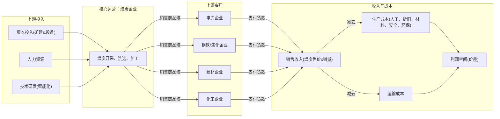
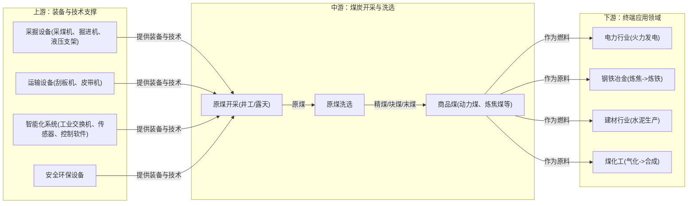

# 煤炭行业一页纸

> 生成时间: 2026-05-27 17:59
> 数据来源: Alpha派 Agent Mode 11（行业一页纸）
> 覆盖期货品种: J, JM

---

[Agent 回答]
# 1.核心投资逻辑

煤炭行业的核心投资逻辑在于，在能源安全和经济稳定压舱石的战略定位下，行业正迎来供给侧结构性改革与新兴需求爆发共同驱动的价值重估。供给端，国内“反内卷”和安全生产高压政策常态化，叠加主要进口国政策收紧，导致全球供给弹性减弱；需求端，传统电力、冶金需求展现韧性，同时以AI算力为代表的新兴产业带来显著的电力需求增量，高油价背景下煤化工的经济性和战略价值凸显。供需格局的深刻重塑，有望推动煤炭价格中枢系统性抬升并维持高位，行业将从传统的强周期属性向兼具高盈利、高现金流、高股息的价值属性转变，龙头企业凭借其成本、资源和一体化优势，将享受更高的利润和估值。

- **需求端：韧性与新增量并存**
    1.  **能源安全的“压舱石”作用强化**：在新能源发电间歇性、不稳定的背景下，煤电作为灵活、可靠的支撑性电源，其“压舱石”和“稳定器”的作用愈发重要，为煤炭消费提供了坚实的底层支撑[1]。
    2.  **AI驱动电力需求新增长极**：人工智能和数据中心的蓬勃发展正催生巨大的电力需求。预计“十五五”期间，AI算力相关的数据中心用电量年均增速有望达到45.2%，成为拉动全社会用电量增长的新引擎，为动力煤需求带来超预期的增量[1]。
    3.  **高油价下的替代经济性**：国际油气价格维持高位，显著提升了煤炭在能源和化工原料领域的替代价值。一方面，推高了天然气发电成本，使得煤电性价比凸显；另一方面，煤制油、煤制烯烃等现代煤化工路线的经济性增强，保障了国家能源和化工产业链安全，拉动了化工用煤需求[2]。

- **供给端：国内外同步收紧，弹性减弱**
    1.  **国内“反内卷”与安全监管常态化**：自2025年7月起，国家层面严格执行煤矿生产核查，严禁超能力生产，纠正“以量补价”的无序竞争[3]。叠加新版《煤矿安全规程》将于2026年2月1日施行，安全生产标准空前提高，将加速落后和不合规产能的退出，使得国内煤炭供给进入强约束、低弹性的新常态[4]。
    2.  **进口补充能力受限**：作为中国最大的煤炭进口来源国，印尼正通过收紧年度生产配额（RKAB）、酝酿恢复出口关税等政策，主动控制出口量以支撑煤价，这将直接削减全球海运市场的有效供给，削弱进口煤对国内市场的补充和价格平抑能力[5][6]。

# 2.行业全景分析
## 2.1 行业定义和存在价值

**专业名词定义**
- **动力煤 (Thermal Coal)**：主要用于燃烧发电、供热的煤炭，是火电厂的主要燃料。
- **炼焦煤/冶金煤 (Coking/Metallurgical Coal)**：经过加工（洗选、炼焦）后，用于高炉炼铁的焦炭生产，是钢铁工业不可或缺的原料。
- **煤化工 (Coal Chemical Industry)**：以煤为原料，经化学加工转化为气体、液体、固体燃料及化学品的过程。分为传统煤化工（如焦炭、合成氨）和现代煤化工（如煤制油、煤制烯烃）。
- **长协煤 (Long-term Contract Coal)**：煤炭供需双方签订的、执行期在一年及以上、有明确数量和定价机制的购销合同，是国家保障电煤供应、稳定煤价的重要机制。

**行业归属与细分**
煤炭行业属于能源工业和原材料工业，是国民经济的基础产业。其产业链条长，关联产业多。主要细分领域包括：
- **按煤种分**：动力煤、炼焦煤、无烟煤等。
- **按开采方式分**：井工开采、露天开采。
- **按产业链环节分**：煤炭开采与洗选、煤炭贸易与物流、下游应用（电力、钢铁、建材、化工等）。

**重要时间节点**
- **2026年2月1日**：新版《煤矿安全规程》正式施行，将全面提升行业安全生产标准，可能加速不达标产能的出清[4]。
- **2026年6月15日**：新《中华人民共和国矿产资源法实施条例》施行，将进一步完善矿业权制度和资源储备应急制度，强化国家对战略性矿产资源的管控[7]。
- **“十五五”期间 (2026-2030年)**：将是煤炭行业实现高水平科技自立自强、推动智能化与绿色转型、构建新型能源体系的关键窗口期[8]。

**核心痛点与价值**
煤炭行业解决的核心痛点是为中国“富煤、贫油、少气”的资源禀赋提供能源安全保障[9]。它为社会经济发展提供了最稳定、可靠、自主可控的能源基石和工业原料，其不可或缺的价值体现在：
1.  **能源安全“压舱石”**：作为主体能源，煤炭提供了国家能源供应的战略纵深和安全冗余，尤其在应对极端天气、新能源出力不足等情况时，发挥着兜底保障作用[10]。
2.  **工业经济“粮食”**：为电力、钢铁、建材、化工等支柱产业提供基础燃料和原料，是维系整个工业体系运转的命脉。

## 2.2 行业发展历程

中国煤炭行业的发展历程大致可分为三个关键阶段：

1.  **高速扩张期（2015年以前）**：为支撑中国经济的高速增长，煤炭行业以规模扩张为主要特征，生产要素持续大量投入。这一时期，煤矿数量众多，但技术水平参差不齐，安全和环境问题较为突出。
2.  **供给侧结构性改革期（2016年-2020年）**：面对产能严重过剩和价格低迷，国家启动了深刻的供给侧结构性改革。通过“三去一降一补”，坚决淘汰落后产能，推动企业兼并重组。全国煤矿数量从2015年的约1.08万处大幅下降至4300处以内，行业集中度显著提升，大型现代化煤矿成为生产主体，平均单产效率大幅提高[11][12]。
3.  **高质量发展与转型期（2021年至今）**：在“双碳”目标和能源安全新战略的指引下，行业发展重心转向高质量发展。这一阶段的核心特征是“保供稳价”与“转型升级”并重，大力推进煤矿智能化、绿色化建设，推动煤炭清洁高效利用，并探索与新能源的融合发展，行业从传统劳动密集型向技术密集型加速转型[13]。

## 2.3 商业模式解析

煤炭行业的核心商业模式是开采和销售矿产资源以获取利润。利润的核心驱动因素是**煤炭销售价格与生产成本之间的价差**。

**成本结构与利润驱动**
- **成本结构**：
    - **固定成本**：矿井建设、设备折旧、土地和矿权费用、管理人员薪酬等。
    - **可变成本**：直接人工成本、电力、燃料、安全生产费用、环保及生态修复费用、维简费、材料消耗、运输费用等。
- **利润驱动因素**：
    1.  **资源禀赋**：煤层厚度、地质条件、煤质等直接决定开采成本和产品售价，是企业盈利能力的基础。
    2.  **规模效应**：大型现代化矿井通过规模化生产，可以摊薄固定成本，提高设备利用率，从而降低单位生产成本。
    3.  **技术领先**：智能化、无人化开采技术能显著“减人提效”，降低人工成本和安全风险，是未来成本控制的关键[14]。
    4.  **产业链一体化**：拥有自营铁路、港口等物流设施的企业（如中国神华）能大幅降低运输成本，并保障外运通畅；“煤-电”、“煤-化”一体化布局能平抑单一环节的价格波动风险，提升整体盈利稳定性[15]。
    5.  **市场定价权**：在供给偏紧时，拥有优质资源和市场份额的龙头企业能获得更高的价格溢价。

**商业模式图**

## 2.4 行业政策

近年来，煤炭行业政策围绕**“安全、保供、绿色、智能”**四大核心展开，呈现出系统性、精细化的特点。

 
| 政策领域        | 核心政策/文件                                                                                           | 主要内容与影响                                                              |
| ----------- | ------------------------------------------------------------------------------------------------- | -------------------------------------------------------------------- |
| **供给与产能调控** | 国家能源局“查超产”核查[3]、产能储备制度[16]         | 严格禁止超能力生产，纠正“以量补价”的无序竞争，从源头收紧供给弹性。建立产能储备制度，实现供给的有序调节，旨在稳定市场预期和价格。    |
| **安全生产**    | 新版《煤矿安全规程》（2026年2月1日起施行）[4]                                       | 全面提升安全准入门槛和生产标准，强化重大灾害防治，强制推广智能化装备应用，将加速不达标中小煤矿退出，抬高行业整体安全成本。        |
| **清洁高效利用**  | 《煤炭清洁高效利用重点领域标杆水平和基准水平(2025年版)》[17]                                | 新增煤制气、煤制油等领域，对标杆和基准水平提出更高要求，对不达标项目限期改造或淘汰，倒逼行业技术升级和能效提升。             |
| **智能化转型**   | 《关于加快煤矿智能化发展的指导意见》[11]、能源行业标准计划 | 明确了2025年和2035年的智能化发展目标，引导行业向“无人则安、少人则安”的模式发展。通过标准化建设，推动技术装备的国产化和通用化。 |
| **绿色与融合发展** | 《关于推进煤炭与新能源融合发展的指导意见》[18]                                         | 鼓励利用矿区土地资源发展风电、光伏，探索“风光火储一体化”模式，推动煤炭企业向综合能源服务商转型，为行业开辟新的增长路径。        |
| **资源管理**    | 《中华人民共和国矿产资源法实施条例》（2026年6月15日起施行）[7]                               | 强化国家对矿产资源的规划、勘查、开采和保护，完善矿业权制度，保障国家资源安全，意味着未来新增产能的审批将更加严格和规范。         |

# 3.产业链深度解析
## 3.1 产业链图谱

## 3.2 上游：装备与智能化系统

上游环节为煤炭开采提供核心的“工具”和“大脑”，其技术水平直接决定了中游开采的效率、安全性和成本。

- **竞争格局与趋势**：市场正从单一设备销售向“设备+系统+服务”的一体化解决方案转型。随着煤矿智能化建设的深入，具备提供全场景解决方案和一体化产品体系能力的企业将占据主导地位[19]。高端装备及智能化系统的国产化替代是明确趋势，技术壁垒和客户认证壁垒较高[20]。
- **技术升级**：核心技术正从自动化向智能化、无人化演进。以5G、工业互联网、AI视觉与算法为基础的智能感知、远程操控、智能决策系统是研发重点[8]。例如，高可靠的井下工业环网是实现数据实时传输和远程操控的底座[19]。
- **投资结论**：**掌握核心智能化技术、能够提供一体化解决方案的平台型公司将越来越强，壁垒越来越高。** 原因是煤矿客户的需求已从购买单一设备转向采购能解决“减人、提效、增安”痛点的整套系统。这类公司通过深度绑定客户，积累了大量应用场景数据，能够持续迭代算法和优化系统，形成强大的技术和生态壁垒，新进入者难以在短时间内追赶[21]。

## 3.3 中游：煤炭开采与洗选

中游是产业链的核心，是将地下资源转化为商品的物理过程，也是价值实现和风险集中的环节。

- **竞争格局与趋势**：行业集中度持续提升，生产重心向资源禀赋优越的晋、陕、蒙、新四省区集聚，四省区原煤产量合计占全国比重已超过80%[22]。大型煤炭集团凭借规模、技术、资金和一体化优势，市场主导地位愈发稳固[10]。
- **技术升级**：开采技术正向大采高、智能化、绿色化方向发展。随着开采深度增加，深部矿井的复杂地质条件（高地应力、强瓦斯等）对灾害智能预警、透明地质、AI无人开采等技术提出了更高要求[13]。绿色开采技术如充填开采、保水开采等正从示范走向规模化应用。
- **投资结论**：**拥有优质资源、成本优势显著、且在智能化和绿色开采技术上领先的龙头煤企将强者恒强。** 原因在于：1. **资源稀缺性**：优质煤炭资源不可再生，牌照严格管制下，存量资源价值凸显。2. **成本护城河**：优越的赋存条件和高效的智能化开采共同构筑了难以逾越的成本护城河，在行业波动中具备更强的盈利能力和生存能力。3. **政策倾斜**：在保供和高质量发展背景下，政策和资源会进一步向这些优势企业倾斜。

## 3.4 下游：终端应用

下游是煤炭价值的最终实现端，其需求结构和技术进步反向决定了中游煤炭产品的价值。

- **电力行业**：作为最主要的下游，耗煤量占总量一半以上[23]。煤电的角色正从基荷电源向提供可靠容量和灵活性的调节电源转变。AI算力需求的爆发式增长，为电力需求带来了新的确定性增量[1]。
- **钢铁冶金**：焦煤是其不可替代的核心原料，需求与宏观经济、基建和房地产周期高度相关。优质主焦煤资源具有战略稀缺性。
- **建材行业**：主要以水泥生产为主，需求同样受房地产和基建投资影响，近年来需求相对疲软。
- **煤化工行业**：是煤炭从燃料向“燃料+原料”并重转型的主要方向。在油价高企的背景下，现代煤化工（煤制烯烃、煤制油气等）的战略安全价值和经济性凸显，成为非电用煤需求的重要增长点[24]。

## 3.5 核心技术路线、演进趋势

**核心技术**
支撑煤炭行业的核心技术体系正经历从“机械化”到“自动化”再到“智能化”的深刻变革。
- **智能绿色开采技术**：包括**透明地质**（通过物探技术精确探明井下地质构造）、**智能导航与定位**、**采掘设备远程/自主控制**、**AI视觉识别**（如煤岩识别）、**矿用机器人**和**绿色充填开采**等[14]。
- **清洁高效利用技术**：包括**超超临界发电**、**循环流化床燃烧**、**现代煤化工**（大型煤气化、合成气转化、煤基新材料制备）以及**碳捕集、利用与封存（CCUS）**技术。
- **数字化与信息技术**：包括**井下5G/工业以太环网**、**物联网（IoT）**、**大数据与云计算平台**、**人工智能大模型**等，这些是实现“智慧矿山”的数字底座[25]。

**技术演进趋势**
- **技术生命周期**：当前煤矿智能化技术整体处于**成长期**。基础的自动化和远程控制已较为成熟，但具备自主决策能力的AI应用、全矿井协同智能等仍处于快速发展和推广阶段[14]。
- **迭代方向**：
    1.  **从“单点智能”到“系统智能”**：从单个工作面的自动化，向采、掘、机、运、通等全系统、全流程的智能协同联动发展。
    2.  **从“远程遥控”到“自主运行”**：AI大模型与智能感知技术深度融合，最终目标是实现采掘设备的自主规划、决策和运行，达成“面内无人”[11]。
    3.  **“AI+煤炭”深度融合**：利用AI大模型进行地质数据分析、灾害智能预警、设备故障预测性维护等，从根本上提升安全和效率水平[8]。
- **研发难点**：深部复杂地质条件下的精准感知、多灾种协同治理、智能化矿井的常态化稳定运行、以及低成本CCUS技术的商业化是当前面临的主要技术挑战[26]。

## 3.5 行业护城河分析

 
| 壁垒类型        | 具体表现与分析                                                                                                                                                                                    |
| ----------- | ------------------------------------------------------------------------------------------------------------------------------------------------------------------------------------------ |
| **政策/资质壁垒** | **（最核心壁垒）** 煤炭开采需获得国家颁发的采矿许可证，在当前严控新增产能的背景下，新建矿井的审批极为严格，几乎构成了绝对的准入壁垒。存量矿井的产能核增也受到严格监管[27]。                                                                        |
| **资本壁垒**    | 煤矿的勘探、设计、建设、设备采购等初期投资巨大，动辄数十亿甚至上百亿。同时，持续的安全、环保、智能化改造也需要大量的资本开支，资金门槛极高。                                                                                                                     |
| **技术壁垒**    | 随着开采走向深部化、智能化，对地质勘探、灾害防治、智能开采系统集成的技术要求越来越高。尤其在智能化解决方案领域，涉及多学科交叉，需要长期的技术积累和数据沉淀，新进入者难以在短期内超越[21]。                                                                |
| **规模壁垒**    | 大型煤炭基地通过规模化开采、集中洗选和统一运输，能形成显著的成本优势。先发企业已占据了最优质、最易开采的资源，后进入者面临的资源禀海外购成本更高。                                                                                                                  |
| **市场/渠道壁垒** | 龙头煤企与下游大型电力、钢铁集团建立了长期稳定的战略合作关系（长协机制），锁定了大部分市场份额。自建的铁路、港口等物流体系构成了强大的渠道壁垒，保证了产品能够低成本、高效率地送达客户[15]。                                                                  |
| **替代路径**    | 能源领域，风能、太阳能、核能等是长期替代路径，但其间歇性和成本问题决定了替代过程是渐进的，短期内煤炭的兜底保障作用无法被取代。原料领域，石油是煤化工的主要替代路径，两者经济性取决于油煤比价；炼焦煤在长流程炼钢中尚无成熟的规模化替代技术。 |

# 4.市场空间测算
## 4.1 供需现状、核心假设

**供给现状**：
- **国内**：产量增长已见顶，在安全、环保强监管和“反内卷”政策下，2026年及未来几年原煤产量大概率无新增量，甚至可能出现同比负增长[28]。
- **国际**：最大出口国印尼收紧生产配额，将减少全球海运煤供给；地缘政治风险和海外金融机构对煤炭项目的融资限制，也约束了全球新产能的投资[29]。

**需求现状**：
- **传统需求**：电力、钢铁等传统下游需求保持韧性。火电在电力系统中的压舱石作用凸显，需求稳定[1]。
- **新兴需求**：AI算力发展带来的数据中心用电量激增，成为电力需求的新增长点[1]。高油价下，煤化工的替代需求和战略价值提升[24]。

**核心假设**：
1.  **产量假设**：假设国内原煤产量在2025年48.5亿吨的基础上，2026-2030年间年均复合增长率为-0.2%，体现供给侧的强约束。
2.  **AI电力需求转化假设**：根据预测，“十五五”期间AI算力用电年均增速45.2%[1]。假设2025年AI用电量为2000亿千瓦时，并以此为基数按40%的保守增速增长。假设新增电力需求的50%由火电提供（作为调峰和保障电源），火电度电耗煤按300克标准煤/千瓦时计算。
3.  **煤化工替代需求假设**：假设在高油价背景下，海外非煤头化工路线每年有2%的产能负荷转向煤炭路线，对应每年新增约700万吨的煤炭需求（基于3.5亿吨总潜在替代空间的2%）[30]。
4.  **价格假设**：供需缺口将推动价格中枢上移。假设动力煤市场均价从2025年的约700元/吨，逐步上涨至2030年的880元/吨，体现价值重估过程[31]。

## 4.2 市场规模测算

基于以上假设，我们测算未来几年中国煤炭消费量及市场规模。

 
| 项目/年份           | 2025年 (基准) | 2026年     | 2027年     | 2028年     | 2029年     | 2030年     |
| :-------------- | :--------- | :-------- | :-------- | :-------- | :-------- | :-------- |
| **需求测算 (亿吨)**   |            |           |           |           |           |           |
| 基础消费量           | 48.30      | 48.30     | 48.30     | 48.30     | 48.30     | 48.30     |
| AI电力增量 (亿千瓦时)   | 2000       | 2800      | 3920      | 5488      | 7683      | 10757     |
| 转化为煤炭需求 (亿吨)    | 0.03       | 0.04      | 0.06      | 0.08      | 0.12      | 0.16      |
| 煤化工替代增量 (亿吨)    | -          | 0.07      | 0.07      | 0.07      | 0.07      | 0.07      |
| **总需求量 (亿吨)**   | **48.33**  | **48.41** | **48.43** | **48.45** | **48.49** | **48.53** |
| **供给测算 (亿吨)**   |            |           |           |           |           |           |
| 国内总产量           | 48.50      | 48.40     | 48.31     | 48.21     | 48.11     | 48.02     |
| **价格与规模测算**     |            |           |           |           |           |           |
| 市场平均价格 (元/吨)    | 700        | 750       | 800       | 830       | 850       | 880       |
| **市场总规模 (万亿元)** | **3.38**   | **3.63**  | **3.87**  | **4.02**  | **4.12**  | **4.27**  |

**测算结论**：
尽管煤炭消费总量增速放缓，但以AI为代表的新兴需求提供了关键的边际增量。更重要的是，在供给端强约束下，微小的供需缺口就足以撬动价格中枢显著上移。预计到2030年，煤炭行业的市场总规模将从约3.38万亿元增长至4.27万亿元，年均复合增长率约为4.0%，行业的整体利润空间将得到显著提升。

# 5.市场竞争格局
## 5.1 核心玩家梯队

中国煤炭行业的竞争格局经过供给侧改革后，呈现出典型的“金字塔”结构，高度集中且以国有企业为主导。

- **第一梯队：全国性巨头**
    - **国家能源集团**、**晋能控股集团**：年产量均在4亿吨以上，是行业内的绝对霸主。国家能源集团更是集煤炭、电力、运输（铁路、港口）、化工于一体的综合性能源航母，产量占全国13%的市场份额，拥有无可比拟的规模和产业链一体化优势[32]。
- **第二梯队：区域龙头与上市公司**
    - **中煤能源**、**陕西煤业**、**兖矿能源**、**山东能源集团**等：年产量在5000万吨至数亿吨级别。这些企业通常是A股市场的核心标的，拥有优质的煤炭资源、先进的开采技术和较强的成本控制能力，是区域市场的领导者或在特定煤种上具有主导地位[33]。
- **第三梯队：地方国企与专业化公司**
    - **山西焦煤**、**潞安环能**、**淮北矿业**、**平煤股份**等：年产量在数千万吨级别。这些企业多为地方国有骨干企业，或在特定细分领域（如炼焦煤、无烟煤）具有深厚的根基和专业优势[33]。
- **煤化工领域玩家**：
    - **央企主导**：国家能源集团、中煤集团等凭借其煤炭资源优势，在煤制油、煤制气等大型现代煤化工项目中占据主导地位[34]。
    - **地方国企与民营龙头**：如**宝丰能源**，依托自有煤矿资源，在煤制烯烃领域建立了强大的成本优势和技术领先地位[35]。

行业集中度极高，2025年，晋、陕、蒙、新四省区的原煤产量合计占全国总产量的81.4%[22]。产量前10的煤企合计产量占全国总产量的50%以上[32]。

## 5.2 核心对比分析

 
| 公司名称     | 股票代码      | 核心优势与特点                                             | 业务布局                         | 2025年产量/经营情况                                                   | 综合评价                                                                                         |
| :------- | :-------- | :-------------------------------------------------- | :--------------------------- | :------------------------------------------------------------- | :------------------------------------------------------------------------------------------- |
| **中国神华** | 601088.SH | 全球领先的以煤为基础的综合能源上市公司，拥有“煤-电-路-港-航-化”一体化产业链，成本优势全球领先。 | 动力煤、电力、运输（铁路、港口）、煤化工         | 商品煤产量3.27亿吨（2024年数据）[32]，业绩稳健。 | **行业绝对龙头**。一体化模式平抑了周期波动，盈利能力和抗风险能力最强，是高股息、稳健配置的核心标的。                                         |
| **中煤能源** | 601898.SH | 中国第二大煤炭央企，煤种齐全，动力煤和炼焦煤并重，煤化工业务布局深入。                 | 动力煤、炼焦煤、煤化工（聚烯烃、尿素）、煤机装备     | 商品煤产量1.35亿吨[10]。                     | **综合性龙头**。业务结构均衡，成长性较好，在建矿井和化工项目将提供未来增量，估值相对有吸引力。                                            |
| **陕西煤业** | 601225.SH | 资源禀赋突出，主产于陕北、黄陵等优质产区，煤质优、开采成本低，长协煤比例较低，业绩弹性大。       | 动力煤为主，铁路投资                   | 产量稳定，高盈利、高分红。                                                  | **高弹性、高分红标杆**。受益于其低成本和高市场煤占比，在煤价上行周期中利润弹性最大，是典型的进攻型品种。                                       |
| **兖矿能源** | 600188.SH | 国内外双布局，控股兖煤澳大利亚，拥有国内外优质煤炭资源。煤化工板块规模大，产品多元。          | 动力煤、炼焦煤（国内外）、煤化工（甲醇、乙二醇、醋酸等） | 国内外权益产量合计超亿吨，煤化工业务贡献重要利润。                                      | **国际化布局龙头**。同时受益于国内外煤价，资产分布多元化。煤化工业务规模大，对油价敏感性高，具备多重催化剂。                                     |
| **山西焦煤** | 000983.SZ | 中国炼焦煤行业龙头，拥有稀缺的优质主焦煤资源，在产业链中具有较强议价能力。               | 炼焦煤、焦炭、电力                    | 聚焦主业，持续推进智能化改造和资源整合。                                           | **炼焦煤稀缺龙头**。产品具有不可替代性和战略价值，是分享钢铁产业链利润的核心标的，稀缺性应给予估值溢价。                                       |
| **宝丰能源** | 600989.SH | A股煤制烯烃龙头，拥有“煤-焦-气-化-电-氢”一体化产业集群，成本优势显著。             | 煤制烯烃（PE、PP）、焦炭、精细化工          | 业绩与油煤比价高度相关，盈利能力在行业内领先。                                        | **煤化工领军者**。通过一体化和技术创新构筑了极深的成本护城河，是煤炭由燃料向原料转型成功的典范，成长性突出[35]。 |

# 6.重点投资标的分析
## 6.1 中国神华(601088.SH)：一体化航母，穿越周期的价值典范

公司是全球领先的以煤炭为基础的综合能源企业，核心业务覆盖煤炭、电力、铁路、港口、航运、煤化工六大板块。这种“产业纵向一体化”的独特商业模式构筑了公司最深的护城河。公司拥有神东矿区等储量大、煤质好、开采成本极低的煤炭资源。自有的“神朔-朔黄”铁路和黄骅港、神华天津煤码头，构成了“西煤东运”的黄金运输线，不仅保障了自身煤炭的高效外运，更创造了巨大的运输利润，有效平滑了煤价波动对业绩的影响。在行业景气上行时，煤炭业务贡献主要利润；在行业下行时，运输和电力业务则提供了稳定的现金流，使其具备穿越周期的强大能力。

## 6.2 陕西煤业(601225.SH)：资源禀赋卓越，高弹性高分红标杆

公司核心资产位于陕北和黄陵两大优质煤炭基地，煤层赋存条件好，地质构造简单，非常适合大型现代化开采，因此其吨煤生产成本在行业内处于最低水平之列。公司主产高热值、低硫、低磷的优质动力煤，产品竞争力强。与其他大型煤企相比，公司长协煤占比相对较低，市场煤销售比例更高，这使其业绩对煤价的敏感性（即弹性）远高于同行。在煤价上涨周期中，公司盈利能力的释放将最为充分。同时，公司长期坚持高比例分红政策，是A股市场知名的高股息标的，兼具进攻性与防御性。

## 6.3 兖矿能源(600188.SH)：国内外双轮驱动，煤化工作为增长新极

公司是一家拥有国内外多地优质煤炭资源的国际化能源公司，控股子公司兖煤澳大利亚是澳洲最大的专营煤炭生产商之一。这种“国内+海外”的资产布局使其能够同时受益于国内和国际两个市场的煤价表现，有效分散了单一市场的风险。在国内，公司不仅拥有山东、陕蒙的煤炭基地，还在煤化工领域深度布局，拥有规模庞大的甲醇、醋酸、乙二醇等产能。在高油价背景下，其煤化工板块的盈利能力将显著增强。公司正积极推进高端化工品项目，力争“十五五”末高端化工品占比超过70%，展现了清晰的转型升级路径[36]。

## 6.4 山西焦煤(000983.SZ)：炼焦煤绝对龙头，战略稀缺性凸显

公司是国内规模最大的炼焦煤生产企业，拥有国内最稀缺的优质主焦煤资源。炼焦煤是长流程炼钢中不可或缺的关键原料，目前尚无成熟的规模化替代技术，其战略地位和资源稀缺性远高于动力煤。公司作为行业龙头，对下游钢厂拥有较强的议价能力。随着国家对战略性矿产资源的日益重视和供给侧改革的持续深化，公司所掌握的优质炼焦煤资源价值将得到持续重估。公司正加快推进智能化矿山建设，提升生产效率与安全水平，进一步巩固其在产业链中的核心地位[37]。

## 6.5 投资价值综合对比

 
| 产业链环节    | 公司名称 | 股票代码      | 稀缺性 | 行业布局深度与收益弹性                                       | 预计受益弹性   |
| :------- | :--- | :-------- | :-- | :------------------------------------------------ | :------- |
| **上游装备** | 天玛智控 | 688570.SH | 较高  | 煤矿无人化、智能化核心解决方案提供商，深度受益于煤矿智能化改造浪潮，订单驱动型增长。        | **超额收益** |
| **上游装备** | 三旺通信 | 688618.SH | 较高  | 工业互联网通信设备核心供应商，为智慧矿山提供网络底座，是智能化建设的“卖水者”，市场空间广阔。   | **超额收益** |
| **中游开采** | 中国神华 | 601088.SH | 极高  | 一体化产业链布局最深，抗周期性最强。市场煤价上涨时，煤炭业务利润大幅增长；运输业务提供稳定现金流。 | **行业平均** |
| **中游开采** | 陕西煤业 | 601225.SH | 极高  | 拥有国内成本最低的优质动力煤资源。市场煤占比较高，业绩对煤价上涨的弹性最大。            | **超额收益** |
| **中游开采** | 兖矿能源 | 600188.SH | 较高  | 国内外资产协同，煤化工业务规模大。同时受益于煤价和油价上涨，具备多重增长催化剂。          | **超额收益** |
| **中游开采** | 中煤能源 | 601898.SH | 较高  | 煤种和业务结构均衡，在建产能提供确定性增长。估值相对较低，具备修复空间。              | **行业平均** |
| **中游开采** | 山西焦煤 | 000983.SZ | 极高  | 掌握稀缺的优质主焦煤资源，在产业链中议价能力强，资源价值有望持续重估。               | **超额收益** |
| **中游开采** | 淮北矿业 | 600985.SH | 较高  | 华东地区焦煤龙头，拥有“煤-焦-化”一体化产业链，区位优势明显，盈利稳定。             | **行业平均** |
| **中游化工** | 宝丰能源 | 600989.SH | 极高  | 煤制烯烃成本控制做到极致，一体化布局构筑深厚护城河。是煤炭向新材料转型的标杆，成长性突出。     | **超额收益** |

[引用来源 63 条]
  1. [路演纪要] 东兴证券｜周期专场 - 2026年度策略会 (2025-12-31)
  2. [路演纪要] 东兴证券｜周期专场 - 2026年度策略会 (2025-12-31)
  3. [路演纪要] 东财能源开采 | 油气上涨，煤炭替代需求空间及煤化工弹性测算 (2026-03-12)
  4. [内资研报] 2026年煤炭行业年度策略：伺机而动 (2025-12-28)
  5. [social_media] 2025年煤炭行业十大热词 (2026-01-10)
  6. [路演纪要] 东财能源开采 | 价格与估值双击，煤炭板块空间怎么看？ (2026-03-02)
  7. [内资研报] 2026年煤炭行业年度策略：伺机而动 (2025-12-28)
  8. [social_media] 2025年煤炭行业十大热词 (2026-01-10)
  9. [内资研报] 煤炭行业周报：资源主权约束下的煤炭稀缺性溢价 (2026-05-26)
  10. [social_media] 煤炭行业高质量发展四问 (2026-05-22)
  11. [公司公告] 新大洲A(000571.SZ):2025年年度报告 (2026-04-29)
  12. [公司公告] 中煤能源(601898.SH):中国中煤能源股份有限公司2025年年度报告 (2026-03-28)
  13. [内资研报] 计算机行业深度报告：政策引导煤矿智能化改造目标确立，AI赋能行业快速发展 (2026-02-10)
  14. [内资研报] 竞争格局优化中的投资机会：从分母端到分子端，寻找“沙漠之花” (2026-04-06)
  15. [social_media] 一线煤炭人的两会心愿单 (2026-03-04)
  16. [social_media] 加快发展煤炭新质生产力战略研究 (2026-02-04)
  17. [公司公告] 淮北矿业(600985.SH):淮北矿业控股股份有限公司2025年年度报告 (2026-03-28)
  18. [内资研报] 2026年煤炭行业年度策略：伺机而动 (2025-12-28)
  19. [social_media] 2025年煤炭行业十大热词 (2026-01-10)
  20. [内资研报] 煤炭行业周报：资源主权约束下的煤炭稀缺性溢价 (2026-05-26)
  21. [内资研报] 计算机行业深度报告：政策引导煤矿智能化改造目标确立，AI赋能行业快速发展 (2026-02-10)
  22. [内资研报] 煤炭行业2026年度策略：改善可期，价值重塑 (2026-01-12)
  23. [social_media] 2025年煤炭行业十大热词 (2026-01-10)
  24. [social_media] 【行业研究】2026年煤炭行业分析 (2026-04-21)
  25. [机构点评] 山西煤矿爆炸，关注煤炭智能化核心标的【三旺通信】，白送N个卫星资产 (2026-05-24)
  26. [公司公告] 天玛智控(688570.SH):天玛智控2025年年度报告 (2026-03-27 00:00:00)
  27. [social_media] 煤炭行业高质量发展四问 (2026-05-22)
  28. [机构点评] 山西煤矿爆炸，关注煤炭智能化核心标的【三旺通信】，白送N个卫星资产 (2026-05-24)
  29. [公司公告] [定期报告]科隆新材(920098.BJ):2025年年度报告 (2026-04-16 00:00:00)
  30. [公司公告] 苏能股份(600925.SH):江苏徐矿能源股份有限公司2025年年度报告 (2026-04-22)
  31. [公司公告] 中煤能源(601898.SH):中国中煤能源股份有限公司2025年年度报告 (2026-03-28)
  32. [social_media] 一线煤炭人的两会心愿单 (2026-03-04)
  33. [social_media] 【中诚信国际行业展望】中国煤炭行业（2026年2月） (2026-02-10)
  34. [路演纪要] 东兴证券｜周期专场 - 2026年度策略会 (2025-12-31)
  35. [social_media] 煤炭产业链景气上行，最受益的13家公司（附名单） (2026-05-19)
  36. [social_media] 加快发展煤炭新质生产力战略研究 (2026-02-04)
  37. [social_media] “十五五”期间我国煤炭行业发展形势探讨及思路建议 (2026-02-11)
  38. [social_media] 加快发展煤炭新质生产力战略研究 (2026-02-04)
  39. [内资研报] 计算机行业深度报告：政策引导煤矿智能化改造目标确立，AI赋能行业快速发展 (2026-02-10)
  40. [social_media] 煤炭行业高质量发展四问 (2026-05-22)
  41. [公司公告] 淮北矿业(600985.SH):淮北矿业控股股份有限公司2025年年度报告 (2026-03-28)
  42. [公司公告] [定期报告]科隆新材(920098.BJ):2025年年度报告 (2026-04-16 00:00:00)
  43. [social_media] 煤炭行业高质量发展四问 (2026-05-26)
  44. [公司公告] 电投能源(002128.SZ):2025年年度报告 (2026-04-15)
  45. [social_media] 煤炭产业链景气上行，最受益的13家公司（附名单） (2026-05-19)
  46. [social_media] 煤炭行业周期系列「第四篇」：全球视野下的煤炭周期——进口与海外映射 (2026-03-04)
  47. [路演纪要] 东兴证券｜周期专场 - 2026年度策略会 (2025-12-31)
  48. [路演纪要] 东兴证券｜周期专场 - 2026年度策略会 (2025-12-31)
  49. [social_media] 煤炭产业链景气上行，最受益的13家公司（附名单） (2026-05-19)
  50. [路演纪要] 东兴证券｜周期专场 - 2026年度策略会 (2025-12-31)
  51. [路演纪要] 东财能源开采 | 2026年第10期：1-2月煤炭行业数据解读 (2026-03-22)
  52. [路演纪要] 东财能源开采 | 价格与估值双击，煤炭板块空间怎么看？ (2026-03-02)
  53. [social_media] 第318期 | 拆解上市公司：辽宁能源 (2026-03-25)
  54. [social_media] 第313期 | 拆解上市公司：华电能源 (2026-03-18)
  55. [social_media] 第313期 | 拆解上市公司：华电能源 (2026-03-18)
  56. [social_media] 煤政策严管下的存量博弈与绿色突围 我国煤制油行业消费结构分化 多龙头并进 (2026-05-09)
  57. [social_media] 煤炭行业周期系列「收官篇」：煤炭的未来——转型、终局与投资机会 (2026-03-07)
  58. [公司公告] 苏能股份(600925.SH):江苏徐矿能源股份有限公司2025年年度报告 (2026-04-22)
  59. [公司公告] 中煤能源(601898.SH):中国中煤能源股份有限公司2025年年度报告 (2026-03-28)
  60. [social_media] 第318期 | 拆解上市公司：辽宁能源 (2026-03-25)
  61. [social_media] 煤炭行业周期系列「收官篇」：煤炭的未来——转型、终局与投资机会 (2026-03-07)
  62. [social_media] 油气价飙升 煤炭迅速“补位” 中东冲突下 油气涨价带来的红利惠及煤炭上中游产业链 (2026-04-10)
  63. [公司公告] 山西焦煤(000983.SZ):2025年年度报告 (2026-04-29 00:00:00)
