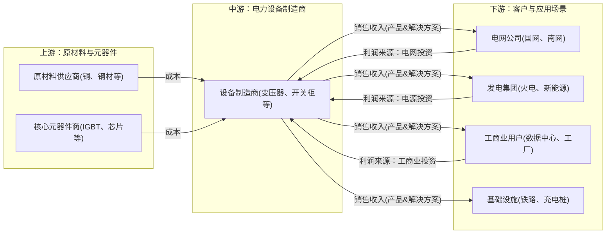
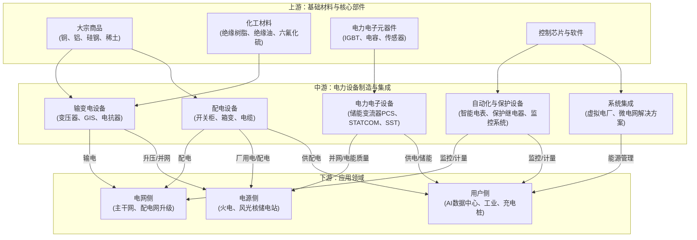

# 电力设备与新能源行业一页纸

> 生成时间: 2026-05-27 18:03
> 数据来源: Alpha派 Agent Mode 11（行业一页纸）
> 覆盖期货品种: LC, SI

---

[Agent 回答]
# 1. 核心投资逻辑

电力设备与新能源行业正迎来由多重需求共振驱动的超级周期。其核心投资逻辑在于，全球能源转型、新型电力系统建设以及AI算力爆发带来的颠覆性电力需求，共同构成了行业增长的强大引擎，而中国企业凭借全球领先的产业链优势，有望在这一轮周期中实现量价齐升。

**1. 需求端：三大引擎驱动，需求爆发式增长**
- **能源转型与电网升级：** “双碳”目标下，全球新能源装机持续高增，风光发电的波动性与间歇性对电网的调节能力、接纳能力和稳定性提出前所未有的挑战[b9a30ccc1dc75db9f366255eaa3a457f_27]。这驱动了对特高压、柔性直流、智能配电网、储能等先进电力设备的大规模投资需求。同时，欧美等发达经济体电网老化严重，更新换代需求迫在眉睫，为中国电力设备出海提供了广阔市场[10fb15f866a86e8d86945776e49bdce5_10]。
- **AI算力需求爆发：** 人工智能（AI）大模型训练和推理需要巨大的能源支撑，数据中心（AIDC）正成为新的用电大户。高盛预测，到2030年，全球数据中心电力需求将增长160%。这种高密度、高可靠性的用电需求，催生了对固态变压器（SST）、高压直流（HVDC）供电、液冷系统、以及配套储能等新型电力设备的强劲需求，构成了行业最具想象力的增量空间[1]。
- **全面电气化深化：** 交通（新能源汽车）、工业（电炉炼钢）、建筑等领域的电气化进程持续加速，进一步推高了全社会的用电总量和用电负荷，对电力系统的容量和灵活性提出了更高要求[2]。

**2. 供给端：中国优势凸显，出海逻辑强化**
- **全球产能与技术优势：** 中国已形成全球最完整、最具竞争力的电力设备产业链。在特高压、智能电网等领域技术世界领先[3]，在中低压设备领域具备巨大的规模和成本优势。面对海外，尤其是美国变压器等设备长达数年的交付周期和产能缺口，中国企业凭借强大的制造能力和交付确定性，迎来了出海的黄金机遇[4]。
- **格局优化与价值重估：** 在高端设备领域（如特高压、核心电力电子器件），技术壁垒高，市场集中度高，呈现“强者恒强”的格局[5]。这些头部企业议价能力强，能够充分分享行业增长和技术升级带来的高附加值。随着海外订单的涌入，这些企业的盈利能力和估值体系有望得到重塑。

综上，电力设备行业的投资逻辑已从传统的电网投资周期，转变为“国内电网升级+海外电网更新+AI算力增量”三轮驱动的全球性、跨周期的高景气逻辑。能够卡位核心技术、成功出海、并切入AI数据中心等新兴供应链的企业，将展现出超越行业的巨大增长弹性。

# 2. 行业全景分析
## 2.1 行业定义和存在价值

**电力设备**是指在发电、输电、变电、配电和用电等电力系统各环节中所使用的各类设备的统称[6]。它构成了电力工业的物质基础，是能源从一次能源形态转换、传输、分配至终端用户的物理载体。

- **所属产业：** 电力设备行业属于能源装备制造业，是支撑国民经济发展的战略性、基础性产业。
- **细分领域：**
    - **发电装备：** 如火电、水电、核电、风电、光伏发电设备。
    - **输配电设备：** 这是产业链的核心，包括变压器、开关设备（GIS、断路器）、互感器、电抗器、电容器、避雷器、绝缘子、电力电缆及附件等[6]。
    - **用电设备：** 如电动机、电加热设备、充电桩等。
    - **调度与控制设备：** 如SCADA系统、继电保护装置、智能电表等。

**核心痛点与价值：**
电力设备行业的核心价值在于**确保电能安全、可靠、高效、经济地从生产端传输到消费端**。在“双碳”背景下，其价值进一步升华：
1.  **支撑新能源消纳：** 解决风、光等新能源发电的波动性和间歇性问题，通过特高压远距离输送、智能电网灵活调度、储能系统削峰填谷，保障高比例新能源的稳定并网和高效利用[7]。
2.  **保障能源安全：** 构建坚强、智能的电网，是应对极端天气、地缘政治等风险，确保国家能源安全和经济社会稳定运行的“压舱石”[8]。
3.  **赋能数字经济：** 为AI数据中心、5G基站等高耗能数字基础设施提供高质量、不间断的电力供应，是数字经济发展的基石[9]。

## 2.2 行业发展历程

1.  **传统电网时代（2000s-2010s）：** 以满足工业化、城镇化快速发展带来的用电量增长为主要矛盾。建设重点是扩大电网覆盖范围和提升输电容量，以大规模、远距离、高电压的“西电东送”为标志，特高压技术开始萌芽并逐步成熟。
2.  **新能源初步融合时代（2010s-2020s）：** 随着风电、光伏发电成本快速下降，新能源装机规模迅速扩大。电网面临的主要挑战转变为如何接纳和消纳具有波动性的新能源电力。智能电网建设开始提速，配电自动化、智能电表等技术得到推广。
3.  **新型电力系统建设时代（2021年至今）：** 在“双碳”目标提出后，构建以新能源为主体的新型电力系统成为国家战略。行业发展的核心拐点出现：
    - **2021年：** “双碳”目标写入“十四五”规划，新型电力系统概念被正式提出。
    - **2025年：** 国家能源局明确，6月后并网的新能源电力原则上全部进入市场交易，标志着新能源从补贴时代迈向市场化时代，对电网调节能力和储能的需求变得空前迫切[d9cdbff1a9e30ec3151c78b8afa138a4_13]。
    - **2026年：** AI算力需求爆发成为行业新的、强劲的增长引擎，对供电架构提出革命性要求，SST、HVDC等新技术迎来发展契机。同时，中国电力设备企业出海进程显著加速。

## 2.3 商业模式解析

电力设备行业主要采用**B2B（企业对企业）**的商业模式，核心是为下游客户提供产品、解决方案和服务。

- **利润核心驱动因素：** 利润主要来源于**技术附加值**和**规模效应**。
    - **技术领先：** 在特高压、柔性直流、固态变压器等高端领域，技术壁垒极高，掌握核心技术的企业享有显著的品牌溢价和高毛利率。
    - **客户认证与渠道壁垒：** 主要客户为国家电网、南方电网等巨头，其供应商认证体系严格、周期长。一旦进入其供应链，便能获得稳定、持续的订单，形成强大的市场壁垒。
    - **规模效应：** 在中低压设备等竞争较充分的领域，通过规模化生产和采购，可以有效降低单位成本，获得成本优势。
    - **系统集成与服务：** 随着客户需求从单一产品向整体解决方案转变，提供设计、集成、运维等全生命周期服务的能力成为新的利润增长点。

- **成本结构：**
    - **可变成本：** 主要为原材料成本，如铜、铝、硅钢片、绝缘材料等，占总成本比重较大，受大宗商品价格波动影响显著[10]。
    - **固定成本：** 包括研发投入、厂房设备折旧、管理费用等。高研发投入是维持技术领先的必要条件。

- **商业模式图：**

## 2.4 政策环境分析

近年来，一系列重磅政策为电力设备与新能源行业的发展提供了明确指引和强大动力。

 
| 发布时间       | 文件名称                             | 发布机构        | 核心内容与影响                                                                                 | 引用                                 |
| :--------- | :------------------------------- | :---------- | :-------------------------------------------------------------------------------------- | :--------------------------------- |
| 2025-02-09 | 《关于深化新能源上网电价市场化改革 促进新能源高质量发展的通知》 | 国家发改委、国家能源局 | 明确新能源上网电量“全量入市”，通过市场交易形成价格。**影响：** 结束了固定电价时代，电价波动加剧了对储能、虚拟电厂等灵活性资源的需求，利好相关电力设备。         | [11]      |
| 2025-12-01 | 《输配电定价成本监审办法》（修订版）               | 国家发改委       | 优化输配电价定价机制，激励电网企业投资效率提升和技术创新。**影响：** 为“十五五”期间电网加大对新型电力系统的投资提供了政策保障和激励。                  | [12] |
| 2026-03-05 | “十五五”规划纲要草案                      | 全国人大        | 提出“加力建设新型能源基础设施”，明确了电网作为关键基础设施的战略地位。**影响：** 奠定了未来五年电网投资高增长的基调。                          | [13]  |
| 2026-04-27 | 《关于更高水平更高质量做好节能降碳工作的意见》          | 中办、国办       | 强调“大力发展非化石能源和新型储能，加快建设新型电力系统，创新发展绿电直连、智能微电网等业态”。**影响：** 从国家顶层设计层面确认了新型电力系统及相关设备、业态的重要性。 |  |
| 2026-05-20 | 《关于有序推动多用户绿电直连发展有关事项的通知》         | 国家发改委、国家能源局 | 允许新能源项目通过专用线路向多个用户直供绿电，并对自用电量比例和储能配置提出要求。**影响：** 开辟了新能源消纳的新场景，直接催生了对配电、储能和智能微网控制设备的需求。  | [14] |

# 3. 产业链深度解析
## 3.1 产业链图谱

## 3.2 上游：原材料与核心部件分析

上游主要为电力设备提供基础原材料和核心电子元器件。

- **竞争格局与趋势：**
    - **大宗原材料：** 如铜、铝、硅钢片等，属于完全竞争市场，价格受全球宏观经济、供需关系影响，波动较大。设备制造商的成本控制能力和供应链管理能力至关重要[10]。
    - **核心电子元器件：** 尤其是功率半导体（如IGBT），是电力电子设备（如变流器、SST）的“心脏”。过去高端市场由海外厂商主导，但近年来国产替代进程加速，是实现产业链自主可控的关键环节。

- **核心结论：** 上游原材料价格波动是影响中游制造商利润的主要风险点。而在核心元器件领域，**国产替代**是明确的投资主线，掌握核心芯片、功率器件技术的公司将拥有极高的战略价值和成长空间。

## 3.3 中游：设备制造与系统集成分析

中游是产业链的核心，负责将上游材料和元器件加工、集成为各类电力设备。

- **竞争格局与趋势：**
    - **金字塔结构：** 行业呈现明显的“金字塔型”竞争格局[5]。
        - **塔尖（高压/特高压）：** 技术壁垒极高，市场高度集中，由特变电工、中国西电、国电南瑞等少数巨头垄断，CR5超过60%[15]。
        - **塔中（中压）：** 市场参与者增多，但仍有较高的技术和品牌壁垒，国内领先企业正不断提升份额[16]。
        - **塔基（低压）：** 市场化程度高，参与者众多，竞争激烈，产品同质化现象较为严重。
    - **出海加速：** 随着海外电网改造和AI建设需求爆发，中国电力设备企业迎来出海浪潮。变压器、高压开关等产品出口额高速增长，2025年1-11月变压器出口额同比增长35%[17]。
    - **智能化与集成化：** 产品正从单一硬件向“硬件+软件+服务”的解决方案演进。虚拟电厂、微电网等系统集成业务成为新的增长点[18]。

- **核心结论：** 行业将呈现**强者恒强**的态势。拥有**核心技术（特别是特高压、柔性直流、SST）、强大品牌力、并成功开拓海外市场的头部企业**，将构筑越来越高的壁垒。它们不仅能分享国内电网投资的稳定增长，更能攫取海外市场和AI新需求的巨大红利，实现超额收益。

## 3.4 下游：应用场景分析

下游是电力设备的需求来源，其结构性变化是驱动行业发展的根本动力。

- **电网侧：** 投资主体为国家电网和南方电网，是电力设备最主要、最稳定的市场。投资重点正从主网架建设向**主配微协同的新型电网平台**演进，配电网智能化改造、柔性直流建设是未来重点[19]。
- **电源侧：** 新能源发电（风、光）装机是主要增量，驱动了对汇集站、升压站内变压器、开关柜等并网设备的需求。
- **用户侧：** 呈现爆发式增长态势，是未来最具弹性的市场。
    - **AI数据中心：** 对供电质量和可靠性要求极高，催生了对SST、HVDC、UPS、配电及配套储能的巨大需求[1]。
    - **工商业储能与微网：** 在电价市场化和峰谷价差拉大的背景下，工商业用户配置储能和建设微电网的意愿增强，以降低用电成本和保障用电安全。
    - **新能源汽车充电设施：** 随着电动汽车渗透率提升，充电桩及其配套配电设备需求持续增长。

- **核心结论：** 下游需求正从**电网投资单一驱动**转变为**电网（存量改造+结构升级）+电源（新能源并网）+用户侧（AI、储能等爆发性增量）**三轮驱动。用户侧，特别是AI数据中心，是未来几年行业增长的最大看点和弹性所在。

## 3.5 核心技术路线、演进趋势

- **核心技术：**
    - **输电技术：** 特高压（UHV）交流/直流输电技术，解决了能源基地与负荷中心远距离、大规模输电问题。柔性直流输电（VSC-HVDC）技术，适用于新能源并网、异步电网互联，控制更灵活。
    - **电力电子技术：** 是实现电能精细化控制和变换的核心，以IGBT等功率器件为基础，广泛应用于变流器（PCS）、静止无功发生器（SVG）、固态变压器（SST）等设备。
    - **智能化与数字化技术：** 传感、通信、大数据、AI等技术与电力设备的深度融合，实现电网的“可观、可测、可控”，如智能电表、数字孪生电网、虚拟电厂等[3]。

- **技术演进趋势：**
    - **固态变压器（SST）/电力电子变压器（PET）：** 被认为是革命性的下一代变压器技术，集成了电压变换、潮流控制、电能质量治理等多种功能，体积小、效率高、控制灵活，是适配AI数据中心、直流配电网、微电网等未来场景的理想方案[9]。目前处于从研发到小批量应用的**成长期初期**。
    - **干法电极技术：** 在储能电池领域，干法电极技术能提升电池能量密度、简化工艺、降低成本，是半固态/全固态电池的理想工艺，特斯拉已宣布规模化量产[20][21]。
    - **构网型技术：** 随着电力电子设备大量接入，电网转动惯量下降，稳定性减弱。构网型储能/逆变器技术能够主动支撑电网频率和电压，为电网提供惯量，是解决高比例新能源并网稳定性的关键技术，处于**成长初期**。

## 3.5 行业护城河分析

 
| 壁垒维度        | 分析                                                                                                                                                 |
| :---------- | :------------------------------------------------------------------------------------------------------------------------------------------------- |
| **技术壁垒**    | **极高。** 特高压、柔性直流等领域涉及复杂的设计、仿真、材料和制造工艺，专利和技术诀窍构成强大壁垒。新进入者需要长期的研发投入和技术积累。例如，许继电气、中国西电等在特高压直流输电、GIS设备等领域具备深厚的技术沉淀[22]。 |
| **资本壁垒**    | **高。** 高压、特高压设备的生产和测试需要昂贵的设备和庞大的厂房，初期投资巨大。例如，一个特高压变压器试验大厅的投资就达数亿元。持续的研发投入和产能扩张也需要雄厚的资本支持。                                                          |
| **市场/渠道壁垒** | **极高。** 电网公司是主要客户，其对供应商有严格的资质认证、挂网运行业绩要求，认证周期长达数年。一旦进入供应商名录，合作关系通常非常稳定，后进入者难以撼动。海外市场同样需要通过当地认证和建立销售网络。                                             |
| **规模壁垒**    | **高。** 头部企业通过大规模采购原材料可获得价格优势，并通过自动化产线降低制造成本。规模效应使得领先者在成本竞争中处于有利地位，进一步挤压中小企业的生存空间。                                                                  |
| **政策/资质壁垒** | **高。** 电力设备关系到国家能源安全，产品必须符合国家和行业强制性标准。特高压等关键设备更是由国家统一规划，只有少数具备资质和实力的企业能够参与。                                                                        |
| **替代路径**    | **有限。** 在物理层面，电网作为能源输送的大动脉，短期内无有效替代品。在技术层面，虽然存在不同技术路线的竞争（如SST对传统变压器），但这些替代通常是行业内部的升级迭代，而非来自外部的颠覆。                                                  |

# 4. 市场空间测算
## 4.1 供需现状、核心假设

**需求侧现状：**
1.  **国内电网投资稳健：** 国家电网“十四五”规划投资约3800亿元，而“十五五”期间计划投资预计达到4万亿元，增长显著，为国内市场提供坚实基础[19]。
2.  **海外需求强劲且紧缺：** 美国、欧洲等地区因电网老化、新能源并网及再工业化，电力设备需求旺盛，但本地供应链老化、产能不足，导致变压器等关键设备交货周期长达2-4年，价格飞涨，为中国企业出海创造了历史性窗口。
3.  **AI算力需求爆发：** AI数据中心成为新的用电大户，其对电力基础设施的投资正快速增长。单个1000MW级数据中心对应新能源装机需求约6-7GW，并需配置大量储能[1]。

**供给侧现状：**
1.  **中国产能全球领先：** 中国拥有全球最完整的电力设备制造体系，尤其在中低压领域产能充裕[4]。
2.  **高端供给结构性紧张：** 全球范围内，能够生产特高压、超高压变压器等高端设备的企业有限，面对激增的需求，高端产能出现结构性短缺。

**核心假设：**
1.  **全球市场增长：** 假设全球输配电及控制设备市场在2024年8636亿元的基础上，受AI和电网更新驱动，2025-2029年复合年增长率为11.3%[6]。
2.  **AI电力投资转化：** 假设全球数据中心IT负载每增加100GW，将带来约682GW的新能源装机需求和546GWh的储能需求[1]。假设电力设备投资占总能源投资的20%。
3.  **SST渗透率：** 假设固态变压器（SST）在AI数据中心等新增市场中渗透率逐步提升，从2026年的低个位数快速增长至2030年的30%以上。
4.  **价格假设：** 假设海外市场设备价格保持在国内市场的2-3倍水平；SST海外单价约为1.8元/W，国内降至0.6元/W[23]。

## 4.2 市场规模测算

基于以上假设，对全球及中国电力设备市场空间进行测算。

 
| 市场分部           | 测算逻辑与过程                                                                                              | 2024年 (亿元) | 2026年 (亿元) | 2030年 (亿元) | 2024-2030 CAGR |
| :------------- | :--------------------------------------------------------------------------------------------------- | :--------- | :--------- | :--------- | :------------- |
| **全球常规电力设备**   | 基于弗若斯特沙利文数据，2024年为8636亿元，假设2025-2029年CAGR为11.3%[6]。                 | 8,636      | 10,700     | 17,500     | 12.5%          |
| **全球AI驱动电力设备** | 假设2026年AI新增电力需求拉动设备投资约500亿元，此后年均增长50%。                                                               | -          | 500        | 3,797      | -              |
| **其中：SST市场**   | 基于SST在AI市场的渗透率和单价测算。2026年全球市场约25亿元，2030年突破1500亿元[23]。                | -          | 25         | 1,500      | -              |
| **全球市场合计**     | 常规市场 + AI驱动市场                                                                                        | **8,636**  | **11,200** | **21,297** | **16.2%**      |
| **中国电力设备市场**   | 基于弗若斯特沙利文数据，2024年为3113亿元，假设2025-2029年CAGR为9.4%[6]。并结合“十五五”投资规划进行调整。 | 3,113      | 3,700      | 5,200      | 8.9%           |

**结论：**
全球电力设备市场正进入高速增长通道，预计到2030年市场规模将突破2.1万亿元，年复合增长率超过16%。其中，**AI驱动的新增需求是核心增长引擎**，其占比将快速提升。SST等新技术将迎来从0到1的爆发式增长，到2030年有望形成千亿级市场。中国市场虽增速低于全球，但体量巨大且增长稳健，仍是行业基本盘。

# 5. 市场竞争格局
## 5.1 核心玩家梯队

电力设备行业的竞争格局呈现清晰的层级分化，尤其在中国市场，以电压等级和技术实力为界，形成了三个梯队[24][25]。

-   **第一梯队：全球巨头与中国央企。**
    -   **国际巨头：** ABB、西门子（Siemens）、施耐德电气（Schneider Electric）、通用电气（GE）、日立能源（Hitachi Energy）。它们在全球市场拥有强大的品牌、技术和渠道优势，但在中国市场的份额，特别是在特高压领域，正面临中国企业的强力竞争。
    -   **中国龙头：** 特变电工、中国西电、国电南瑞、平高电气等。这些企业是国内电网建设的主力军，完全掌握特高压核心技术，在国内市场占据主导地位，并正积极向海外扩张[26]。

-   **第二梯队：细分领域领先者。**
    -   包括思源电气、许继电气、四方股份、金盘科技等。这些公司在GIS、继电保护、干式变压器、SST等特定细分市场具备强大的技术实力和市场份额，机制灵活，成长性强。

-   **第三梯队：区域性及中低压设备商。**
    -   数量众多，主要集中在中低压配电设备领域，市场竞争激烈，产品同质化程度较高。它们主要依靠成本优势和区域性渠道生存，面临较大的盈利压力[5]。

根据弗若斯特沙利文的数据，2024年中国输配电及控制设备市场较为集中，**前五名企业合计占据61.1%的市场份额**，前十名企业合计占据79.2%[6]。

## 5.2 核心对比分析

 
| 公司名称     | 主要产品/环节      | 核心优势与技术特点                             | 市场地位与进展                                                                                                                     | 综合评价                                                       |
| :------- | :----------- | :------------------------------------ | :-------------------------------------------------------------------------------------------------------------------------- | :--------------------------------------------------------- |
| **特变电工** | 输变电（变压器）、新能源 | 全球领先的变压器制造商，特高压技术实力雄厚，产业链向上延伸至多晶硅等领域。 | 国内变压器市场龙头，海外市场开拓经验丰富，是“一带一路”电力建设的核心供应商。                                                                                     | **产业链一体化巨头。** 输变电主业稳固，受益于国内外电网建设；新能源业务提供增长弹性。壁垒深厚，综合实力强。   |
| **中国西电** | 输变电（开关GIS）   | 全球领先的高压、超/特高压开关（GIS）制造商，技术底蕴深厚。       | 国内GIS市场绝对龙头，与平高电气形成双寡头格局。近期整合旗下资源，提升整体竞争力。                                                                                  | **高压开关王者。** 在电网设备中卡位核心，技术壁垒极高。受益于主网架投资和电网升级，业绩确定性强。        |
| **国电南瑞** | 电网自动化、电力电子   | 电网“大脑”供应商，在调度自动化、继电保护、柔性直流等领域技术全面领先。  | 国家电网旗下核心技术平台，市场份额稳固。在新型电力系统建设中，其软件和控制系统价值凸愈发显。                                                                              | **电网智能化核心。** 业务覆盖“发输变配用”全环节的智能化，是新型电力系统建设不可或缺的核心标的，护城河极宽。  |
| **思源电气** | GIS、开关柜、电力电子 | 中高压GIS领域技术领先，产品线齐全，海外市场拓展迅速，管理效率高。    | 国内中高压GIS市场重要参与者，2024年在中国输配电市场份额约3.5%[27]。2025年海外收入增长迅猛[15]。 | **出海先锋与民企龙头。** 机制灵活，市场反应迅速，海外业务已成为其重要增长引擎，有望充分受益于全球电网投资热潮。 |
| **金盘科技** | 干式变压器、储能、SST | 全球领先的干式变压器制造商，数字化工厂模式效率高。前瞻性布局储能及SST。 | 在新能源、数据中心等新兴领域的干变市场份额领先。SST产品已获得小批量订单，走在行业前列。                                                                               | **新兴领域卡位者。** 深度受益于新能源和数据中心等高景气下游，SST技术的领先布局为其打开了巨大的长期成长空间。 |

# 6. 重点投资标的分析
## 6.1 特变电工 (600089.SH)：输变电与新能源双轮驱动的行业巨擘

- **业务与布局：** 公司是全球领先的输变电装备制造商和系统集成商，核心产品包括变压器、电线电缆等。在电力设备领域，公司在110kV及以上电压等级的变压器市场占据领先地位，并深度参与了国内外所有特高压重点工程。同时，公司纵向一体化布局新能源产业，业务涵盖多晶硅、逆变器、光伏风电项目开发等。
- **投资价值：** 公司作为输变电领域的绝对龙头，将深度受益于“十五五”期间国内外电网建设，特别是特高压项目的加速。其丰富的海外项目经验和品牌影响力，使其在电力设备出海浪潮中具备显著优势。新能源业务（特别是多晶硅）的周期性为公司提供了业绩弹性。

## 6.2 国电南瑞 (600406.SH)：新型电力系统的“中枢神经”

- **业务与布局：** 作为国家电网公司旗下核心的科研和产业化单位，国电南瑞是电网自动化与保护控制领域的绝对龙头。业务覆盖电网调度、继电保护、变电站自动化、配网自动化、智能用电等全方位，并积极拓展工业控制、轨道交通等领域。
- **投资价值：** 在构建新型电力系统的过程中，电网的“可观、可测、可控”能力至关重要，这正是国电南瑞的核心价值所在。无论是新能源大规模并网所需的稳定控制，还是电力市场化交易需要的高级软件系统，都离不开公司的技术支撑。其护城河极深，业绩增长确定性高，是电力设备板块的“压舱石”标的。

## 6.3 思源电气 (002028.SZ)：机制灵活、加速出海的民企典范

- **业务与布局：** 公司是国内领先的输配电设备制造商，产品线覆盖中高压GIS、开关柜、变压器、电力电子设备等。公司以技术创新和高效运营著称，近年来在海外市场取得了突破性进展。
- **投资价值：** 公司是本轮电力设备出海逻辑的核心受益者。面对海外巨大的市场需求和供给缺口，公司凭借高性价比的产品和快速的交付能力，海外订单和收入持续高增。其灵活的民营企业机制使其能快速响应市场变化。公司有望在全球市场重塑过程中，从国内细分龙头成长为全球有影响力的供应商。

## 6.4 金盘科技 (688676.SH)：卡位新兴赛道的“卖铲人”

- **业务与布局：** 公司是全球知名的干式变压器制造商，产品广泛应用于新能源（风电、光伏）、数据中心、轨道交通等高端领域。公司前瞻性地布局了储能系统和固态变压器（SST）业务，并已实现SST的小批量供货[28]。
- **投资价值：** 公司完美卡位了当前最高景气的两大下游：新能源和AI数据中心。传统干变业务受益于下游高增而稳定增长。更具看点的是其在新技术上的布局，SST作为AI数据中心供电架构的理想选择，未来市场空间巨大。公司作为SST领域的先行者，具备显著的先发优势和稀缺性，有望在未来AI能源革命中获得极高的增长弹性。

## 6.5 投资价值综合对比

 
| 产业链环节       | 公司名称 | 股票代码      | 稀缺性/卡位特征                | 未来受益弹性与分享方式                                              |
| :---------- | :--- | :-------- | :---------------------- | :------------------------------------------------------- |
| **中游-输变电**  | 特变电工 | 600089.SH | 特高压变压器寡头，产业链一体化         | **超额收益。** 分享国内外主网投资，并通过出海获得超额增长。新能源业务提供周期弹性。             |
| **中游-输变电**  | 中国西电 | 600117.SH | 特高压开关（GIS）寡头            | **行业平均。** 核心受益于国内主网架建设，业绩确定性强，但弹性相对平稳。                   |
| **中游-自动化**  | 国电南瑞 | 600406.SH | 电网智能化“全科冠军”，护城河极深       | **超额收益。** 作为新型电力系统“大脑”，其软件与服务价值将持续提升，分享行业智能化升级的核心价值。     |
| **中游-输配电**  | 思源电气 | 002028.SZ | 民企出海龙头，机制灵活             | **超额收益。** 核心受益于海外市场的高景气和高毛利，业绩弹性巨大，有望实现市占率和估值的双重提升。      |
| **中游-新兴设备** | 金盘科技 | 688676.SH | 卡位AI数据中心+新能源赛道，SST技术先行者 | **极高超额收益。** 深度绑定高增长下游，SST业务具备从0到1的爆发潜力，是分享AI能源革命红利的稀缺标的。 |
| **上游-绝缘材料** | 神马电力 | 603530.SH | 复合绝缘子全球龙头，深度绑定海外大客户     | **超额收益。** 作为海外电力设备巨头的核心供应商，直接受益于全球电网设备需求高景气，出海逻辑纯粹。      |

[引用来源 44 条]
  1. [内资研报] 电力设备行业算电协同：算力时代的能源重构，新能源需求出现新增长极 (2026-03-19)
  2. [路演纪要] 李茂正：电力设备新能源：筑基待势，万象启新 | 中金公司2026年春季投资策略会 (2026-03-20)
  3. [social_media] 电力设备行业：AI与数字孪生赋能，迈向“可观、可测、可控”智能新时代 (2025-12-23)
  4. [路演纪要] 华泰证券 | 电力设备和新能源板块更新 (2026-03-01)
  5. [social_media] 2月2日 | 电力电气设备制造行业2026年无系统性风险，头部优势巩固，中小企业风险需要警惕 (2026-02-02)
  6. [social_media] 市值1600亿，上海电力设备巨头再闯IPO，给国家电网供货 (2026-02-19)
  7. [social_media] 市值1600亿，上海电力设备巨头再闯IPO，给国家电网供货 (2026-02-19)
  8. [social_media] 一文吃透一个热点题材｜电力脱碳加速！迎来爆发式增长！ (2026-04-04)
  9. [路演纪要] 开源研究 | 策略对话电新：电力设备：AI叙事与能源安全的“压舱石” (2026-03-18)
  10. [内资研报] 电力设备与新能源行业深度报告：AIDC供电三重挑战下，SST率军突围 (2026-01-18)
  11. [内资研报] 电力设备与新能源行业3月第2周周报：锂电旺季来临，产业链景气上行 (2026-03-15)
  12. [公司公告] [定期报告]许昌智能(920496.BJ):2025年年度报告 (2026-04-29)
  13. [内资研报] 电力设备与新能源行业动态点评：输配电定价新规助新型电力系统建设 (2025-11-30)
  14. [内资研报] 电力设备及新能源行业周报：“十五五”提出加力建设新型能源基础设施，产业链上游价格下降 (2026-03-13)
  15. [内资研报] 电力设备及新能源行业周报：多用户绿电直连政策发布，20MW漂浮式海风机组启动建造 (2026-05-25)
  16. [内资研报] 电力设备与新能源行业3月第2周周报：锂电旺季来临，产业链景气上行 (2026-03-15)
  17. [social_media] 2月2日 | 电力电气设备制造行业2026年无系统性风险，头部优势巩固，中小企业风险需要警惕 (2026-02-02)
  18. [social_media] 无惧中东冲突，持续独立走强的中美共振方向 (2026-03-04)
  19. [公司公告] 泰永长征(002927.SZ):2025年年度报告 (2026-04-29)
  20. [social_media] 一天吃透一条产业链：电网设备（AI支柱） (2026-03-22)
  21. [内资研报] 电力设备及新能源行业专题研究：虚拟电厂产业链之河南概况 (2026-03-26)
  22. [social_media] 电网设备行业深度：驱动因素、市场空间、出海情况及相关公司深度梳理 (2026-03-10)
  23. [内资研报] 电力设备行业算电协同：算力时代的能源重构，新能源需求出现新增长极 (2026-03-19)
  24. [social_media] 电力设备行业：AI与数字孪生赋能，迈向“可观、可测、可控”智能新时代 (2025-12-23)
  25. [内资研报] 电力设备与新能源行业深度报告：AIDC供电三重挑战下，SST率军突围 (2026-01-18)
  26. [内资研报] 电力设备及新能源行业固态报告系列一：固态设备的奇点时刻 (2026-02-06)
  27. [内资研报] 电力设备与新能源行业周观察：太空光伏催化持续，电力设备需求高景气延续 (2026-02-08)
  28. [social_media] 电力设备行业迎来超级周期！头部企业业绩分化加剧！ (2026-05-14)
  29. [social_media] 电网设备行业深度：驱动因素、市场空间、出海情况及相关公司深度梳理 (2026-03-10)
  30. [内资研报] 电力设备行业算电协同：算力时代的能源重构，新能源需求出现新增长极 (2026-03-19)
  31. [路演纪要] 华泰证券 | 电力设备和新能源板块更新 (2026-03-01)
  32. [social_media] 市值1600亿，上海电力设备巨头再闯IPO，给国家电网供货 (2026-02-19)
  33. [内资研报] 电力设备行业算电协同：算力时代的能源重构，新能源需求出现新增长极 (2026-03-19)
  34. [social_media] SST板块及相关厂商调研纪要 (2026-04-07)
  35. [social_media] 市值1600亿，上海电力设备巨头再闯IPO，给国家电网供货 (2026-02-19)
  36. [social_media] SST板块及相关厂商调研纪要 (2026-04-07)
  37. [social_media] 第303期 | 拆解上市公司：顺钠股份 (2026-03-05)
  38. [social_media] 第298期 | 拆解上市公司：赣能股份 (2026-02-27)
  39. [路演纪要] 东财策略对话行业 | 新能源行情：风光储锂电车如何排序 (2026-04-01)
  40. [social_media] 2月2日 | 电力电气设备制造行业2026年无系统性风险，头部优势巩固，中小企业风险需要警惕 (2026-02-02)
  41. [social_media] 市值1600亿，上海电力设备巨头再闯IPO，给国家电网供货 (2026-02-19)
  42. [social_media] 无惧中东冲突，持续独立走强的中美共振方向 (2026-03-04)
  43. [social_media] 市值1600亿，上海电力设备巨头再闯IPO，给国家电网供货 (2026-02-19)
  44. [公司公告] 金盘科技(688676.SH):2025年年度报告 (2026-03-21 00:00:00)
