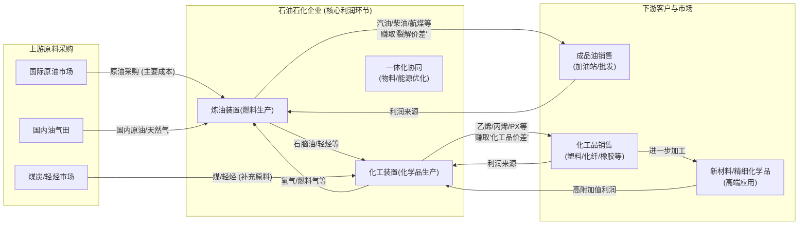
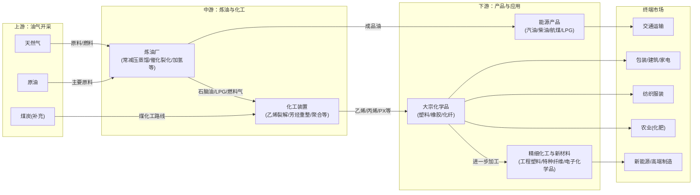

# 石油石化行业一页纸

> 生成时间: 2026-05-27 18:06
> 数据来源: Alpha派 Agent Mode 11（行业一页纸）
> 覆盖期货品种: BU, LU, PG, SC

---

[Agent 回答]
# 1.核心投资逻辑

石油石化行业的核心投资逻辑正在经历深刻的结构性重塑，从过去依赖成品油需求的周期性波动，转向由供给侧改革和下游需求结构变迁驱动的价值重估。

1.  **供给端：从无序扩张到存量优化，龙头企业护城河加深。**
    *   **国内政策强力约束**：“双碳”目标和“反内卷”政策正成为行业供给的“硬约束”[7a9744eb44b95b492873d238c598d08d_9][1]。国家对炼油总产能设置了10亿吨/年的上限[2]，并强制淘汰200万吨/年及以下的落后装置[3]，叠加对老旧装置的清查评估[4]，行业供给侧正加速出清。这改变了过去“劣币驱逐良币”的局面，为技术领先、规模化、一体化的大型企业腾出了市场空间和利润空间。
    *   **全球格局重塑**：欧洲、日韩等传统石化地区因高昂的能源成本和碳排放限制，正加速收缩其基础化工产能[5][6]。这为具备成本优势和全产业链优势的中国龙头企业提供了抢占全球市场份额的历史性机遇。

2.  **需求端：从“燃料”到“材料”，新需求打开增长天花板。**
    *   **结构性分化**：虽然交通燃油需求因新能源汽车的普及而面临增长瓶颈甚至萎缩[7]，但经济转型和消费升级带来了对高端化学品、新材料和专用化学品的强劲需求[8]。这些新需求（如新能源汽车轻量化材料、光伏胶膜原料、高端聚烯烃等）附加值更高，成长空间更大[9]。
    *   **“油转化”战略转型**：行业正从传统的“燃料型”炼厂向“化工型”甚至“材料型”炼厂转变[10]。通过原油直接裂解制化学品（COTC）、重油高效催化裂解（RTC）等先进技术，企业将更多的原油转化为高价值的化工产品，这不仅提升了产业链的价值，也有效对冲了成品油需求下滑的风险[7]。

**结论：** 行业的投资逻辑已转变为**“供给优化下的集中度提升”**与**“需求结构升级下的价值链重构”**。在此双重驱动下，具备**规模化、一体化、低成本和技术领先**优势的头部企业，将能够穿越周期，实现盈利中枢的系统性抬升和市场份额的持续扩大，享受行业格局优化和结构升级带来的超额收益。地缘政治冲突等外部因素则会加剧油价波动，进一步凸显上游资源型企业和产业链韧性强的龙头企业的稀缺价值[f3bf6ee9861b6e651358cffcfc08fd75_5]。

# 2.行业全景分析
## 2.1 行业定义和存在价值

石油石化行业是以石油、天然气、煤炭等为基础原料，生产汽油、柴油、航空煤油等燃料，以及乙烯、丙烯、芳烃等基础化工原料，并进一步加工成塑料、合成橡胶、合成纤维、化肥、医药中间体等各类化工产品的国民经济支柱产业[11][12]。

*   **所属产业**：能源化工产业，是制造业的上游。
*   **细分领域**：主要包括上游的油气勘探与开采，中游的炼油与石油化工，以及下游的精细化工、化工新材料等[13]。
*   **核心痛点与价值**：作为“工业的血液”，石油石化行业为现代社会提供了最基础的能源动力和物质材料，支撑着交通运输、工业生产、农业发展、国防安全乃至人们的衣食住行等方方面面，是维系现代文明运转不可或缺的基石[14][15]。
*   **重要时间节点**：
    *   **2025年**：是“十五五”规划的开局之年，也是多项节能降碳行动方案的关键节点，如原油一次加工能力控制在10亿吨以内，落后产能淘汰进入攻坚期[2][16]。
    *   **2030年**：是中国承诺的碳达峰年份，将对行业的能源结构、工艺路线和碳排放管理提出更严峻的挑战和更高的要求[17]。

## 2.2 行业发展历程

中国石油石化行业的发展大致可分为三个阶段：

1.  **初步发展与国家主导阶段（20世纪50年代-90年代）**：以满足国内基本能源需求为目标，建立了以“三桶油”（中石油、中石化、中海油）为主体的国家石油工业体系，初步形成炼油能力。
2.  **规模扩张与市场化改革阶段（2000年-2018年）**：随着中国加入WTO和经济高速增长，能源需求激增，行业进入大规模产能扩张期。市场化改革逐步推进，地方炼厂（“地炼”）兴起，但同时也出现了产能结构性过剩和低端竞争加剧的问题。
3.  **高质量发展与结构转型阶段（2019年至今）**：以大型民营炼化一体化项目投产为标志，行业进入新阶段。政策层面，“双碳”目标和“反内卷”成为核心导向，行业从追求规模扩张转向注重质量效益。技术上，“减油增化”、“油转化”成为主流趋势，产业重心向下游高附加值的新材料和精细化工品转移[7]。行业格局从“央企主导”演变为“央企主导、民企崛起、外资布局”的多元化竞争格局[18]。

## 2.3 商业模式解析

石油石化行业的核心商业模式是通过大规模、一体化的生产，将低价值的原油转化为高附加值的燃料和化工产品，赚取其中的加工利差和产品溢价。

*   **成本结构**：原油是最大的可变成本，占总成本的80%-90%。固定成本主要来自庞大生产装置的折旧、维护和人工等。
*   **利润驱动因素**：
    *   **规模效应**：千万吨级的炼化装置能显著降低单位生产成本。
    *   **一体化优势**：炼化一体化能够实现物料的循环利用和能量的梯级利用，优化资源配置，平抑单一产品价格波动的风险[19]。
    *   **技术领先**：掌握先进的催化剂技术、节能降碳技术和“油转化”等核心工艺，是获取超额利润的关键[8]。
    *   **原料多元化**：同时布局“油头”（石脑油裂解）、“煤头”（煤制烯烃）和“气头”（轻烃裂解）等多种原料路线，可以根据不同原料的价格波动灵活调整生产，实现成本最优化[19]。

## 2.4 行业政策

近年来，国家围绕“能源安全”、“双碳目标”和“高质量发展”出台了一系列关键政策，深刻影响着行业格局和发展方向。

 
| 政策名称/方向         | 发布机构     | 核心内容                                                                                                                         | 影响分析                                                              |
| :-------------- | :------- | :--------------------------------------------------------------------------------------------------------------------------- | :---------------------------------------------------------------- |
| **“双碳”目标及配套政策** | 中共中央、国务院 | 明确2030年碳达峰、2060年碳中和目标。全面实行碳排放总量与强度“双控”[20]。                                                    | 长期最核心的约束。倒逼行业进行绿色低碳转型，提升能效标准，高能耗、高排放的落后产能面临淘汰压力，为拥有先进节能技术的企业带来优势。 |
| **“反内卷”与供给侧优化** | 发改委、工信部等 | 严控新增炼油产能，淘汰落后产能，整治无序竞争[1]。推动老旧装置更新改造或退出[4]。                    | 加速行业供给侧出清，优化竞争格局，提升产业集中度。龙头企业凭借规模和技术优势，市场份额和议价能力将进一步增强。           |
| **能源安全与自主可控**   | 财政部、能源局等 | 通过税收优惠等政策支持海洋油气勘探开发和天然气进口[21]。强化油气勘探开发，推动关键核心技术攻关[22]。                  | 利好上游勘探开发企业（尤其是海洋油气）和相关油服、设备公司。保障产业链上游原料供应的稳定性。                    |
| **高质量发展与产业升级**  | 工信部、发改委等 | 推动石化行业向高端化、精细化、绿色化发展，鼓励发展化工新材料和高端专用化学品[23]。推动“减油增化”和炼化一体化[7]。 | 引导资本和资源投向高附加值领域，拥有强大研发能力和新材料布局的企业将获得新的增长动力。                       |

# 3.产业链深度解析
## 3.1 产业链图谱

## 3.2 上游：油气勘探与开采

*   **环节概述**：通过地质勘探、钻井等手段，将地下的原油和天然气开采出来，是整个产业链的起点，具有高风险、高投入、长周期的特点[13]。
*   **竞争格局**：国内市场由中石油、中石化、中海油“三桶油”主导，拥有绝大部分油气资源区块的开采权[24]。民营企业如中曼石油等通过获取海外油田或提供油田服务参与其中[25]。
*   **核心趋势**：
    *   **增储上产保安全**：为保障国家能源安全，国内油气勘探开发投资持续保持高位，产量稳步增长。2025年国内原油产量达2.16亿吨，创历史新高[26][17]。
    *   **走向深海与非常规**：陆上常规油气田开采难度加大，增量主要来自海洋油气（尤其是深水）和陆上页岩油气等非常规资源[26][27]。
*   **产业链地位**：资源为王，利润直接与国际油价挂钩。在高油价时期，上游环节是整个产业链中利润最丰厚的。成本传导能力最强，能充分享受油价上涨带来的红利[28][29]。

## 3.3 中游：炼油与石油化工

*   **环节概述**：将上游开采的原油通过一系列物理和化学过程，分离和转化成各种成品油和化工原料。这是产业链的价值转化中枢，技术密集、资本密集[30]。
*   **竞争格局**：呈现“央企主导、民企崛起”的多元化格局。中石油、中石化等央企占据主导地位，而恒力石化、荣盛石化等民营大炼化企业凭借新建装置的技术和规模优势，竞争力迅速提升，形成了三足鼎立的态势[2][31]。
*   **核心趋势**：
    *   **格局优化，强者恒强**：在政策推动下，小型低效炼厂加速退出，行业集中度持续提升。未来资源将加速向头部优势企业倾斜[2]。
    *   **技术驱动，价值提升**：从“炼油”到“炼化”，再到“油头、煤头、气头”三头并举，企业通过技术路径的多元化和产业链的延伸，不断提升产品附加值和抗风险能力[19]。
*   **产业链地位**：中游环节是本轮行业投资逻辑的核心。拥有**一体化、规模化、基地化、技术先进**的企业将构筑越来越高的壁垒。它们能以更低的成本生产更多样化、更高价值的产品，有效抵御原材料价格波动，并在行业整合中占据主导地位，利润弹性巨大。

## 3.4 下游：化工产品与终端应用

*   **环节概述**：将中游生产的基础化学品进一步加工成面向终端消费的各类产品，包括塑料制品、纺织品、日化用品、汽车配件等[32]。
*   **竞争格局**：下游领域极为广泛，市场参与者众多，竞争激烈，尤其是在大宗通用产品领域。但在高端、特种化学品领域，技术壁垒高，市场格局相对集中。
*   **核心趋势**：
    *   **需求升级倒逼产业升级**：新能源汽车、高端装备、电子信息等新兴产业的发展，对上游材料提出了更高性能的要求，如轻量化、高强度、耐高温等，倒逼聚烯烃等产品向高端化、差异化发展[9]。
    *   **成本传导不畅**：下游企业通常议价能力较弱，当上游原油价格大幅上涨时，成本压力难以完全传导至终端，利润空间受到挤压，导致部分企业减产甚至停产[33][34]。
*   **产业链地位**：下游是需求的最终体现，但利润受上游成本和终端消费意愿的双重挤压。长期来看，只有那些能够通过技术创新，开发出满足新兴需求、具有高附加值产品的企业，才能摆脱同质化竞争，获得稳定且丰厚的利润。

## 3.5 核心技术路线、演进趋势

*   **核心技术**：
    *   **炼油技术**：核心是催化裂化、加氢裂化等二次加工技术，目标是提高轻质油品和高价值产品的收率[7]。
    *   **化工技术**：核心是蒸汽裂解制乙烯/丙烯、催化重整制芳烃，以及茂金属催化剂等先进聚合技术，用于生产高性能聚合物[35]。
    *   **前沿技术**：原油直接制化学品（COTC/COTC+）、重油高效催化裂解（RTC）等，旨在跳过传统炼油路径，最大化化工品产出率，是“油转化”的关键[8]。
*   **技术演进趋势**：
    *   **当前阶段**：行业技术处于从成熟期向新一轮成长期过渡的阶段。传统炼油技术成熟，但“油转化”和绿色低碳技术（如CCUS、生物基材料、化学回收）正处于快速成长期[36]。
    *   **未来方向**：
        1.  **绿色化**：开发绿氢、生物燃料、可降解塑料等技术，推动化石能源与绿色能源协同发展[36]。
        2.  **高端化**：突破高端聚烯烃、特种工程塑料、碳材料等高附加值产业链的关键技术[37]。
        3.  **智能化**：应用人工智能（AI）、大数据、工业互联网等技术，实现从勘探、生产到销售全链条的智能化决策和优化，提升效率与安全水平[38]。

## 3.6 行业护城河分析

 
| 壁垒类型        | 具体表现                                                                                                   |
| :---------- | :----------------------------------------------------------------------------------------------------- |
| **资本壁垒**    | **极高**。建设一个千万吨级炼化一体化项目的投资额动辄上千亿元人民币，后续的运营和技术改造也需要持续的资本开支。                                              |
| **技术壁垒**    | 核心工艺包、高效催化剂、特种材料配方等构成关键技术壁垒。尤其在高端化工新材料领域，专利和专有技术是核心竞争力[39]。              |
| **政策/资质壁垒** | 新建炼化项目需经国家发改委等部门严格审批，并受到产能总量控制、能耗、环保等多重指标的严格约束。成品油销售也需要专门的经营许可。      |
| **规模壁垒**    | 规模效应是石化行业的核心竞争要素之一。大型装置的单位产品能耗、物耗和固定成本远低于小型装置，构筑了强大的成本护城河。                                             |
| **一体化壁垒**   | 从原油到终端化工品的完整产业链布局，使得企业能够灵活调整产品结构，对冲市场风险，实现内部物料和能源的最优配置，这是单一环节企业难以比拟的系统性优势[19]。 |
| **替代路径**    | 长期看，生物基材料、氢能等新能源路线是对传统石油化工路径的潜在替代，但目前仍处于发展初期，短期内无法形成大规模替代[17]。          |

# 4.市场空间测算
## 4.1 供需现状、核心假设

*   **供给现状**：
    *   中国原油一次加工能力在2025年已达9.68亿吨/年，接近10亿吨的政策上限，未来新增产能受严格控制[2]。
    *   行业供给侧改革持续深化，落后产能加速出清，供给结构不断优化[16]。
*   **需求现状**：
    *   成品油需求进入平台期，未来增长空间有限。
    *   化工品需求与宏观经济紧密相关，其中，大宗品需求温和复苏，而新材料、高端化学品等新兴领域需求保持较快增长[16]。
*   **核心假设**：
    1.  **油价假设**：地缘政治冲突常态化和全球供需紧平衡将支撑油价中枢维持高位。假设2026-2030年布伦特原油均价在**85美元/桶**的水平波动。
    2.  **产能假设**：国内原油总加工能力在2030年前稳定在**10亿吨/年**的上限内，实际加工量随需求温和增长。
    3.  **“油转化”率假设**：随着技术进步和新建/改造装置投产，原油转化为化学品（主要指乙烯、丙烯、芳烃三大类）的比例将显著提升。假设该比例从2025年的约15%提升至2030年的**25%**。
    4.  **价格传导假设**：假设乙烯、丙烯、PX等大宗化工品价格与原油价格保持较为稳定的历史价差关系。

## 4.2 市场规模测算

基于上述假设，我们测算核心石化产品（乙烯、丙烯、PX）的市场空间。

 
| 指标            | 单位       | 2025年 (E) | 2027年 (E) | 2030年 (E) | 测算逻辑与说明                           |
| :------------ | :------- | :-------- | :-------- | :-------- | :-------------------------------- |
| **原油加工量**     | 百万吨/年    | 980       | 990       | 1,000     | 逐步接近10亿吨产能上限，年均增长约0.5%。           |
| **化工品转化率**    | %        | 15.0%     | 20.0%     | 25.0%     | **核心驱动变量**。假设技术进步和新建装置推动转化率系统性提升。 |
| **化工原料总产量**   | 百万吨/年    | 147.0     | 198.0     | 250.0     | = 原油加工量 * 化工品转化率                  |
|               |          |           |           |           |                                   |
| **乙烯产量**      | 百万吨/年    | 55.9      | 75.2      | 95.0      | 假设乙烯在化工原料中占比稳定在38%。               |
| **乙烯均价**      | 美元/吨     | 1,100     | 1,150     | 1,200     | 基于85美元/桶油价及历史价差，并考虑供需改善带来的温和上涨。   |
| **乙烯市场规模**    | **十亿美元** | **61.5**  | **86.5**  | **114.0** | = 乙烯产量 * 乙烯均价                     |
|               |          |           |           |           |                                   |
| **丙烯产量**      | 百万吨/年    | 61.7      | 83.2      | 105.0     | 假设丙烯在化工原料中占比稳定在42%。               |
| **丙烯均价**      | 美元/吨     | 1,050     | 1,100     | 1,150     | 基于85美元/桶油价及历史价差，并考虑供需改善带来的温和上涨。   |
| **丙烯市场规模**    | **十亿美元** | **64.8**  | **91.5**  | **120.8** | = 丙烯产量 * 丙烯均价                     |
|               |          |           |           |           |                                   |
| **PX产量**      | 百万吨/年    | 44.1      | 59.4      | 75.0      | 假设PX在化工原料中占比稳定在30%。               |
| **PX均价**      | 美元/吨     | 1,200     | 1,250     | 1,300     | 基于85美元/桶油价及历史价差，并考虑供需改善带来的温和上涨。   |
| **PX市场规模**    | **十亿美元** | **52.9**  | **74.3**  | **97.5**  | = PX产量 * PX均价                     |
|               |          |           |           |           |                                   |
| **三大化工品合计规模** | **十亿美元** | **179.2** | **252.3** | **332.3** | -                                 |

**结论**：即使原油总加工量增长有限，但随着“油转化”战略的深入推进，核心化工品的产量和市场规模仍有巨大的增长空间。预计到2030年，仅乙烯、丙烯、PX三大类产品的市场规模就将超过**3300亿美元**，年复合增长率约**9%**，远高于行业整体增速。这部分增量将主要由技术领先的头部企业所分享。

# 5.市场竞争格局
## 5.1 核心玩家梯队

中国石油石化行业的竞争格局已从过去的“央企独大”演变为“央企、民企、外资”三元并存、激烈竞合的新阶段。

*   **第一梯队：全能型国家队**
    *   **代表企业**：中国石化、中国石油。
    *   **特点**：拥有从上游勘探开采、中游炼化到下游销售的完整产业链，规模巨大，在成品油市场占据绝对主导地位。近年来积极推动转型升级，加大化工品和新材料布局[40]。
*   **第二梯队：高效型民营巨头**
    *   **代表企业**：恒力石化、荣盛石化、东方盛虹、恒逸石化。
    *   **特点**：以世界级规模、最新工艺技术和极高的一体化程度为标志。机制灵活，成本控制能力强，专注于“原油-芳烃/烯烃-化纤/新材料”产业链，是推动行业“油转化”和技术进步的核心力量[16]。
*   **第三梯队：专业型及区域性企业**
    *   **代表企业**：中海油（侧重上游）、延长石油、以及部分具备特色产品优势的地方炼厂和化工企业。
    *   **特点**：在特定领域或区域市场具备优势，但整体规模和一体化程度与前两大梯队有差距。在行业整合趋势下，不具备核心竞争力的企业面临较大压力。

根据卓创资讯数据，2025年中国炼油行业呈现“两桶油为主、多元主体为辅”的格局，中石油、中石化占据主导地位。大型炼化一体化企业合计产能占全国总产能的46.18%[2]。

## 5.2 核心对比分析

 
| 对比维度     | 中国石化 (600028.SH)                                                    | 中国石油 (601857.SH)                            | 荣盛石化 (002493.SZ)                              | 恒力石化 (600346.SH)                                  |
| :------- | :------------------------------------------------------------------ | :------------------------------------------ | :-------------------------------------------- | :------------------------------------------------ |
| **企业类型** | 中央企业                                                                | 中央企业                                        | 民营企业                                          | 民营企业                                              |
| **核心优势** | 国内最大炼油商，拥有最完善的成品油销售网络，化工品类齐全。                                       | 国内最大油气生产商，天然气全产业链优势突出，资源禀赋雄厚。               | 控股全球单体最大的浙石化炼化项目，成本优势和规模优势极强，产品结构丰富。          | 全球领先的“原油-PX-PTA-聚酯”全产业链龙头，一体化程度极高，运营效率领先。         |
| **技术路线** | 积极推进“油转化”，布局高端合成材料，但存量装置转型压力较大。                                     | 同样推进“减油增化”，在乙烯、合成树脂等领域有深厚积累。                | 装置新、技术先进，化工品收率高，在EVA、PC等新材料领域布局领先。            | 率先打通全产业链，实现“一滴油到一根丝”，成本控制做到极致。                    |
| **盈利模式** | 炼油、化工、销售、勘探四大板块贡献利润，业绩与油价呈倒V型关系[40]。 | 上游勘探和天然气业务是利润压舱石，受高油价正面影响大。                 | 主要赚取“原油-化工品/新材料”的加工价差，盈利弹性巨大。                 | 主要赚取全产业链的协同利润，盈利能力相对稳定且强大。                        |
| **综合评价** | **“大象转身”的行业稳定器**。规模庞大，转型虽有阵痛但方向明确，受益于行业整体复苏。                        | **“资源为王”的能源巨擘**。在高油价和天然气景气周期中最为受益，是能源安全的基石。 | **“成本杀手”与“规模之王”**。凭借极致的规模和成本优势，在行业洗牌中将持续扩大份额。 | **“一体化典范”**。通过产业链的深度整合构筑了难以逾越的护城河，盈利能力和抗风险能力行业顶尖。 |

# 6.重点投资标的分析

## 6.1 中国海油 (600938.SH)：纯粹的上游资源龙头，高油价的最大受益者

*   **业务布局**：公司是中国最大的海上原油及天然气生产商，业务聚焦于上游的勘探、开发和生产。拥有国内海上油气独家经营权，并在圭亚那等海外地区拥有丰富的优质资源储备[41]。
*   **投资逻辑**：作为纯上游企业，公司业绩与国际油价高度正相关，是油价上涨最具弹性的标的。其生产成本在全球范围内具备显著优势，桶油成本低，使得公司在任何油价水平下都能保持高盈利能力。持续的增储上产计划和高股息政策使其兼具成长性与防御性。

## 6.2 荣盛石化 (002493.SZ)：全球级炼化航母，新材料布局打开新空间

*   **业务布局**：公司通过控股的浙江石油化工有限公司（浙石化）运营着4000万吨/年的炼化一体化项目，是全球规模最大、最先进的炼化基地之一。产业链从原油延伸至芳烃、烯烃，再到聚酯、EVA、聚碳酸酯等多种新材料，产品矩阵极为丰富[16]。
*   **投资逻辑**：公司是“油转化”趋势最彻底的践行者和受益者。其世界级的规模带来了极致的成本优势，而先进的工艺技术使其能够生产高附加值的化工品和新材料。在行业供给侧改革、落后产能出清的背景下，荣盛石化将凭借其强大的竞争力持续抢占市场份额，盈利能力有望在行业景气复苏周期中展现巨大弹性。

## 6.3 卫星化学 (002648.SZ)：轻烃裂解龙头，成本优势显著

*   **业务布局**：公司是国内轻烃裂解领域的龙头企业，专注于C2（乙烷）、C3（丙烷）产业链。通过从美国进口低成本乙烷，裂解生产乙烯，并向下游延伸至环氧乙烷、乙二醇、聚乙烯以及丙烯酸及酯等产品。
*   **投资逻辑**：公司的核心护城河在于其独特的“气头”原料路线。乙烷裂解制乙烯的成本通常显著低于传统的石脑油裂解路线，尤其在高油价时期，其成本优势愈发突出[5][6]。公司通过签订长期乙烷采购合同锁定了低成本原料，构筑了强大的成本壁垒。随着新项目的持续投产，公司成长性明确。

## 6.4 悦龙科技 (832090.BJ)：极端工况柔性管道专家，受益油气开采景气

*   **业务布局**：公司专注于极端工况下的柔性管道研发与生产，产品广泛应用于海洋油气钻采、陆地页岩油气开发等领域。其高压钻探软管、柔性压裂软管等核心产品打破了国外垄断，技术水平全球领先[26]。
*   **投资逻辑**：作为油气开采装备产业链上的“小巨人”，悦龙科技直接受益于国内外油气勘探开发资本支出的增加。其产品技术壁垒高，尤其在海洋工程和超高压压裂领域具备稀缺性，部分产品在国内无直接竞争对手。随着国家能源安全战略推进和海陆油气开采持续景气，公司产能扩张将有效兑现业绩增长[26]。

## 6.5 投资价值综合对比

 
| 环节     | 公司名称     | 股票代码      | 稀缺性/卡位                         | 行业布局与受益逻辑                                           | 利润弹性    |
| :----- | :------- | :-------- | :----------------------------- | :-------------------------------------------------- | :------ |
| **上游** | **中国海油** | 600938.SH | **高**：国内海上油气资源垄断者，成本优势全球领先。    | 纯上游油气开采业务，直接、充分受益于高油价环境，是油价上涨的最佳弹性标的。               | **超额**  |
| **上游** | **中国石油** | 601857.SH | **高**：国内最大油气生产商，天然气全产业链龙头。     | 上游业务受益于高油价，庞大的天然气业务提供稳定现金流，是国家能源安全的压舱石。             | **超额**  |
| **中游** | **荣盛石化** | 002493.SZ | **高**：拥有全球单体最大、技术最先进的炼化一体化项目。  | 深度践行“油转化”，成本和规模优势极致。在行业供给优化周期中，将最大化分享集中度提升和景气复苏的红利。 | **超额**  |
| **中游** | **恒力石化** | 600346.SH | **高**：全球首个打通“原油-化工-化纤”全产业链的企业。 | 极致一体化带来强大成本控制和抗风险能力，盈利能力稳定。受益于PX-PTA-聚酯链的景气修复。      | **超额**  |
| **中游** | **中国石化** | 600028.SH | **中**：国内最大炼化企业和成品油销售商。         | 规模巨大，产业链完整。业绩受益于行业整体景气度回升，但上游成本压力与下游需求博弈，弹性相对平稳。    | **无超额** |
| **中游** | **卫星化学** | 002648.SZ | **高**：国内C2/C3轻烃裂解的绝对龙头。        | 锁定低成本乙烷原料，在高油价背景下成本优势显著，是典型的技术和资源卡位型公司。             | **超额**  |
| **设备** | **悦龙科技** | 832090.BJ | **高**：极端工况柔性管道细分领域冠军，技术壁垒高。    | 直接受益于上游油气勘探开发投资景气度提升，国产替代空间广阔。                      | **超额**  |

[引用来源 72 条]
  1. [内资研报] 化工行业政府工作报告学习体会 (2026-03-06)
  2. [内资研报] 化工行业2026年度策略：行业周期拐点已近，新材料蓄势腾飞 (2026-01-28)
  3. [内资研报] 石油石化行业深度报告：当前时点看民营大炼化的再估值 (2026-01-19)
  4. [内资研报] 化工行业2026年度策略：行业周期拐点已近，新材料蓄势腾飞 (2026-01-28)
  5. [内资研报] 化工行业周报：国际油价下跌，草甘膦、安赛蜜价格上涨 (2026-04-12)
  6. [内资研报] 化工行业周报：国际油价上涨，草甘膦、维生素价格下跌 (2026-05-18)
  7. [social_media] 我国石化行业发展困境及“十五五”趋势展望 (2026-04-25)
  8. [social_media] 我国石化行业发展困境及“十五五”趋势展望 (2026-04-25)
  9. [公司公告] 岳阳兴长(000819.SZ):2025年年度报告 (2026-04-21)
  10. [social_media] 我国石化行业发展困境及“十五五”趋势展望 (2026-04-19)
  11. [social_media] 我国石化行业发展困境及“十五五”趋势展望 (2026-04-25)
  12. [内资研报] 石油化工行业11月动态报告：油价震荡偏弱，聚焦“反内卷”主线 (2025-12-03)
  13. [内资研报] 石油化工行业3月动态报告：油价高位波动，关注石油替代路线 (2026-04-02)
  14. [social_media] 影响世界经济命脉！石油&四次石油战争爆发--解析 (2026-03-02)
  15. [内资研报] 石油化工行业12月动态报告：油价重心下探，聚焦化工投资主线 (2025-12-29)
  16. [内资研报] 石油化工行业4月动态报告：油价高位运行，石油替代路线高景气延续 (2026-04-30)
  17. [内资研报] 化工行业2026年度策略：行业周期拐点已近，新材料蓄势腾飞 (2026-01-28)
  18. [内资研报] 2026年石化行业策略报告：上游油价触底、下游供给侧优化加速，产业链有望迎来共振周期 (2025-12-12)
  19. [路演纪要] 中金公司周期行业研讨会 | 石化化工行业十五五规划和反内卷（傅向升） (2026-02-28)
  20. [social_media] 我国石化行业发展困境及“十五五”趋势展望 (2026-04-25)
  21. [公司公告] 镇海股份(603637.SH):镇海石化工程股份有限公司2025年年度报告全文 (2026-04-17 00:00:00)
  22. [公司公告] 东方盛虹(000301.SZ):2025年年度报告 (2026-04-29)
  23. [social_media] 我国石化行业发展困境及“十五五”趋势展望 (2026-04-25)
  24. [公司公告] 东方盛虹(000301.SZ):2025年年度报告 (2026-04-29)
  25. [内资研报] 化工行业政府工作报告学习体会 (2026-03-06)
  26. [内资研报] 化工行业2026年度策略：行业周期拐点已近，新材料蓄势腾飞 (2026-01-28)
  27. [social_media] 我国石化行业发展困境及“十五五”趋势展望 (2026-04-25)
  28. [路演纪要] 光大石化化工交运 | 一期一会第169期：降碳提质加速，石化化工行业价值重估进行时 (2026-04-26)
  29. [内资研报] 石油石化行业政策点评：税收优惠政策支持海洋油气开发及天然气进口利用 (2026-02-26)
  30. [公司公告] 海油发展(600968.SH):2025年年度报告 (2026-03-25)
  31. [内资研报] 石油化工行业3月动态报告：油价高位波动，关注石油替代路线 (2026-04-02)
  32. [social_media] 影响世界经济命脉！石油&四次石油战争爆发--解析 (2026-03-02)
  33. [social_media] 第301期 | 拆解上市公司：中国石油 (2026-03-03)
  34. [公司公告] 中曼石油(603619.SH):中曼石油2025年年度报告 (2026-04-15)
  35. [路演纪要] 中金公司周期行业研讨会 | 石化化工行业十五五规划和反内卷（傅向升） (2026-02-28)
  36. [social_media] 核心技术铸就领先地位，三桶油关键设备供应商悦龙科技成功上市 (2026-03-30)
  37. [social_media] 核心技术铸就领先地位，三桶油关键设备供应商悦龙科技成功上市 (2026-03-30)
  38. [social_media] 定档五月北京！2026中国石油石化节能提效绿色低碳技术交流大会即将召开 (2026-04-17)
  39. [social_media] 危中有机：油价冲击下的行业配置 (2026-03-25)
  40. [social_media] 国泰海通·策略前瞻丨危中有机：油价冲击下的行业配置 (2026-03-25)
  41. [social_media] 【招商策略】A股调整机制及见底信号，地缘博弈与应对策略——A股投资策略周报（0321） (2026-03-22)
  42. [内资研报] 化工行业2026年度策略：行业周期拐点已近，新材料蓄势腾飞 (2026-01-28)
  43. [social_media] 中国PX市场竞争形势及竞争状态分析 (2026-04-29)
  44. [内资研报] 化工行业2026年度策略：行业周期拐点已近，新材料蓄势腾飞 (2026-01-28)
  45. [公司公告] 东方盛虹(000301.SZ):2025年年度报告 (2026-04-29)
  46. [social_media] 一文吃透一个热点题材｜霍尔木兹海峡动荡，如何搅动全球石油油气市场？ (2026-04-03)
  47. [公司公告] 岳阳兴长(000819.SZ):2025年年度报告 (2026-04-21)
  48. [social_media] 美伊冲突对中国产业链的影响：哪些受损？哪些受益？ (2026-04-27)
  49. [social_media] 原油上涨--中下游被迫减产停产 (2026-03-18)
  50. [social_media] 我国石化行业发展困境及“十五五”趋势展望 (2026-04-25)
  51. [social_media] 官宣！“十大”揭晓！ (2026-02-09)
  52. [social_media] 我国石化行业发展困境及“十五五”趋势展望 (2026-04-25)
  53. [social_media] 能源化工行业市场洞察 (2026-05-02)
  54. [social_media] 能源化工行业市场洞察 (2026-05-02)
  55. [公司公告] 三旺通信(688618.SH):深圳市三旺通信股份有限公司2025年年度报告 (2026-04-30 00:00:00)
  56. [路演纪要] 中金公司周期行业研讨会 | 石化化工行业十五五规划和反内卷（傅向升） (2026-02-28)
  57. [公司公告] 东方盛虹(000301.SZ):2025年年度报告 (2026-04-29)
  58. [公司公告] 三旺通信(688618.SH):深圳市三旺通信股份有限公司2025年年度报告 (2026-04-30 00:00:00)
  59. [内资研报] 石油化工行业3月动态报告：油价高位波动，关注石油替代路线 (2026-04-02)
  60. [内资研报] 化工行业2026年度策略：行业周期拐点已近，新材料蓄势腾飞 (2026-01-28)
  61. [内资研报] 2026年石化行业策略报告：上游油价触底、下游供给侧优化加速，产业链有望迎来共振周期 (2025-12-12)
  62. [内资研报] 2026年石化行业策略报告：上游油价触底、下游供给侧优化加速，产业链有望迎来共振周期 (2025-12-12)
  63. [路演纪要] 光大石化化工交运 | 一期一会第166期：布油100美元/桶，三桶油受益几何？ (2026-04-06)
  64. [内资研报] 2026年石化行业策略报告：上游油价触底、下游供给侧优化加速，产业链有望迎来共振周期 (2025-12-12)
  65. [内资研报] 化工行业2026年度策略：行业周期拐点已近，新材料蓄势腾飞 (2026-01-28)
  66. [路演纪要] 光大石化化工交运 | 一期一会第166期：布油100美元/桶，三桶油受益几何？ (2026-04-06)
  67. [机构点评] 油公司估值仍存修复空间【原油价格存在强支撑，26-28年供需进入再平衡】 (2026-02-24)
  68. [内资研报] 2026年石化行业策略报告：上游油价触底、下游供给侧优化加速，产业链有望迎来共振周期 (2025-12-12)
  69. [内资研报] 化工行业周报：国际油价下跌，草甘膦、安赛蜜价格上涨 (2026-04-12)
  70. [内资研报] 化工行业周报：国际油价上涨，草甘膦、维生素价格下跌 (2026-05-18)
  71. [social_media] 核心技术铸就领先地位，三桶油关键设备供应商悦龙科技成功上市 (2026-03-30)
  72. [social_media] 核心技术铸就领先地位，三桶油关键设备供应商悦龙科技成功上市 (2026-03-30)
