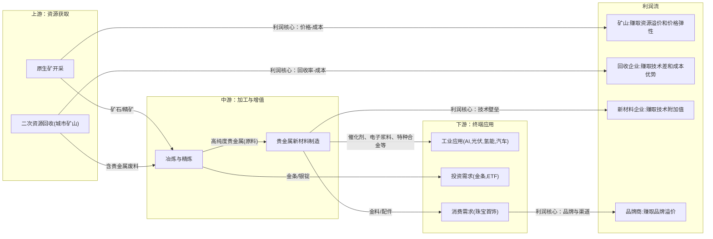
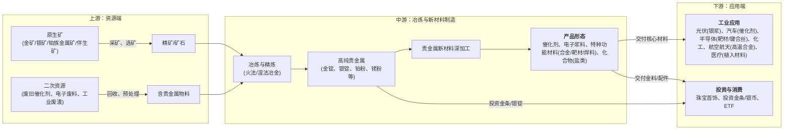

# 贵金属行业一页纸

> 生成时间: 2026-05-27 18:09
> 数据来源: Alpha派 Agent Mode 11（行业一页纸）
> 覆盖期货品种: AG, AU

---

[Agent 回答]
# 1. 核心投资逻辑

贵金属行业的投资逻辑正经历深刻的结构性重塑，其核心驱动力源于**需求端的结构性爆发**与**供给端的长期刚性约束**共同作用形成的供需错配，这不仅推升了贵金属的金融避险价值，更开启了其作为关键工业“维生素”的成长新周期。

1.  **需求侧：金融与工业属性共振，开启“戴维斯双击”**
    *   **金融属性重估（需求之“锚”）：** 在全球去美元化、地缘政治冲突常态化以及主权信用货币体系面临长期挑战的宏观背景下，全球央行连续增持黄金，将其作为战略储备的核心资产[1]。这种由官方机构主导的、非价格敏感的结构性需求，为贵金属（尤其是黄金）提供了坚实的价值底部，其逻辑已从传统的“抗通胀”升级为对冲法币体系系统性风险的“替代货币”[2]。
    *   **工业需求爆发（成长之“翼”）：** 技术革命正为贵金属开辟全新的、高增长的应用场景。
        *   **白银：** 成为AI与新能源革命的“卖铲人”。AI数据中心对高速、低耗能运算的极致追求，激增了对含银连接器、半导体封装等组件的需求[3]。同时，光伏产业作为能源转型的主力，其核心材料光伏银浆的需求随装机量持续增长[4]。
        *   **铂族金属（PGMs）：** 深度赋能氢能产业。铂（Pt）和铱（Ir）是燃料电池和PEM电解水制氢技术中不可或缺的催化剂，其需求与氢能产业的商业化进程深度绑定[4]。

2.  **供给侧：原生矿产增长乏力，二次资源战略地位凸显**
    *   **原生矿供给刚性：** 全球优质、易开采的贵金属矿产资源日益枯竭，新矿勘探发现难度和成本大幅增加。行业进入“弱供给周期”，深井开采成为常态，资本开支巨大但产量增长有限[5][6]。此外，许多贵金属（如白银、铂族金属）是铜、镍等基础金属的伴生矿，其供给受制于主金属的开采计划，缺乏独立弹性[7]。
    *   **二次资源（城市矿山）重要性提升：** 在原生矿供给受限和资源安全战略驱动下，从废旧催化剂、电子废料中回收贵金属的“城市矿山”模式，正从补充渠道上升为核心供应来源。尤其对于中国这样铂族金属对外依存度超80%的国家，二次资源循环利用是保障产业链安全的关键[8]。

综上，贵金属行业正站在新一轮长期牛市的起点。其投资价值不再仅仅是宏观避险的单一叙事，而是叠加了**新质生产力**驱动的、具备高成长弹性的工业需求。供需基本面的持续紧张（如白银市场已连续多年供应赤字[1]），预示着价格中枢将结构性上移，产业链利润向上游资源端和掌握核心回收技术的中游企业集中，具备资源禀赋和技术壁垒的公司将充分享受行业增长的超额收益。

# 2. 行业全景分析
## 2.1 行业定义和存在价值

*   **专业名词定义：** 贵金属（Precious Metals）通常指金（Au）、银（Ag）和铂族金属（PGMs），其中铂族金属包括铂（Pt）、钯（Pd）、铑（Rh）、钌（Ru）、铱（Ir）、锇（Os）共6种。它们因在地壳中含量稀少、性质稳定、价格昂贵而得名。
*   **产业归属与细分：** 贵金属行业隶属于有色金属产业，是新材料领域的重要分支。其产业链可细分为三大板块：
    1.  **贵金属新材料制造：** 将提纯后的贵金属加工成催化材料、功能材料、信息材料、特种材料等，服务于下游各行各业[4]。
    2.  **贵金属资源循环利用：** 从工业废料、报废产品等二次资源中回收提纯贵金属，是“城市矿山”的核心实践[9]。
    3.  **贵金属供给服务：** 包括贵金属的贸易、租赁、套期保值等，为产业链提供原料保障和金融服务[9]。
*   **重要时间节点：**
    *   **2025-2027年：** 《黄金产业高质量发展实施方案》的政策窗口期，重点推动产业升级和资源回收体系完善[10]。
    *   **“十五五”期间（2026-2030年）：** 国家将制定循环经济发展规划，稀贵金属回收利用是重点部署方向，行业将迎来规范化、规模化发展的关键时期[11]。同时，黄金行业将聚焦深井开采等技术瓶颈的突破[6]。
*   **核心价值与痛点解决：**
    *   **对冲信用风险：** 作为超越主权信用的“硬通货”，贵金属是抵御法币贬值、通货膨胀和金融系统性风险的终极价值储存手段。
    *   **赋能科技创新：** 凭借其独特的光、电、催化、稳定性等物理化学性质，贵金属是现代工业不可或缺的“维生素”[12]。从汽车尾气净化到半导体芯片制造，再到光伏发电和氢燃料电池，贵金属解决了诸多高精尖领域中其他材料无法胜任的性能难题，是推动技术进步的关键功能材料[4]。

## 2.2 行业发展历程

贵金属行业的发展史是一部货币金融史与工业技术史的交织。

*   **古代至1971年（货币化阶段）：** 数千年来，黄金和白银主要作为货币和财富象征。其价值由共识和稀缺性决定。
*   **1971年-2000年（金融化与工业化起步）：** 布雷顿森林体系瓦解后，黄金与美元脱钩，价格开始自由浮动，金融属性凸显。同时，其工业应用开始萌芽，例如在电子和化工领域的初步应用。
*   **2001年-2020年（工业应用深化与投资普及）：** 随着全球化和科技发展，贵金属在汽车催化、电子信息、医疗等领域的应用不断深化。同时，黄金ETF等投资工具的出现，极大地降低了普通投资者的参与门槛。
*   **2021年至今（结构性重塑阶段）：** 行业迎来关键拐点。**宏观层面**，全球地缘政治格局重塑和“去美元化”趋势，使黄金的战略储备价值被重新认识，全球央行开启持续购金潮[1]。**产业层面**，以“双碳”目标为核心的能源革命（光伏、氢能）和以AI为代表的新一轮科技革命，为白银和铂族金属创造了巨大的、结构性的新增需求，行业增长逻辑从周期性波动转向长期成长。

## 2.3 商业模式解析

贵金属行业的利润核心驱动力在于**资源掌控能力**和**技术附加值**。不同环节的盈利模式差异显著。

*   **成本结构与利润驱动：**
    *   **上游矿山企业：** 利润主要来源于“（金属价格 - 综合开采成本）* 产量”。其盈利对金属价格的弹性最大，核心是拥有低成本、长周期的优质矿产资源。
    *   **中游冶炼与新材料企业：** 利润来源多元化。一是通过冶炼赚取加工费；二是通过技术研发，将贵金属加工成高附加值的新材料（如催化剂、电子浆料），赚取远高于金属本身价值的“技术溢价”[13]。
    *   **资源回收企业：** 利润来源于“（回收金属价值 - 回收成本 - 废料采购成本）”。核心竞争力在于高效、环保的回收技术和稳定的废料来源渠道。其回收成本通常比原生矿开采低15%-20%，在价格高位时利润空间更大[13]。
    *   **下游品牌商（如珠宝）：** 利润来源于“（零售价 - 原料成本 - 加工费）”，主要赚取品牌溢价、设计价值和渠道利润。

*   **商业模式图：**

## 2.4 行业政策
近年来，中国围绕贵金属行业的政策导向清晰，旨在**保障资源安全、推动产业升级、规范市场秩序**。

 
| 政策名称                                                                                        | 发布部门        | 发布时间     | 核心内容与影响                                                                                                     |
| ------------------------------------------------------------------------------------------- | ----------- | -------- | ----------------------------------------------------------------------------------------------------------- |
| **《黄金产业高质量发展实施方案(2025—2027 年)》**[10][14] | 工业和信息化部等九部门 | 2025年6月  | **鼓励二次资源回收：** 明确支持从废催化剂、电子废弃物、退役光伏组件中回收金银。**影响：** 为贵金属回收行业提供了顶层设计和政策支持，利好拥有合规回收能力的企业。                       |
| **《固体废物综合治理行动计划》及“十五五”循环经济规划**[11]                                 | 国务院、国家发改委   | 2026年1月  | **提升战略地位：** 将稀贵金属回收利用作为循环经济发展的重点任务进行部署。**影响：** 标志着贵金属回收从环保产业提升至国家资源安全战略层面，行业将迎来更大力度的支持和更严格的监管，加速向规模化、高值化发展。 |
| **《关于黄金有关税收政策的公告》**[15]                                     | 财政部、国家税务总局  | 2025年11月 | **规范税收体系：** 调整黄金增值税政策，改变了行业的成本核算与利润分配机制。**影响：** 增加了不合规企业的成本，市场资源向合规经营的头部企业集中，加速了黄金珠宝行业的洗牌。                  |
| **《矿产资源法》（修订）**[16]                                          | 国务院常务会议审议通过 | 2026年5月  | **强化战略管控：** 将锂、稀土、钨等列为战略性矿产，新矿权审批上收，严格审查，旨在保障国内供应链安全。**影响：** 提升了上游资源的准入门槛，利好拥有核心矿产资源的大型企业，行业集中度将进一步提升。      |

# 3. 产业链深度解析
## 3.1 产业链图谱

## 3.2 上游：资源为王，回收崛起
上游是整个产业链的价值源头，利润弹性最大。格局正从单纯的“资源占有”向“资源掌控+技术回收”并重转变。

*   **竞争格局：** 原生矿开采领域，行业集中度高，由少数大型矿业集团主导，如紫金矿业、山东黄金等。二次资源回收领域，市场相对分散，但随着环保监管趋严和技术门槛提高，市场份额正向贵研铂业、浩通科技等具备核心技术和合规资质的头部企业集中[8][17]。
*   **发展趋势：**
    1.  **资源品质下降，技术重要性凸显：** 随着高品位矿的枯竭，如何从低品位、难处理的共伴生矿中低成本、环保地提取贵金属，成为核心竞争力[6]。
    2.  **回收成为战略保障：** “城市矿山”的价值被重估，其不仅是原生矿的补充，更是保障供应链安全、实现碳中和的关键环节。全产业链布局、拥有稳定回收渠道的企业护城河将越来越深。
*   **产业链地位：** 绝对的核心。上游的供给状况直接决定了整个产业链的成本和景气度。在当前供给偏紧的格局下，上游企业拥有最强的议价能力，产业链利润呈现向上游聚集的态势[18]。

## 3.3 中游：技术驱动，材料为先
中游是技术密集型环节，是连接“资源”与“应用”的桥梁，其价值创造的核心在于技术附加值。

*   **竞争格局：** 全球市场由优美科、庄信万丰、贺利氏等国际巨头主导，它们凭借深厚的技术积累和专利壁垒占据高端市场[8]。国内以贵研铂业为代表的企业，依托国家级研发平台，正加速在催化材料、高纯材料等领域实现国产替代，追赶国际先进水平[4]。
*   **技术升级趋势：**
    1.  **从“提纯”到“创造”：** 业务重心从单纯的金属精炼，转向基于客户需求开发特定功能的贵金属新材料，如更高催化活性的单原子催化剂、更低银耗的光伏银浆、满足5G射频芯片要求的高性能材料等[4]。
    2.  **闭环产业链优势：** 能够实现“二次资源回收→原料精炼→材料制备→器件制造→废料回收”闭环模式的企业，不仅能有效对冲原料价格波动风险，还能为客户提供一站式解决方案，客户粘性极强，壁垒持续增高[13]。
*   **产业链地位：** 战略卡位环节。中游的技术水平决定了一个国家贵金属产业的最终高度。掌握核心材料技术的企业，能够深度绑定下游高端客户，即使在上游资源涨价时，也能通过技术溢价传导成本，保持稳定的盈利能力。

## 3.4 下游：应用多元，需求分化
下游是需求的最终体现，呈现出传统领域稳健、新兴领域爆发的特点。

*   **竞争格局：** 珠宝首饰领域，品牌、渠道和设计是核心竞争力，市场集中度正在提升，从渠道为王转向品牌为王[19]。工业应用领域，客户多为各行业的龙头企业，对供应商有严格的认证体系，一旦进入供应链则合作关系稳定。
*   **需求趋势：**
    1.  **工业需求结构性增长：** 新能源（光伏、氢能）、新一代信息技术（AI、半导体）、高端装备（航空航天）等战略性新兴产业成为贵金属需求增长的核心引擎[20]。
    2.  **投资需求逻辑转变：** 居民购买黄金的心态从“短期投机”转变为“长期资产配置”，对实物金条等投资产品的需求韧性增强[15]。
    3.  **消费需求高端化：** 黄金珠宝消费从“买重量”转向“买工艺、买设计”，高工艺附加值产品更受欢迎[19]。
*   **产业链地位：** 需求拉动引擎。下游新兴领域的需求爆发是驱动本轮贵金属行业景气周期的核心变量。然而，下游企业（尤其是加工制造业）在产业链中议价能力相对较弱，面临着上游原材料成本上涨的压力[21]。

## 3.5 核心技术路线、演进趋势

*   **核心技术拆解：**
    *   **资源端：**
        *   **绿色选矿技术：** 如“低毒环保型贵金属浸出剂技术”，替代传统高污染的氰化法，解决环保痛点，已达到国际先进水平[22]。
        *   **二次资源综合回收技术：** 针对不同来源（如汽车尾气催化剂、石化催化剂、电子废料）的复杂物料，开发高效、精准、绿色的分离提纯工艺，回收率是核心指标（行业领先水平可超98%）。
    *   **材料端：**
        *   **催化材料技术：** 核心在于通过纳米化、合金化、单原子化等手段，在保证催化活性的前提下，尽可能降低贵金属（尤其是铂、铑）的用量，即“降铂/降铑”技术[4]。
        *   **高纯材料制备技术：** 满足半导体、航空航天等尖端领域对5N（99.999%）甚至6N级高纯贵金属的需求[13]。
        *   **特种功能材料制备技术：** 如用于航空发动机的铂铱合金、用于核反应堆的银基中子吸收体、用于3D打印的球形金粉等，涉及复杂的合金设计、组织性能控制和精密成型工艺[23][24]。

*   **技术演进趋势：** 当前行业技术处于从**成长期向成熟期过渡**的阶段，但新兴应用不断催生新的技术需求。
    *   **演进方向：** **“四化”趋势**——**绿色化**（环保工艺）、**高效化**（提高回收率和催化效率）、**高值化**（从材料到器件）、**智能化**（AI驱动新材料研发[4]）。
    *   **研发重点与难点：** 核心目标是“少用、高效、长效”[4]。难点在于如何在降低贵金属用量、控制成本的同时，保证甚至提升材料在严苛工况下的性能和稳定性，并解决其规模化生产和回收再利用的难题。

## 3.6 行业护城河分析

 
| 壁垒类型        | 具体表现与分析                                                                                                                                                          |
| ----------- | ---------------------------------------------------------------------------------------------------------------------------------------------------------------- |
| **技术壁垒**    | **极高。** 核心体现在中游新材料制造和二次资源回收环节。涉及大量专利、专有技术（Know-how）和持续的高研发投入。例如，贵金属催化剂的配方和制备工艺、从复杂废料中高效分离提纯多种贵金属的技术，是企业数十年研发沉淀的结果，新进入者难以在短期内复制[4]。    |
| **资本壁垒**    | **高。** 上游矿山开采需要巨额的前期勘探和建设投资。中游冶炼、回收和新材料生产线同样是重资产投入，且需要大量流动资金用于贵金属原料的周转[8]。                                                            |
| **市场/渠道壁垒** | **高。** **工业领域：** 下游客户（如汽车、半导体、航空航天）对材料供应商有极其严格且漫长的认证周期，一旦进入其供应链体系，合作关系非常稳固，形成强大的客户粘性。**回收领域：** 建立稳定、合规、规模化的二次资源回收网络需要长期积累和渠道深耕。                                  |
| **规模壁垒**    | **中高。** 在冶炼和回收环节，规模效应可以显著摊薄固定成本，提升盈利能力。在资源获取上，规模大的企业议价能力更强。                                                                                                      |
| **政策/资质壁垒** | **高。** 矿产开采需获得采矿许可证。二次资源回收属于危险废物经营，需要国家颁发的危废处理牌照，环保监管标准极高，是限制新进入者的重要门槛[25]。此外，部分涉及国防军工的贵金属材料生产需要军工资质。                                   |
| **替代路径**    | **有限。** 在许多核心应用场景，贵金属的催化、导电、耐腐蚀等性能是不可替代的[4]。虽然“降贵”和寻找替代材料是长期研发方向，但在可预见的未来，尤其是在高性能要求领域，贵金属的“技术锁定效应”依然牢固[26]。 |

# 4. 市场空间测算
## 4.1 供需现状、核心假设

*   **供给现状：**
    *   **原生矿供给：** 全球矿产银供给增长乏力，预计2025年全球矿产银产量仅增长2%至835百万盎司[27]。铂族金属供给高度集中于南非、俄罗斯等地，易受地缘政治和生产扰动影响[28]。
    *   **二次资源供给：** 占比稳步提升，2024年全球铂族金属二次资源回收量占比已达24.2%[9]。回收供给的增长依赖于存量产品的报废周期和回收体系的完善。
    *   **结论：** 整体供给端缺乏弹性，难以匹配需求的快速增长。

*   **需求现状：**
    *   **工业需求是主要驱动力：** 2024年，工业需求占中国贵金属总需求量的47.9%，五年间增长了63.7%[9]。
    *   **白银：** 连续多年出现供应赤字[1]。光伏和电子电气是主要增长点。
    *   **铂族金属：** 汽车尾气催化剂仍是基本盘，氢能是未来最大的想象空间。
    *   **黄金：** 投资需求（央行购金、个人配置）是主导价格的核心变量。

*   **核心假设：**
    1.  **新兴产业高增长持续：** 假设全球光伏新增装机量、AI数据中心建设、氢燃料电池汽车渗透率在未来5年保持高速增长。
    2.  **贵金属单耗下降（技术进步效应）：** 考虑技术进步带来的“节约化”（Thrifting）效应，假设光伏电池、汽车催化剂等领域的贵金属单位消耗量逐年小幅下降。
    3.  **价格中枢上移：** 鉴于持续的供需缺口，假设贵金属（以白银为例）价格在未来几年温和上涨。
    4.  **数据基准：** 以2024年全球白银需求数据为基础进行测算。根据《世界白银调查2025》，2024年全球白银总供给为1015.1百万盎司[27]。

## 4.2 市场规模测算

以**白银**为例，测算其在核心工业领域驱动下的市场空间增长。

**假设基础：**
*   **基准年份：** 2024年。
*   **光伏领域：** 假设全球光伏新增装机量年复合增长率（CAGR）为15%。考虑技术进步，假设每吉瓦（GW）光伏装机对应的银耗以每年3%的速度下降。
*   **AI与数据中心：** 假设该领域白银需求CAGR为20%，反映AI产业的爆发式增长[3]。
*   **其他工业与消费：** 假设传统工业（电子、焊料等）和消费（首饰、银器）需求保持3%的平稳增长。
*   **价格：** 假设白银均价从2024年的基准价（约30美元/盎司）开始，以每年5%的CAGR上涨，反映供需紧张格局。

 
| 需求领域             | 2024年 (基准) | 2026年 (预测) | 2028年 (预测) | 测算逻辑                      |
| :--------------- | :--------- | :--------- | :--------- | :------------------------ |
| **需求量 (百万盎司)**   |            |            |            |                           |
| 光伏               | 350        | 425        | 516        | 基数 * (1+15%)^n * (1-3%)^n |
| AI与数据中心          | 100        | 144        | 207        | 基数 * (1+20%)^n            |
| 其他工业与消费          | 550        | 583        | 620        | 基数 * (1+3%)^n             |
| **总工业与消费需求量**    | **1,000**  | **1,152**  | **1,343**  | **各分项加总**                 |
| **假设均价 (美元/盎司)** | **30.0**   | **33.1**   | **36.5**   | 基数 * (1+5%)^n             |
| **市场规模 (亿美元)**   |            |            |            |                           |
| 光伏               | 105.0      | 140.7      | 188.3      | 需求量 * 均价                  |
| AI与数据中心          | 30.0       | 47.7       | 75.6       | 需求量 * 均价                  |
| 其他工业与消费          | 165.0      | 193.0      | 226.3      | 需求量 * 均价                  |
| **总工业与消费市场规模**   | **300.0**  | **381.4**  | **490.2**  | **各分项加总**                 |

**测算结论：**
在核心假设下，仅考虑工业与消费需求，全球白银市场的规模预计将从2024年的约**300亿美元**增长至2028年的约**490亿美元**，年复合增长率（CAGR）约为**13%**。这一增长主要由光伏和AI两大新兴领域的需求量价齐升所驱动，展现了贵金属从传统周期品向成长性资产转变的巨大潜力。

# 5. 市场竞争格局
## 5.1 核心玩家梯队

贵金属行业的竞争格局呈现出典型的**寡头垄断**和**技术驱动**特征，尤其是在中上游环节。

*   **第一梯队：全球综合性巨头**
    *   **代表企业：** 优美科（Umicore）、庄信万丰（Johnson Matthey）、贺利氏（Heraeus）、巴斯夫（BASF）、日本田中贵金属（Tanaka）[8]。
    *   **特征：** 这些企业均为拥有百年历史的跨国公司，业务覆盖贵金属全产业链，尤其在催化剂、高纯材料和资源回收领域拥有深厚的技术壁垒和全球化的客户网络，是行业的标准制定者和技术引领者。

*   **第二梯队：国内全产业链龙头**
    *   **代表企业：** 贵研铂业（600459.SH）[8]。
    *   **特征：** 作为国内贵金属领域的“国家队”，贵研铂业是少数能实现“资源-材料-回收”全产业链布局的企业。依托国家级重点实验室，在军工、航天、环保、新能源等关键领域承担核心材料的国产化任务，综合实力国内领先，正积极参与国际竞争[29]。

*   **第三梯队：细分领域“专精特新”企业**
    *   **代表企业：** 浩通科技（301026.SZ）、西部材料（002149.SZ）等。
    *   **特征：** 这些企业聚焦于某一特定环节或应用领域，构筑差异化竞争优势。例如，浩通科技专注于石化、化工领域的含贵金属废催化剂回收[17]；西部材料则在核电、航天用贵金属特种功能材料方面技术领先[23]。

*   **第四梯队：上游资源型企业**
    *   **代表企业：** 山东黄金（600547.SH）、紫金矿业（601899.SH）、中金黄金（600489.SH）等。
    *   **特征：** 主要从事贵金属矿产的开采和初级冶炼，是产业链的资源基础。其核心竞争力在于资源储量和开采成本控制，业绩与贵金属价格高度相关。

## 5.2 核心对比分析

 
| 对比维度      | 全球巨头 (优美科、庄信万丰等)                                                    | 国内龙头 (贵研铂业)                                                                                                           | 细分专家 (浩通科技)                                                                 | 资源巨头 (山东黄金)                                            |
| :-------- | :------------------------------------------------------------------ | :-------------------------------------------------------------------------------------------------------------------- | :-------------------------------------------------------------------------- | :----------------------------------------------------- |
| **市场定位**  | 全球贵金属材料与回收解决方案领导者                                                   | 中国贵金属新材料与循环利用全产业链核心企业                                                                                                 | 石化领域贵金属回收专家                                                                 | 全球领先的黄金生产商                                             |
| **核心优势**  | **技术与专利壁垒**：在汽车催化、燃料电池等领域技术全球领先，拥有大量核心专利。**全球化网络**：客户遍布全球，供应链管理能力强。 | **全产业链闭环**：国内独有的“资源-材料-回收”一体化模式，抗风险能力强。**国家队背景**：承担国家重大专项，深度服务军工、航天等战略领域，政策支持力度大[13]。 | **细分市场卡位**：深度绑定中石油、中石化等大客户，在特定废料处理上技术和渠道壁垒深厚[17]。 | **资源禀赋**：拥有大规模、低成本的黄金矿产资源，是金价上涨的最大受益者。                 |
| **技术异同**  | 侧重于前沿应用的基础研究和产品开发，如新一代催化剂、电池材料。                                     | 技术全面，覆盖面广，近年来在追赶国际先进水平，并在部分领域（如高温合金、二次资源回收）实现突破[4]。                                        | 专注于特定物料的回收提纯工艺优化，技术路线专精，产业化程度高。                                             | 核心技术在于地质勘探、深井开采和大规模选冶技术，以降本增效为主要目标。                    |
| **市占率情况** | 在全球高端贵金属材料市场（尤其汽车催化剂）占据主导地位，呈寡头垄断格局。                                | 国内贵金属新材料和铂族金属回收领域的龙头，国内市占率领先并持续提升[29][8]。                  | 在国内石化废催化剂回收细分市场占据领先地位。                                                      | 国内黄金产量位居前列，属于第一梯队[30]。 |
| **综合评价**  | **引领者**：技术和市场的全球定义者，但面临国内企业在成本和市场响应速度上的竞争。                          | **追赶与超越者**：综合实力最强的国内选手，受益于国产替代和内循环战略，成长空间广阔。                                                                          | **小而美**：在利基市场建立了强大的护城河，经营稳健，成长性依赖于下游行业的景气度和业务拓展。                            | **周期之王**：业绩与金价强相关，是投资贵金属价格周期的纯粹标的。                     |

# 6. 重点投资标的分析

## 6.1 贵研铂业(600459.SH)：国内贵金属全产业链稀缺龙头

公司是国内唯一在贵金属领域拥有完整产业链的企业，集“资源开采（少量）-新材料制造-资源循环利用-供给服务”于一体。其业务深度绑定国家战略性新兴产业和国防军工，是国内贵金属新材料领域的绝对核心资产。

*   **行业布局深度：**
    *   **新材料制造：** 产品覆盖汽车尾气净化催化剂、化工催化剂、电接触材料、高温合金等上千个品种，广泛应用于航空航天、国防军工、新能源、信息技术、环保等关键领域，解决了多项“卡脖子”材料难题[4]。
    *   **资源循环利用：** 公司将二次资源回收提升至战略高度，已建成全国性的回收网络布局，铂族金属回收的国内市占率持续提升。该业务不仅保障了原料供应安全，降低了成本，还形成了难以复制的闭环生态优势[8]。
    *   **研发实力：** 依托“贵金属功能材料全国重点实验室”，拥有国内最完整的核心技术和创新体系，主导或参与制定了百余项国家及行业标准，技术壁垒深厚[13]。

## 6.2 浩通科技(301026.SZ)：石化领域贵金属回收“小巨人”

公司是专注于从含贵金属废催化剂等二次资源中回收铂、钯、铑、银等贵金属的国家高新技术企业，在石油化工这一细分领域构筑了极强的竞争优势。

*   **行业布局深度：**
    *   **核心卡位：** 公司深度服务于中石油、中石化等大型石化企业，这些客户产生的废催化剂是贵金属回收的重要来源，客户关系稳定且具有排他性[17]。
    *   **技术专精：** 拥有多项国内领先的回收核心技术，并主持或参与制定了多项国家及行业标准，在特定物料处理上形成了品牌和技术双重壁垒[17]。
    *   **产业链延伸：** 公司利用回收的贵金属原料，向下游延伸生产醋酸四氨铂、高纯铼酸铵等新材料产品，提升产品附加值，形成了“回收-新材料”的协同发展模式[17]。

## 6.3 山东黄金(600547.SH)：纯粹的黄金资源龙头

公司是国内黄金行业的龙头企业之一，主营业务为黄金开采、选冶，拥有丰富的高品质黄金矿产资源。

*   **行业布局深度：**
    *   **资源为王：** 公司核心竞争力在于其庞大的黄金资源储量和领先的开采技术。业绩直接受益于黄金价格上涨，是分享黄金牛市最直接、弹性最大的标的之一。
    *   **全球化布局：** 公司积极进行海外资源并购，提升全球竞争力，以对冲单一区域的经营风险[10]。
    *   **技术优势：** 在深井开采等核心技术领域处于国内领先地位，能够有效控制开采成本，保障高金价下的利润释放[31]。

## 6.4 投资价值综合对比

 
| 维度            | 贵研铂业 (600459.SH)                                                        | 浩通科技 (301026.SZ)                                             | 山东黄金 (600547.SH)                              | 西部材料 (002149.SZ)                                              |
| :------------ | :---------------------------------------------------------------------- | :----------------------------------------------------------- | :-------------------------------------------- | :------------------------------------------------------------ |
| **公司名称**      | 贵研铂业                                                                    | 浩通科技                                                         | 山东黄金                                          | 西部材料                                                          |
| **股票代码**      | 600459.SH                                                               | 301026.SZ                                                    | 600547.SH                                     | 002149.SZ                                                     |
| **所在环节**      | 中游 (新材料) & 上游 (回收)                                                      | 上游 (回收)                                                      | 上游 (矿产)                                       | 中游 (特种材料)                                                     |
| **是否具备稀缺性**   | **是 (极高)**。A股唯一全产业链布局的贵金属平台型公司，国家战略地位突出。                                | **是 (较高)**。石化催化剂回收细分赛道龙头，客户和资质壁垒高。                           | **是 (高)**。拥有稀缺的优质大型金矿资源。                      | **是 (高)**。核电、军工等领域特种贵金属材料核心供应商。                               |
| **行业布局与受益弹性** | **超额收益**。同时享受贵金属价格上涨、下游新兴产业（氢能、半导体）放量、国产替代加速和资源回收行业规范化四重红利，成长逻辑多元，弹性巨大。 | **稳健超额**。受益于资源回收行业的持续增长和集中度提升，业绩增长确定性高，受金属价格短期波动影响相对较小，经营稳健。 | **超额收益**。业绩与黄金价格强相关，是金价牛市中弹性最高的标的之一，直接分享资源溢价。 | **超额收益**。深度绑定下游战略性产业的资本开支周期，受益于国防军工、核电等领域的自主可控和高端化趋势，订单驱动型增长。 |
| **核心卡位特征**    | **平台卡位**。作为国内贵金属新材料的技术策源地和标准制定者，下游高端产业对其依赖性将持续增强。                       | **渠道卡位**。深度绑定大型央企客户，形成了稳定的“原料”来源，护城河稳固。                      | **资源卡位**。掌控了产业链的最初始、最稀缺的环节，拥有最强的定价权基础。        | **应用卡位**。在特定“卡脖子”应用场景提供关键材料，具备不可替代性，议价能力强。                    |

[引用来源 76 条]
  1. [social_media] 贵金属市场技术面与基本面的逆转 (2026-05-12)
  2. [内资研报] 贵金属2026年策略报告：降息逻辑渐近尾声，避险逻辑考期将至 (2025-12-26)
  3. [内资研报] 贵金属行业深度报告：锚定货币属性提振，关注供需共振下的贵金属机遇 (2026-01-21)
  4. [公司公告] 贵研铂业(600459.SH):云南省贵金属新材料控股集团股份有限公司2025年度报告 (2026-04-27)
  5. [公司公告] 贵研铂业(600459.SH):云南省贵金属新材料控股集团股份有限公司2025年度报告 (2026-04-27)
  6. [内资研报] 东兴证券｜晨报 (2026-02-27)
  7. [social_media] 关注！央行重要部署 (2026-02-05)
  8. [内资研报] 贵金属行业深度报告：锚定货币属性提振，关注供需共振下的贵金属机遇 (2026-01-21)
  9. [公司公告] 贵研铂业(600459.SH):云南省贵金属新材料控股集团股份有限公司2025年度报告 (2026-04-27)
  10. [social_media] 贵金属市场技术面与基本面的逆转 (2026-05-12)
  11. [公司公告] 贵研铂业(600459.SH):云南省贵金属新材料控股集团股份有限公司2025年度报告 (2026-04-27)
  12. [公司公告] 贵研铂业(600459.SH):云南省贵金属新材料控股集团股份有限公司2025年度报告 (2026-04-27)
  13. [公司公告] 贵研铂业(600459.SH):云南省贵金属新材料控股集团股份有限公司2025年度报告 (2026-04-27)
  14. [公司公告] 山东黄金(600547.SH):山东黄金矿业股份有限公司2025年年度报告 (2026-03-27)
  15. [social_media] 关注！央行重要部署 (2026-02-05)
  16. [公司公告] 浩通科技(301026.SZ):2025年年度报告 (2026-04-29)
  17. [公司公告] 华新科技(301265.SZ):2025年年度报告 (2026-04-23)
  18. [公司公告] 贵研铂业(600459.SH):云南省贵金属新材料控股集团股份有限公司2025年度报告 (2026-04-27)
  19. [social_media] 贵金属市场技术面与基本面的逆转 (2026-05-12)
  20. [social_media] 贵研铂业的崛起之路 (2026-02-02)
  21. [social_media] 贵研铂业的崛起之路 (2026-02-02)
  22. [公司公告] 山东黄金(600547.SH):山东黄金矿业股份有限公司2025年年度报告 (2026-03-27)
  23. [公司公告] 浩通科技(301026.SZ):2025年年度报告 (2026-04-29)
  24. [公司公告] 怡 亚 通(002183.SZ):2025年年度报告 (2026-04-17)
  25. [social_media] 菜百股份（605599.SH）深度研究报告：税收新政重塑黄金珠宝行业格局，全直营龙头尽享“超级金价”时代红利 (2026-03-11)
  26. [路演纪要] 天风策略 | 政策与大类资产配置周观察 (2026-05-23)
  27. [公司公告] 贵研铂业(600459.SH):云南省贵金属新材料控股集团股份有限公司2025年度报告 (2026-04-27)
  28. [公司公告] 浩通科技(301026.SZ):2025年年度报告 (2026-04-29)
  29. [social_media] 关注！央行重要部署 (2026-02-05)
  30. [内资研报] 金属行业2026年度展望(Ⅰ)：弱供给周期下的行业配置属性再探讨，工业金属板块已进入新一轮强景气周期 (2025-12-16)
  31. [公司公告] 贵研铂业(600459.SH):云南省贵金属新材料控股集团股份有限公司2025年度报告 (2026-04-27)
  32. [公司公告] 贵研铂业(600459.SH):云南省贵金属新材料控股集团股份有限公司2025年度报告 (2026-04-27)
  33. [公司公告] 贵研铂业(600459.SH):云南省贵金属新材料控股集团股份有限公司2025年度报告 (2026-04-27)
  34. [social_media] 贵研铂业的崛起之路 (2026-02-02)
  35. [内资研报] 黄金珠宝行业专题：贵金属价格与珠宝板块机会研究框架 (2026-03-09)
  36. [公司公告] 华阳新材(600281.SH):山西华阳新材料股份有限公司2025年年度报告 (2026-04-30 00:00:00)
  37. [social_media] 菜百股份（605599.SH）深度研究报告：税收新政重塑黄金珠宝行业格局，全直营龙头尽享“超级金价”时代红利 (2026-03-11)
  38. [内资研报] 黄金珠宝行业专题：贵金属价格与珠宝板块机会研究框架 (2026-03-09)
  39. [social_media] 贵金属产业链企业套期保值：风险管理框架与策略工具解析 (2025-12-22)
  40. [social_media] 净利润2.72亿元，暂缓后二次IPO过了！ (2026-05-10)
  41. [公司公告] 贵研铂业(600459.SH):云南省贵金属新材料控股集团股份有限公司2025年度报告 (2026-04-27)
  42. [social_media] 贵研铂业的崛起之路 (2026-02-02)
  43. [公司公告] 西部材料(002149.SZ):2025年年度报告 (2026-04-28)
  44. [social_media] 6大技术突破，研究院行业原创技术策源地的底气何在？ | 黄金榜样 • 身边力量 (2026-03-24)
  45. [公司公告] 贵研铂业(600459.SH):云南省贵金属新材料控股集团股份有限公司2025年度报告 (2026-04-27)
  46. [公司公告] 贵研铂业(600459.SH):云南省贵金属新材料控股集团股份有限公司2025年度报告 (2026-04-27)
  47. [公司公告] 贵研铂业(600459.SH):云南省贵金属新材料控股集团股份有限公司2025年度报告 (2026-04-27)
  48. [公司公告] 贵研铂业(600459.SH):云南省贵金属新材料控股集团股份有限公司2025年度报告 (2026-04-27)
  49. [公司公告] 华新科技(301265.SZ):2025年年度报告 (2026-04-23)
  50. [公司公告] 贵研铂业(600459.SH):云南省贵金属新材料控股集团股份有限公司2025年度报告 (2026-04-27)
  51. [内资研报] 2025年贵金属市场回顾与2026年展望：全球流动性充裕，贵金属价格偏多 (2025-12-31)
  52. [内资研报] 招商期货｜贵金属数据周报：利率博弈与地缘反复交织：贵金属震荡格局延续 (2026-04-26)
  53. [公司公告] 贵研铂业(600459.SH):云南省贵金属新材料控股集团股份有限公司2025年度报告 (2026-04-27)
  54. [公司公告] 贵研铂业(600459.SH):云南省贵金属新材料控股集团股份有限公司2025年度报告 (2026-04-27)
  55. [social_media] 贵金属市场技术面与基本面的逆转 (2026-05-12)
  56. [内资研报] 2025年贵金属市场回顾与2026年展望：全球流动性充裕，贵金属价格偏多 (2025-12-31)
  57. [内资研报] 贵金属行业深度报告：锚定货币属性提振，关注供需共振下的贵金属机遇 (2026-01-21)
  58. [公司公告] 贵研铂业(600459.SH):云南省贵金属新材料控股集团股份有限公司2025年度报告 (2026-04-27)
  59. [公司公告] 贵研铂业(600459.SH):云南省贵金属新材料控股集团股份有限公司2025年度报告 (2026-04-27)
  60. [social_media] 【脱水速通】贵研铂业分析及评估报告-中公司中价格 (2025-12-22)
  61. [公司公告] 浩通科技(301026.SZ):2025年年度报告 (2026-04-29)
  62. [公司公告] 西部材料(002149.SZ):2025年年度报告 (2026-04-28)
  63. [公司公告] 贵研铂业(600459.SH):云南省贵金属新材料控股集团股份有限公司2025年度报告 (2026-04-27)
  64. [公司公告] 贵研铂业(600459.SH):云南省贵金属新材料控股集团股份有限公司2025年度报告 (2026-04-27)
  65. [social_media] 贵研铂业的崛起之路 (2026-02-02)
  66. [公司公告] 浩通科技(301026.SZ):2025年年度报告 (2026-04-29)
  67. [social_media] 【脱水速通】贵研铂业分析及评估报告-中公司中价格 (2025-12-22)
  68. [social_media] 2026年中国黄金行业报告（极简版） (2026-05-13)
  69. [公司公告] 贵研铂业(600459.SH):云南省贵金属新材料控股集团股份有限公司2025年度报告 (2026-04-27)
  70. [公司公告] 贵研铂业(600459.SH):云南省贵金属新材料控股集团股份有限公司2025年度报告 (2026-04-27)
  71. [social_media] 贵研铂业的崛起之路 (2026-02-02)
  72. [公司公告] 浩通科技(301026.SZ):2025年年度报告 (2026-04-29)
  73. [公司公告] 浩通科技(301026.SZ):2025年年度报告 (2026-04-29)
  74. [公司公告] 浩通科技(301026.SZ):2025年年度报告 (2026-04-29)
  75. [公司公告] 山东黄金(600547.SH):山东黄金矿业股份有限公司2025年年度报告 (2026-03-27)
  76. [social_media] 有色金属、黄金行业、市场格局 (2026-03-02)
