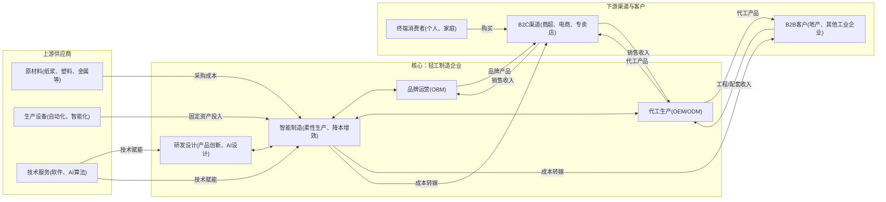
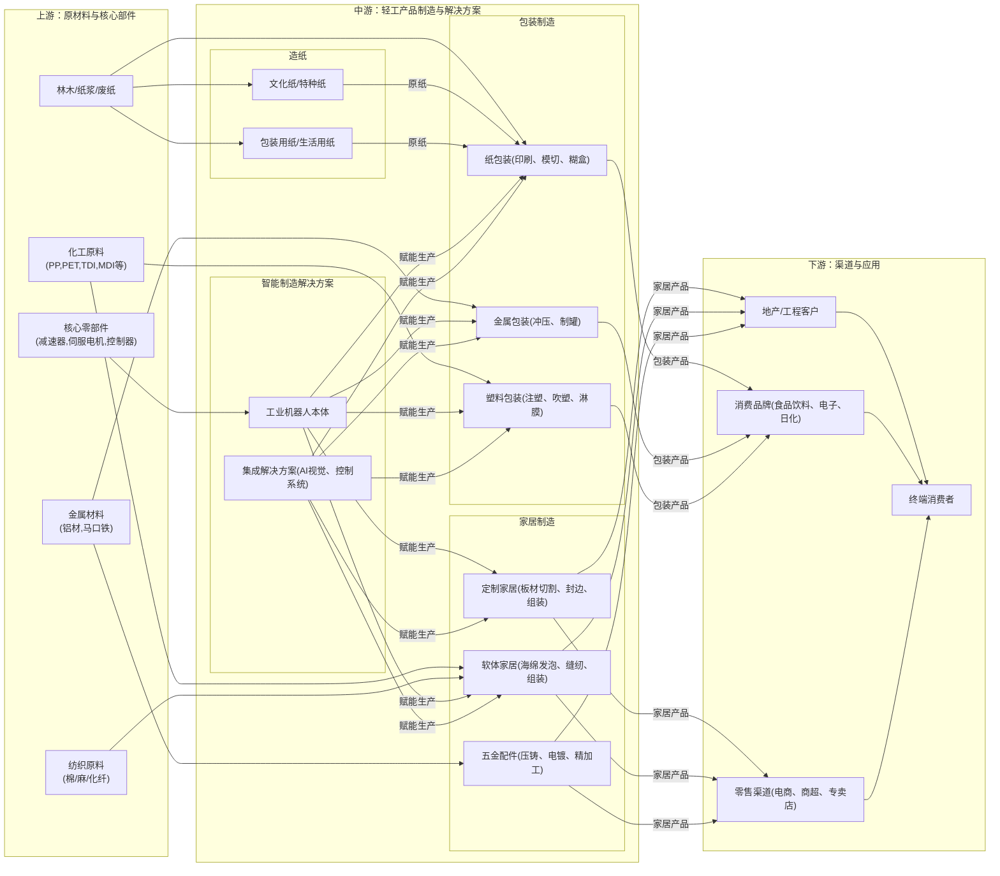

# 轻工制造行业一页纸

> 生成时间: 2026-05-27 18:13
> 数据来源: Alpha派 Agent Mode 11（行业一页纸）
> 覆盖期货品种: SP

---

[Agent 回答]
# 1.核心投资逻辑

轻工制造行业的核心投资逻辑正从传统的规模扩张转向由技术革新、需求升级和全球化布局驱动的价值重估。供需两端的变化共同构筑了行业的增长新范式：

1.  **需求端：结构性升级与全球化拓展创造新增长点。**
    *   **内需消费升级**：国内消费市场呈现分层与升级并行的趋势，消费者对产品的品质、设计、智能化和个性化需求日益增长[cda70d5eef875799e4fa7b061dada2eb_49]。这催生了如智能家居、AI眼镜、高端个护、个性化定制等新兴赛道，为具备创新能力的企业提供了更高的溢价空间[1]。
    *   **出海逻辑深化**：中国企业正从简单的“产品输出”转向“能力输出”，通过在海外建厂、设立研发中心、并购等方式深度融入全球产业链[2]。海外市场，特别是欧美市场，利润率普遍高于国内[3]，而“一带一路”和RCEP等新兴市场则提供了广阔的增量空间[2]。具备全球化运营能力的企业能够有效对冲单一市场风险，享受更广阔市场的成长红利。

2.  **供给端：技术驱动的效率革命与格局优化。**
    *   **数智化转型降本增效**：面对劳动力成本上升和市场竞争加剧，轻工企业正通过深度融合人工智能、工业互联网等技术，向提供“智能工厂解决方案”转型[2]。这不仅解决了劳动力短缺问题，更通过提升生产效率、降低次品率、实现柔性生产，全面重塑了成本结构和竞争优势[4]。
    *   **政策驱动行业出清与升级**：国家“两新”（大规模设备更新和消费品以旧换新）政策为行业带来了存量市场的技改高峰[2]。同时，环保、绿色低碳政策（如“双碳”目标）提高了行业准入门槛，加速淘汰落后产能，使得市场份额向具备技术、资金和绿色资质的头部企业集中[5][6]。

综上，行业的投资逻辑在于，通过**“数智化+绿色化”**的技术升级，叠加**“内需升级+全球出海”**的市场扩张，行业龙头企业能够实现超越行业的“戴维斯双击”：一方面通过降本增效和高附加值产品提升利润率，另一方面通过国内外市场份额的提升实现收入增长。

# 2.行业全景分析
## 2.1 行业定义和存在价值

**轻工制造**是指主要生产消费资料的工业部门，产品直接面向终端消费者，与日常生活息息相关。它属于制造业的重要组成部分，上游承接原材料和能源，下游连接广阔的消费市场。

*   **细分领域**：该行业覆盖范围极广，主要包括**家居用品**（家具、家纺、五金）、**造纸与纸制品**（文化纸、包装纸、生活用纸）、**塑料制品**（包装、日用品）、**文教体育用品**（文具、玩具、体育器材）、**个人护理用品**、**包装印刷**等多个类别。
*   **核心痛点与价值**：轻工制造的核心价值在于满足国民经济和人民生活的基本需求。它通过规模化生产，为社会提供丰富、价廉、质优的消费品，是维持社会正常运转和提升生活品质的基础产业。随着技术进步，行业正从满足“温饱”向满足“品质”、“个性”和“体验”升级，为消费者创造更高的附加值。
*   **重要时间节点**：
    *   **2025年**：国家“两新”政策进入实质性落地阶段，下游食品、包装、造纸等传统产业迎来技改高峰[2]。
    *   **2026-2027年**：预计将是国内造纸行业新增纸产能大幅萎缩的时期，行业重心全面转向上游木浆产业链整合，供需格局有望持续改善[7]。
    *   **2027年**：《以标准提升引领轻工产品品质革命实施方案》目标制修订约200项标准，推动行业品质升级[8]。
    *   **2030年**：基本形成全球领先的轻工业标准体系，全面引领“中国轻工”品牌走向世界[8]。

## 2.2 行业发展历程

1.  **起步与扩张期（20世纪80年代-2000年代初）**：改革开放后，凭借劳动力成本优势，轻工制造成为“中国制造”的典型代表，以OEM/ODM模式融入全球供应链，实现了规模的快速扩张。
2.  **转型升级期（2000年代中-2018年）**：随着国内市场崛起和劳动力、环保成本上升，行业开始从“要素驱动”向“效率驱动”转型。品牌意识觉醒，部分企业开始发展自主品牌（OBM）。同时，自动化改造开始普及。
3.  **全球化与数智化深水区（2018年至今）**：中美贸易摩擦加速了中国企业全球化布局的进程，从产品出海到产能出海、品牌出海[9]。同时，以“新质生产力”为导向，行业全面进入数智化转型深水区，AI、工业互联网等技术开始深度赋能研发、生产、营销全链条，行业竞争从“价格战”转向“价值战”和“生态战”[10]。

## 2.3 商业模式解析

轻工制造行业的利润核心驱动因素正从单一的规模效应和成本控制，转向技术领先、品牌溢价和全球化运营的复合驱动模式。

*   **成本结构**：原材料成本是主要的可变成本，在金属包装、造纸、塑料制品等行业中占比极高（如金属包装原料成本占比超80%[11]），其价格波动直接影响企业盈利。此外，人工、能源、折旧等也是重要成本构成。
*   **利润驱动因素**：
    1.  **技术与效率**：通过智能化改造和精益管理，实现降本增效是核心。例如，翼菲智能通过机器人解决方案帮助下游企业提升效率[4]；众鑫股份凭借自研设备构建了显著高于同行的毛利率[12]。
    2.  **品牌与产品力**：通过研发创新和品牌建设，推出高附加值产品，获取品牌溢价。例如，软体家居企业通过推出AI智能床垫等产品，带动销额提升[13]。
    3.  **全球化布局**：海外市场，尤其是欧美市场，通常具备更高的利润空间[3]。在海外设厂不仅能规避贸易壁垒，还能享受当地较低的竞争强度，赚取“供给不卷”的钱[3]。
    4.  **产业链整合**：向上游原材料延伸（如浆纸一体化）可以锁定成本优势，向下游服务延伸（如提供整体解决方案）可以提升客户粘性和价值。

## 2.4 政策环境分析

近年来，国家层面出台一系列政策，旨在引导轻工制造行业向高质量、绿色化、智能化方向发展，为行业转型升级提供了明确指引和有力支持。

 
| 政策名称/方向              | 发布机构/时间           | 核心内容                                                 | 影响范围与分析                                                                                                                                                  |
| :------------------- | :---------------- | :--------------------------------------------------- | :------------------------------------------------------------------------------------------------------------------------------------------------------- |
| **《推动工业领域设备更新实施方案》** | 国务院 (2024年)       | 推动工业领域设备更新和技术改造，促进设备向高端、智能、绿色、安全方向升级。                | 直接利好轻工机械和智能制造解决方案供应商。下游食品、包装、造纸、家居等行业将迎来技改高峰，具备整线集成和节能降耗优势的头部企业将获得更多订单[2]。                                              |
| **培育和发展“新质生产力”**     | 中央经济工作会议 (2023年)  | 强调以科技创新推动产业创新，特别是以颠覆性技术和前沿技术催生新产业、新模式、新动能。           | 引导轻工行业摒弃规模扩张的旧路径，聚焦于融合AI、工业互联网等技术，向提供“智能工厂解决方案”转型，提升全要素生产率[2]。                                                          |
| **绿色低碳发展系列政策**       | 多部委               | 包括《绿色工厂评价通则》、碳足迹核算、推广绿色包装、淘汰落后产能等，旨在构建绿色低碳循环发展的经济体系。 | 推动行业向环保化、规范化发展。一方面，提升了环保准入门槛，加速了中小落后产能的出清[6]；另一方面，为掌握绿色材料（如生物基材料、再生塑料）和清洁生产技术的企业创造了竞争优势[14]。 |
| **《轻工产品数字护照技术要求》**   | 中国轻工业信息中心 (2025年) | 旨在为轻工产品赋予“数字身份证”，实现全生命周期数据贯通，以应对全球贸易规则变革。            | 提升产品追溯能力和国际竞争力，特别是在应对欧盟等市场的环保法规时，具备“数字护照”能力的企业将占据先机[15][16]。                                |

# 3.产业链深度解析
## 3.1 产业链图谱

## 3.2 上游：原材料与设备分析

上游环节是轻工制造的成本和技术基础，其价格波动和技术进步直接影响中游企业的盈利能力和竞争力。

*   **竞争格局与趋势**：
    *   **原材料**：大宗原材料如纸浆、化工原料、金属等，呈现高度全球化和周期性特征。木浆产能集中度高，CR10约50%[17]，价格坚挺。中游企业通过**向上游一体化**（如太阳纸业、玖龙纸业布局林浆纸一体化[7]）和**全球化采购**来对冲成本风险。绿色环保材料（如PLA、PHA、再生塑料）是重要发展方向，掌握相关改性技术的企业（如恒鑫生活[18]、英科再生[14]）具备先发优势。
    *   **核心设备**：高端制造装备曾由国外品牌主导，但国内供应商在精密减速器、伺服电机、控制器等核心组件上不断取得突破[4]，推动了工业机器人等智能装备的国产替代和成本下降。

*   **核心结论**：对于中游制造企业而言，**供应链管理能力**是核心竞争力之一。能够通过垂直整合、长期协议、技术合作等方式锁定上游资源和成本的企业，将在竞争中占据有利地位。未来，具备**绿色环保材料研发和应用能力**的企业将获得政策和市场的双重红利。

## 3.3 中游：制造与整合分析

中游制造是轻工产业链的核心，正经历从“制造”向“智造”的深刻变革，行业分化加剧，“强者恒强”的马太效应日益凸显。

*   **竞争格局与趋势**：
    *   **行业集中度提升**：多数细分行业呈现“大行业、小企业”的格局，但技术升级、环保压力和下游需求变化正加速行业洗牌。例如，定制家居行业，具备全链路数字化能力的企业正在挤压中小企业份额[19]；金属包装行业，奥瑞金收购中粮包装后，CR3超过70%，行业格局显著优化[20]。
    *   **从“价格战”到“价值战”**：单纯的低价竞争难以为继，企业转向通过技术创新、品牌建设和服务升级来构建差异化优势[10]。例如，软体家居头部企业通过智能化和质价比重塑行业格局，将高端功能下放至亲民价格带，挤压中小品牌生存空间[21]。
    *   **商业模式延伸**：企业不再局限于单一制造环节，而是向“制造+服务”转型。例如，轻工机械企业从“卖设备”转向“卖方案、卖服务”[2]；家居企业从卖单品转向提供“全屋定制”、“整家一体化”解决方案[22]。

*   **核心结论**：未来，**具备全链路数智化能力、强大品牌和渠道、以及全球化运营能力**的平台型龙头企业将持续胜出。这些企业能够整合产业链资源，快速响应市场需求，实现规模与效率的统一，其护城河将越来越宽。

## 3.4 下游：应用与渠道分析

下游需求是拉动轻工制造行业增长的最终引擎，其结构性变化正深刻重塑中游的生产和商业模式。

*   **需求结构变化**：
    *   **房地产周期影响**：房地产市场从“增量”转向“存量”时代，新房装修需求承压，但存量房翻新、旧房改造需求成为新的增长点[23][24]。这对家居企业的渠道布局和服务能力提出了新要求。
    *   **消费场景多元化**：新式茶饮、连锁咖啡、预制菜、电商快递等新兴消费场景的爆发，为包装、餐饮具等行业带来了巨大的增量需求[25][26]。
    *   **消费群体变迁**：“悦己消费”、“情绪消费”等新消费理念兴起，驱动了潮玩、香氛、智能小家电等品类的快速增长[1]。

*   **渠道变革**：
    *   线上渠道持续渗透，抖音等兴趣电商、即时零售等新模式崛起，改变了品牌的触达和销售方式[97a771c783d4e885102b46e6744600a0_6][27]。
    *   线下渠道向小型化、社区化、体验化转型，如家居行业的社区店、整装大店等[13]。

*   **核心结论**：下游需求的高度分化和渠道的碎片化，要求中游制造企业必须具备**敏锐的市场洞察力和柔性的生产能力**。能够快速捕捉新兴需求、并高效触达消费者的企业，才能在存量博弈中找到增量。

## 3.5 核心技术路线、演进趋势

轻工制造行业的技术演进正从单一工序的自动化，迈向全流程、全链条的智能化和数据化，AI技术成为核心引擎。

*   **核心技术**：
    *   **智能制造技术**：包括工业机器人、高精度数控系统、机器视觉、AGV/AMR智能物流等。这些技术是实现自动化、柔性化生产的基础。
    *   **数字化与软件技术**：包括CAD/CAM、MES（制造执行系统）、ERP、PLM（产品生命周期管理）等工业软件，以及近年来兴起的云设计、数字孪生、工业互联网平台。
    *   **人工智能（AI）技术**：AI正渗透到设计、生产、质检等全环节。例如，AI设计（酷家乐的“所见即所得”[28]）、AI质检（机器视觉识别瑕疵）、AI驱动的智能排产等。
    *   **新材料技术**：包括生物基可降解材料（PLA、PHA）、高性能改性塑料、环保涂料、功能性纺织材料等，是实现产品绿色化和差异化的关键。

*   **技术演进趋势**：
    *   **从自动化到智能化**：技术重心从“机器换人”的自动化阶段，演进到利用AI和大数据进行自主决策和优化的智能化阶段。下一代机器人将利用嵌入式AI实现情境化决策和预测性维护[4]。
    *   **从单点应用到全链集成**：技术应用从单个工序的改造，扩展到覆盖“设计-生产-物流-销售-服务”的全价值链数字化打通，形成数据驱动的闭环。
    *   **从标准化到个性化**：柔性制造、3D打印等技术的发展，使得大规模个性化定制（C2M）成为可能，满足消费者日益增长的个性化需求[4]。

当前，行业大部分企业处于自动化向智能化过渡的**成长期**，头部企业已开始探索AI深度融合的应用。未来的颠覆性技术可能包括基于AI大模型的生成式设计、完全自主的“黑灯工厂”以及新材料的突破性应用。

## 3.5 行业护城河分析

随着行业竞争加剧和技术门槛提升，轻工制造行业的护城河正在被重新定义，综合性壁垒日益重要。

 
| 壁垒类型        | 具体表现与分析                                                                                                                                                                                                    |
| :---------- | :--------------------------------------------------------------------------------------------------------------------------------------------------------------------------------------------------------- |
| **技术壁垒**    | **从工艺到生态的转变**：早期壁垒体现在专有生产工艺（如玉马科技的多层调光面料织造技术[29]）。当前壁垒正转向**“数据+算法”驱动的智能生态**。具备全链路数字化能力、自研核心软件和算法的企业（如尚品宅配的AI设计工厂[28]），能形成设计、生产、服务的闭环，构建难以复制的竞争优势。 |
| **资本壁垒**    | **投入持续加大**：建设一条现代化的智能生产线需要巨大的初期投资。同时，持续的研发投入（如英科再生研发费用连续三年增长[14]）和全球化产能布局，对企业的资本实力提出了极高要求。                                                                                   |
| **市场/渠道壁垒** | **客户认证与品牌粘性**：进入大型跨国公司（如消费电子、快消品巨头）的供应链需要漫长的认证周期，一旦进入则合作关系稳固，形成强大壁垒（如中荣股份深度绑定头部品牌客户[5]）。在C端，品牌认知度和消费者信任是核心护城河，尤其是在竞争激烈的个护、家居等领域。                                            |
| **规模壁垒**    | **成本优势与供应链议价权**：规模化生产能摊薄固定成本，并在原材料采购中获得更强的议价能力。头部企业凭借规模优势，能以更低成本提供更高配置的产品，发动“价值战”挤压对手[21]。                                                                                   |
| **政策/资质壁垒** | **绿色与合规门槛**：日益严格的环保法规、安全标准和国际贸易规则（如碳足迹、数字护照）成为新的准入门槛。获得“绿色工厂”认证、符合国际环保标准的企业将在国内外市场中获得通行证，而落后产能则面临淘汰。                                                                     |
| **替代路径**    | 潜在的替代路径主要来自**商业模式创新**和**颠覆性技术**。例如，C2M模式对传统零售模式的颠覆；3D打印对部分传统制造工艺的替代；新材料的出现可能完全改变某些产品的成本结构和性能。                                                                                                              |

# 4.市场空间测算
## 4.1 供需现状、核心假设

**供给端现状**：
*   行业正处于结构性优化的关键时期，整体呈现“有保有压”的态势。
*   **压**：传统、低效、高污染的产能正在加速出清。尤其在造纸、家居等领域，受环保政策和市场需求疲软影响，中小企业退出明显[30]。造纸行业新增产能扩张周期已近尾声，2026-2027年新增纸产能将大幅萎缩[7]。
*   **保**：新增投资和产能主要集中在高端化、智能化、绿色化领域。例如，造纸龙头企业资本开支全面向上游木浆倾斜，构建一体化成本优势[7]；家居企业积极布局智能制造和全屋解决方案。

**需求端现状**：
*   **内需**：呈现结构性分化。与地产关联度高的传统家居需求承压[31]，但存量房改造、智能化升级（如智能床垫[11]）、悦己消费（如潮玩）等细分领域需求旺盛。
*   **外需**：出海成为重要增长引擎。中国企业凭借供应链优势和产品创新，在全球市场持续扩大份额[cda70d5eef875799e4fa7b061dada2eb_49]。新兴市场（非洲、东南亚）渗透率提升空间广阔[32]，欧美市场则贡献了较高的利润。
*   **政策驱动需求**：国家“两新”政策将直接拉动一轮设备更新和消费品换购的需求高峰[2]。

**核心假设**：
1.  **设备更新市场**：假设在“两新”政策驱动下，未来5年是轻工行业设备更新的高峰期。
2.  **智能化渗透率**：假设智能化设备/解决方案的渗透率将逐年提升，其单价高于传统设备，带来价值量提升。
3.  **行业规模**：根据国家统计局数据，2025年轻工机械行业规上企业营收同比增长0.41%[2]，家具制造业规上企业营收为6,125.1亿元[31]。我们以2025年整个轻工制造行业（含机械、家具、造纸、包装等）约4万亿元的产值为基数进行估算。
4.  **设备投资占比**：假设固定资产投资中，设备投资占制造业企业总产值的5%-8%。
5.  **智能化溢价**：假设智能化改造的投资额是传统设备更新的1.5倍。

## 4.2 市场规模测算

我们将聚焦于**“设备更新”政策带来的智能化改造市场空间**进行测算。

**测算逻辑**：市场空间 = 轻工行业总产值 × 设备投资占比 × 年均更新率 × 智能化渗透率 × 智能化溢价

 
| 测算项                | 2026年 (E) | 2027年 (E) | 2028年 (E) | 假设与说明                              |
| :----------------- | :-------- | :-------- | :-------- | :--------------------------------- |
| **轻工行业总产值 (万亿元)**  | 4.12      | 4.24      | 4.37      | 假设行业保持3%的年均温和增长。                   |
| **年设备投资总额 (万亿元)**  | 0.25      | 0.25      | 0.26      | 假设设备投资占总产值的6%。                     |
| **年均设备更新率**        | 15%       | 18%       | 20%       | 假设设备平均折旧周期约7年，政策刺激下更新率从15%提升至20%。  |
| **待更新设备市场规模 (亿元)** | 3708      | 4579      | 5244      | 计算公式：年设备投资总额 × 年均设备更新率。            |
| **智能化改造渗透率**       | 30%       | 40%       | 50%       | 假设在政策推动和技术成熟下，智能化改造在更新设备中的渗透率逐年提升。 |
| **智能化改造溢价系数**      | 1.5       | 1.5       | 1.5       | 假设智能化设备及解决方案的投资额是传统设备的1.5倍。        |
| **传统设备更新市场 (亿元)**  | 2596      | 2747      | 2622      | 计算公式：待更新规模 × (1 - 渗透率)。            |
| **智能化改造市场 (亿元)**   | 1669      | 2747      | 3933      | 计算公式：待更新规模 × 渗透率 × 溢价系数。           |
| **设备更新总市场空间 (亿元)** | **4265**  | **5494**  | **6555**  | **传统更新市场 + 智能化改造市场**。              |

**结论**：
基于以上测算，仅由设备更新政策驱动的轻工制造智能化改造市场，未来三年的市场空间有望从约1669亿元增长至近4000亿元，复合增长率超过50%。整个设备更新市场的总规模将从约4265亿元增长至6555亿元。这为上游的智能装备、工业机器人、软件及解决方案提供商带来了巨大的历史性机遇。

# 5.市场竞争格局
## 5.1 核心玩家梯队

轻工制造行业格局呈现“整体分散，细分龙头集中”的特点。随着行业进入高质量发展阶段，市场份额正加速向具备综合竞争优势的头部企业集中，形成明显梯队。

*   **第一梯队：平台型综合龙头**
    *   **特征**：通常是千亿或数百亿营收规模的上市公司，在各自领域具备强大的品牌力、全渠道覆盖、雄厚的资本实力和领先的数智化能力。它们不仅是产品制造商，更是产业链的整合者。
    *   **代表企业**：欧派家居（定制家居）、顾家家居（软体家居）、裕同科技（纸包装）、奥瑞金（金属包装）、太阳纸业（造纸）、思摩尔国际（电子雾化）。

*   **第二梯队：细分领域“隐形冠军”**
    *   **特征**：在某个垂直细分领域做到技术领先和市占率第一，拥有极强的产品力和技术壁垒，客户关系稳固，盈利能力强。
    *   **代表企业**：xTool（消费级激光雕刻机，母公司为图激光）[33]、创想三维（消费级3D打印机）[34]、众鑫股份（纸浆模塑餐饮具）[12]、匠心家居（功能沙发）[9]、康耐特光学（AI眼镜镜片）[13]。

*   **第三梯队：区域性品牌与专业制造商**
    *   **特征**：在特定区域或特定工艺环节具备一定优势，但品牌影响力、技术水平和资本实力有限。面临头部企业的挤压，生存压力较大，是行业整合的主要对象[35]。

**市场集中度趋势**：
行业集中度正在稳步提升。例如：
*   **金属包装（两片罐）**：奥瑞金收购中粮包装后，CR3（前三名市占率）超过70%[20]。
*   **消费级激光雕刻机**：xTool一家独大，2025年前9个月GMV市占率达47%，超过第二到第十名之和[33]。
*   **消费级3D打印机**：拓竹科技（35.5%）和创想三维（11.2%）合计占据近半市场[36]。
*   **纸浆模塑（餐饮类）**：CR5产量占比达50%[12]。
*   **家居行业**：虽然整体集中度仍低（定制家居CR3<10%[37]），但头部企业凭借全案整装、渠道变革和供应链优势，正在持续侵蚀中小企业份额[30]。

## 5.2 核心对比分析

 
| 公司名称     | 所属细分 | 核心优势与能力                                                                                                                                                         | 市场地位与进展                                                                         | 综合评价                                                  |
| :------- | :--- | :-------------------------------------------------------------------------------------------------------------------------------------------------------------- | :------------------------------------------------------------------------------ | :---------------------------------------------------- |
| **欧派家居** | 定制家居 | **品牌与渠道**：行业绝对龙头，品牌认知度高，经销商网络深厚。**一体化能力**：率先推进“整家定制”，整合品类能力强，数智化赋能设计生产。                                                                                         | 2025年面临地产下行压力，但积极推动渠道变革，探索整装、社区店等新模式[19]。         | 行业巨轮，短期承压但长期护城河稳固。通过渠道和品类扩张，有望在存量市场中持续提升份额，强者恒强。      |
| **顾家家居** | 软体家居 | **全球化供应链**：在越南、墨西哥等地建有成熟基地，有效对冲贸易风险，成本优势明显[13]。**产品创新与效率**：发布多款智能沙发、床垫，并实现“7天快发”，供应链效率是核心护城河[38]。 | 2026年发布多款高质价比智能新品，以“价值战”抢占市场份额[21]。               | 全球化布局和高效供应链的典范。在智能化和质价比浪潮中，有望进一步巩固龙头地位，实现国内外双增长。      |
| **裕同科技** | 纸包装  | **大客户绑定与全球化服务**：深度服务消费电子、烟酒等领域全球头部客户，客户结构优质。**技术与设计驱动**：具备从创意设计到智能制造的全案包装解决能力，海外业务毛利率远高于国内[39]。                                  | 海外收入持续高增，积极在越南、印度、印尼等地布局产能，跟随核心客户出海，享受海外市场高盈利红利。                                | 包装行业的“出海”先锋，凭借大客户粘性和全球服务网络，成长确定性高，盈利结构持续优化。           |
| **奥瑞金**  | 金属包装 | **规模与成本优势**：收购中粮包装后成为两片罐行业绝对龙头（市占率约40%[20]），规模效应显著。**行业定价权**：作为龙头，在行业“反内卷”趋势下，对下游议价能力增强，有望主导价格修复。                                 | 2025年为“出海元年”，在泰国、哈萨克斯坦、中东等地加速布局，开拓海外增长极[27]。    | 国内格局改善+海外增量拓展，公司迎来盈利和估值的双重修复拐点。行业龙头地位稳固，业绩弹性可期。       |
| **太阳纸业** | 造纸   | **林浆纸一体化**：在上游木浆环节布局深厚，拥有显著的成本优势，能有效抵御浆价波动风险[40]。**产品结构多元**：产品覆盖文化纸、包装纸、特种纸等，抗风险能力强。                                               | 资本开支重心向上游木浆转移，巩固成本护城河。在行业供给收缩周期中，盈利优势将更加凸显[7]。 | 造纸行业供给侧改革的核心受益者。凭借一体化成本优势，有望在行业景气回升时释放巨大盈利弹性。         |
| **创想三维** | 3D打印 | **全球领先品牌**：全球消费级3D打印机市占率第二，产品远销多国，品牌知名度高[34]。**产品矩阵完善**：覆盖FDM和光固化两大技术路线，满足从个人创客到中小企业的多元需求。                                        | 2024年收入22.88亿元，3D打印耗材和扫描仪业务成为新增长点，增速迅猛[34]。       | 消费级3D打印赛道的领跑者之一。随着行业从极客走向大众，公司凭借品牌和渠道优势，有望充分分享市场扩容红利。 |

# 6.重点投资标的分析
## 6.1 裕同科技(002831.SZ)：全球化布局的包装解决方案龙头

裕同科技是国内领先的纸制品包装企业，为消费电子、烟酒、大健康、化妆品等行业的全球知名品牌提供“设计+制造+服务”一体化的包装解决方案。公司核心竞争力在于深度绑定大客户的能力、领先的设计研发实力以及前瞻性的全球化产能布局。

公司紧随核心客户（如苹果、华为、微软等）的全球化步伐，在越南、印度、印尼、泰国等地建立了生产基地[39]。这一方面能规避贸易摩擦风险，另一方面能享受海外市场更高的盈利水平。数据显示，公司海外业务毛利率显著高于国内（25年上半年海外毛利率28.79%，国内为19.41%[39]），随着海外收入占比持续提升，公司整体盈利能力有望系统性抬升。

## 6.2 顾家家居(603883.SH)：效率驱动的全球化软体家居巨头

顾家家居是国内软体家居行业的龙头企业，产品涵盖沙发、床垫、餐椅等。公司的核心优势在于其卓越的全球化供应链管理能力和以效率为核心的运营体系。

公司在越南、墨西哥等地拥有成熟的生产基地，使其在全球贸易格局变化中具备极强的抗风险能力和成本优势[13]。在国内，公司通过数智化改造和仓配服体系优化，实现了部分产品“7天快发”，极大提升了消费者体验和渠道效率[38]。在产品端，公司紧跟智能化浪潮，推出多款智能沙发、智能床垫，并通过“质价比”策略抢占市场。在行业从增量竞争转向存量博弈的背景下，顾家家居凭借其效率护城河，有望持续提升市场份额。

## 6.3 太阳纸业(002078.SZ)：林浆纸一体化的成本优势王者

太阳纸业是国内造纸行业的龙头企业，实现了从林木种植、制浆到造纸的“林浆纸一体化”全产业链布局。这一模式是其最核心的护城河。

在全球木浆价格高位波动的背景下，高比例的自供浆使其具备了显著的成本优势，盈利能力远超依赖外购浆的同行[40]。当前，国内造纸行业产能扩张周期见顶，中小产能加速出清，行业供需格局持续改善[7]。太阳纸业作为成本领先者，将在行业景气度回升周期中，展现出最强的盈利弹性。公司资本开支已全面向上游木浆和高附加值纸种倾斜，进一步巩固其长期竞争优势。

## 6.4 投资价值综合对比

 
| 公司名称     | 股票代码      | 所在环节         | 稀缺性                     | 行业布局与受益方式                                                                             | 预计受益弹性  |
| :------- | :-------- | :----------- | :---------------------- | :------------------------------------------------------------------------------------ | :------ |
| **太阳纸业** | 002078.SZ | 上游/中游 (造纸)   | **高** (林浆纸一体化龙头)        | 深度布局上游木浆，构建全行业领先的成本护城河。在供给侧改革和浆价高位背景下，其成本优势将转化为超额利润。                                  | **超额**  |
| **英科再生** | 688087.SH | 上游/中游 (新材料)  | **较高** (再生塑料全产业链)       | 掌握从泡沫减容到食品级再生的核心工艺，形成“设备-材料-制品”一体化能力，契合全球绿色环保趋势[14]。    | **超额**  |
| **裕同科技** | 002831.SZ | 中游 (包装)      | **较高** (服务全球顶级客户的包装方案商) | 深度绑定消费电子等领域头部客户，并跟随其进行全球化产能布局。将受益于海外市场的高利润率和客户粘性。                                     | **超额**  |
| **奥瑞金**  | 002701.SZ | 中游 (包装)      | **高** (国内两片罐绝对龙头)       | 国内市场通过并购实现寡头垄断，议价能力提升，盈利有望修复。同时加速海外布局，打开第二增长曲线[27]。   | **超额**  |
| **顾家家居** | 603883.SH | 中游 (家居)      | **中等** (软体家居龙头之一)       | 全球化供应链布局成熟，效率优势突出。通过智能化、质价比产品抢占市场份额，受益于行业集中度提升。                                       | **超额**  |
| **欧派家居** | 603833.SH | 中游 (家居)      | **中等** (定制家居绝对龙头)       | 品牌和渠道优势无人能及，通过“整家”战略整合产业链。在存量房市场中，其一站式服务能力和品牌力将持续吸引客户。                                | **无超额** |
| **创想三维** | (未上市)     | 中游 (智能设备)    | **较高** (消费级3D打印龙头)      | 品牌和渠道优势显著，产品矩阵丰富。将直接受益于3D打印从极客走向大众的渗透率提升过程。                                           | **超额**  |
| **家联科技** | 301193.SZ | 中游 (塑料/降解制品) | **中等** (全品类餐饮具供应商)      | 产品矩阵覆盖传统塑料、生物降解、植物纤维，具备全产业链能力和全球生产基地。受益于下游餐饮、茶饮连锁化和环保趋势[41]。 | **无超额** |

[引用来源 90 条]
  1. [路演纪要] 方正轻工&社服 | 2026年度策略 (2026-01-06)
  2. [social_media] 【装备】2025年全国轻工机械行业经济运行情况 (2026-04-01)
  3. [路演纪要] 浙商轻工 | 行业深度汇报：供应链出海产业趋势开启 (2025-11-30)
  4. [social_media] 【装备】2025年全国轻工机械行业经济运行情况 (2026-04-01)
  5. [social_media] 【华安证券·轻工制造】行业周报：智能化改造升级，推动行业降本增效 (2026-04-28)
  6. [social_media] 【装备】2025年全国轻工机械行业经济运行情况 (2026-04-01)
  7. [内资研报] 轻工制造行业：43W2025轻工制造周报 (2025-12-07)
  8. [内资研报] 轻工制造行业2026年政府工作报告学习解读：关注内需消费的投资机会 (2026-03-06)
  9. [social_media] 【装备】2025年全国轻工机械行业经济运行情况 (2026-04-01)
  10. [social_media] 【华安证券·轻工制造】行业周报：造纸产能扩张周期见顶，重心向上游木浆转移 (2026-05-27)
  11. [social_media] 【华安证券·轻工制造】行业周报：造纸产能扩张周期见顶，重心向上游木浆转移 (2026-05-27)
  12. [social_media] 【华安证券·轻工制造】行业周报：造纸产能扩张周期见顶，重心向上游木浆转移 (2026-05-27)
  13. [路演纪要] 浙商轻工 | 行业深度汇报：供应链出海产业趋势开启 (2025-11-30)
  14. [social_media] 【装备】2025年全国轻工机械行业经济运行情况 (2026-04-01)
  15. [路演纪要] 银河轻工 | 2026年度策略：内外兼修，优选个股α制胜 (2025-12-15)
  16. [social_media] 【华安证券·轻工制造】行业周报：智能化改造升级，推动行业降本增效 (2026-04-28)
  17. [公司公告] 众鑫股份(603091.SH):2025年年度报告 (2026-04-14)
  18. [路演纪要] 浙商轻工 | 行业深度汇报：供应链出海产业趋势开启 (2025-11-30)
  19. [路演纪要] 国联民生轻工&中小盘 | 轻工制造行业2026年度投资策略：出海作矛，内需铸盾 (2026-01-18)
  20. [social_media] 【装备】2025年全国轻工机械行业经济运行情况 (2026-04-01)
  21. [内资研报] 轻工制造行业2026年政府工作报告学习解读：关注内需消费的投资机会 (2026-03-06)
  22. [内资研报] 9W2026轻工制造行业周报 (2026-03-04)
  23. [内资研报] 轻工制造行业：43W2025轻工制造周报 (2025-12-07)
  24. [social_media] 上证早知道｜八部门最新印发，中药产业迎利好；千问30亿元“春节请客计划”，今日上线 (2026-02-06)
  25. [内资研报] 轻工制造行业：2026轻工聚焦品效&纺服关注国内量价 (2026-04-06)
  26. [social_media] 【华安证券·轻工制造】行业周报：造纸产能扩张周期见顶，重心向上游木浆转移 (2026-05-27)
  27. [内资研报] 9W2026轻工制造行业周报 (2026-03-04)
  28. [公司公告] 恒鑫生活(301501.SZ):2025年年度报告 (2026-04-28)
  29. [social_media] 【华安证券·轻工制造】行业周报：智能化改造升级，推动行业降本增效 (2026-04-28)
  30. [social_media] 【装备】2025年全国轻工机械行业经济运行情况 (2026-04-01)
  31. [内资研报] 轻工制造行业：50W2025轻工制造周报 (2025-12-17)
  32. [内资研报] 轻工制造行业年度行业策略报告：挖掘顺周期低估值机会，关注出海、情绪消费及AI眼镜 (2025-12-22)
  33. [机构点评] 【国海轻工】软体家居新品发布会速递：智能化浪潮来袭，质价比重塑行业格局 (2026-03-22)
  34. [social_media] 【装备】2025年全国轻工机械行业经济运行情况 (2026-04-01)
  35. [内资研报] 轻工制造行业2026年年度策略：战略看多出海，内需重在提效 (2025-12-11)
  36. [内资研报] 轻工制造行业新消费2026年度策略报告：星河长明，向阳而生 (2025-12-11)
  37. [公司公告] 森鹰窗业(301227.SZ):2025年年度报告 (2026-04-17)
  38. [公司公告] 富岭股份(001356.SZ):2025年年度报告 (2026-04-18)
  39. [公司公告] 龙利得(300883.SZ):2025年年度报告 (2026-04-13)
  40. [路演纪要] 方正轻工&社服 | 2026年度策略 (2026-01-06)
  41. [路演纪要] 国联民生轻工&中小盘 | 轻工制造行业2026年度投资策略：出海作矛，内需铸盾 (2026-01-18)
  42. [路演纪要] 国联民生轻工&中小盘 | 轻工制造行业2026年度投资策略：出海作矛，内需铸盾 (2026-01-18)
  43. [social_media] 【华安证券·轻工制造】行业周报:AI赋能空间设计，家装行业机遇涌现 (2026-01-20)
  44. [social_media] 【华安证券·轻工制造】行业周报：智能化改造升级，推动行业降本增效 (2026-04-28)
  45. [social_media] 【华安证券·轻工制造】行业周报：智能化改造升级，推动行业降本增效 (2026-04-28)
  46. [内资研报] 轻工制造行业：43W2025轻工制造周报 (2025-12-07)
  47. [内资研报] 9W2026轻工制造行业周报 (2026-03-04)
  48. [机构点评] 【国海轻工】软体家居新品发布会速递：智能化浪潮来袭，质价比重塑行业格局 (2026-03-22)
  49. [social_media] 【华安证券·轻工制造】行业周报:AI赋能空间设计，家装行业机遇涌现 (2026-01-20)
  50. [公司公告] 玉马科技(300993.SZ):2025年年度报告 (2026-04-22)
  51. [路演纪要] 长江轻工 | 与辉同羿第192期 - 家居行业：聚焦当下地产数据回暖，放眼未来庞大存量潜力 (2026-05-05)
  52. [social_media] 【华安证券·轻工制造】行业周报：造纸产能扩张周期见顶，重心向上游木浆转移 (2026-05-27)
  53. [social_media] 【华安证券·轻工制造】行业周报：造纸产能扩张周期见顶，重心向上游木浆转移 (2026-05-27)
  54. [路演纪要] 银河轻工 | 2026年度策略：内外兼修，优选个股α制胜 (2025-12-15)
  55. [公司公告] 顶固集创(300749.SZ):2025年年度报告 (2026-04-27)
  56. [内资研报] 轻工制造行业专题研究：以乐舒适看新兴市场卫品发展机遇 (2026-01-20)
  57. [social_media] 【装备】2025年全国轻工机械行业经济运行情况 (2026-04-01)
  58. [social_media] 【装备】2025年全国轻工机械行业经济运行情况 (2026-04-01)
  59. [公司公告] 顶固集创(300749.SZ):2025年年度报告 (2026-04-27)
  60. [路演纪要] 浙商轻工 | 行业深度汇报：供应链出海产业趋势开启 (2025-11-30)
  61. [公司公告] 众鑫股份(603091.SH):2025年年度报告 (2026-04-14)
  62. [路演纪要] 国联民生轻工&中小盘 | 轻工制造行业2026年度投资策略：出海作矛，内需铸盾 (2026-01-18)
  63. [内资研报] 轻工制造行业周报：xTool招股书梳理，驭光成影，皆为造物 (2026-02-09)
  64. [内资研报] 轻工制造行业专题研究：从极客走向大众，消费级3D打印全民破圈进行时 (2026-02-26)
  65. [内资研报] 轻工制造行业年度行业策略报告：挖掘顺周期低估值机会，关注出海、情绪消费及AI眼镜 (2025-12-22)
  66. [内资研报] 轻工制造行业周报：xTool招股书梳理，驭光成影，皆为造物 (2026-02-09)
  67. [公司公告] 金陵体育(300651.SZ):2025年年度报告 (2026-04-28)
  68. [内资研报] 轻工制造行业25A&26Q1业绩综述：重视供给主导的消费新周期 (2026-05-11)
  69. [公司公告] 众鑫股份(603091.SH):2025年年度报告 (2026-04-14)
  70. [路演纪要] 长江轻工 | 与辉同羿第192期 - 家居行业：聚焦当下地产数据回暖，放眼未来庞大存量潜力 (2026-05-05)
  71. [social_media] 【华安证券·轻工制造】行业周报：从2017到2026，家居行业变迁带来价值重估 (2026-04-20)
  72. [social_media] 【华安证券·轻工制造】行业周报：造纸产能扩张周期见顶，重心向上游木浆转移 (2026-05-27)
  73. [路演纪要] 国联民生轻工&中小盘 | 轻工制造行业2026年度投资策略：出海作矛，内需铸盾 (2026-01-18)
  74. [内资研报] 轻工制造行业：50W2025轻工制造周报 (2025-12-17)
  75. [内资研报] 轻工制造行业年度行业策略报告：挖掘顺周期低估值机会，关注出海、情绪消费及AI眼镜 (2025-12-22)
  76. [机构点评] 【国海轻工】软体家居新品发布会速递：智能化浪潮来袭，质价比重塑行业格局 (2026-03-22)
  77. [路演纪要] 国联民生轻工&中小盘 | 轻工制造行业2026年度投资策略：出海作矛，内需铸盾 (2026-01-18)
  78. [内资研报] 轻工制造行业专题研究：从极客走向大众，消费级3D打印全民破圈进行时 (2026-02-26)
  79. [机构点评] 【国海轻工】软体家居新品发布会速递：智能化浪潮来袭，质价比重塑行业格局 (2026-03-22)
  80. [内资研报] 轻工制造行业新消费2026年度策略报告：星河长明，向阳而生 (2025-12-11)
  81. [内资研报] 造纸轻工行业周报：上游表现强于下游，格局优化进行中 (2026-03-31)
  82. [内资研报] 轻工制造行业新消费2026年度策略报告：星河长明，向阳而生 (2025-12-11)
  83. [内资研报] 轻工制造行业新消费2026年度策略报告：星河长明，向阳而生 (2025-12-11)
  84. [路演纪要] 国联民生轻工&中小盘 | 轻工制造行业2026年度投资策略：出海作矛，内需铸盾 (2026-01-18)
  85. [机构点评] 【国海轻工】软体家居新品发布会速递：智能化浪潮来袭，质价比重塑行业格局 (2026-03-22)
  86. [内资研报] 造纸轻工行业周报：上游表现强于下游，格局优化进行中 (2026-03-31)
  87. [social_media] 【华安证券·轻工制造】行业周报：造纸产能扩张周期见顶，重心向上游木浆转移 (2026-05-27)
  88. [内资研报] 9W2026轻工制造行业周报 (2026-03-04)
  89. [路演纪要] 国联民生轻工&中小盘 | 轻工制造行业2026年度投资策略：出海作矛，内需铸盾 (2026-01-18)
  90. [公司公告] 家联科技(301193.SZ):2025年年度报告 (2026-04-28)
