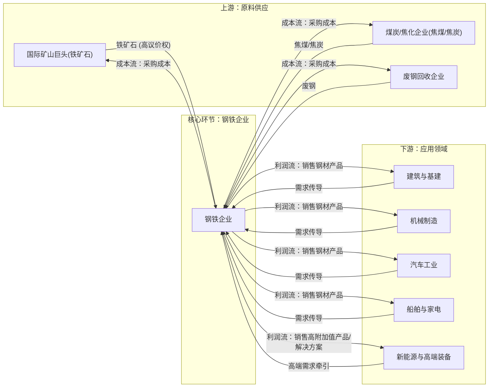
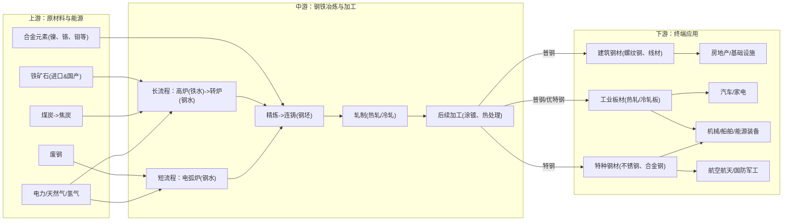

# 钢铁行业一页纸

> 生成时间: 2026-05-27 18:19
> 数据来源: Alpha派 Agent Mode 11（行业一页纸）
> 覆盖期货品种: HC, I, RB, SF, SM

---

[Agent 回答]
# 1. 核心投资逻辑

钢铁行业的核心投资逻辑正在发生深刻转变，从过去依赖规模扩张和周期性波动的“旧范式”，转向由供给侧结构性改革、需求结构升级和技术创新驱动的“新范式”。投资机会的核心在于，行业在“减量”背景下实现“提质”，龙头企业盈利中枢有望系统性上移。

1.  **供给端：政策驱动下的“反内卷”与格局重塑**
    *   **供给收缩预期强化**：以2026年5月新版《钢铁行业产能置换实施办法》为代表的政策，明确将全国置换比例统一提高至不低于1.5:1，并逐步取消跨企业产能置换，这被视为史上最严的产能管控政策[1][2]。这标志着行业供给侧改革进入深水区，旨在从根本上遏制新增产能，加速出清落后产能，破解长期困扰行业的“内卷式”竞争[3][4]。
    *   **行业集中度提升**：政策明确鼓励兼并重组，目标是将行业CR10从2025年的43%左右提升至60%以上[5]。随着“南宝武、北鞍钢”格局的深化，龙头企业通过整合将获得更强的上下游议价能力，改善目前产业链利润被上游（铁矿石）严重挤压的局面[6]。

2.  **需求端：结构性升级创造高附加值市场**
    *   **传统需求触底，新兴需求崛起**：虽然房地产用钢需求持续下行，但其负向拖累效应有望边际减弱[5]。与此同时，由新能源（风电、光伏、新能源汽车）、高端装备制造（航空航天、船舶）、新基建（特高压）等战略性新兴产业驱动的高端钢材需求正快速增长，预计仅新能源产业2026年就将带来超过2000万吨的新增钢铁需求[7]。
    *   **价值链重估**：需求升级推动钢铁企业从“按吨卖钢”的同质化竞争，转向“按价值卖服务、卖解决方案”的高附加值模式[8]。能够满足下游“卡脖子”材料国产化需求的企业，如生产高温合金、高牌号无取向硅钢、抗氢脆管线钢的企业，将享受显著的技术溢价和质量溢价[9]。

3.  **技术与成本：绿色化与智能化驱动新一轮成本优势**
    *   **绿色转型**：随着钢铁行业被纳入全国碳市场，以及欧盟碳边境调节机制（CBAM）的实施，绿色低碳成为企业的“生存门票”[10][11]。率先布局氢冶金、全废钢电炉等低碳技术的企业，不仅能规避未来的碳成本，还能获得“绿钢”溢价，构建新的竞争优势。
    *   **智能制造**：人工智能、数字孪生等技术正从“降本增效”的工具，演变为驱动商业模式创新的核心引擎[8]。通过AI优化生产流程、提升产品质量一致性，企业能够更好地满足高端客户的定制化需求，增强客户黏性。

综上，行业的投资逻辑已从博弈钢价的短期弹性，转向投资具备长期竞争优势的“新质生产力”钢企。这些企业通过技术创新、绿色转型和高端产品布局，将在行业集中度提升和需求结构升级的过程中，实现超越周期的成长和盈利能力的系统性提升。

# 2. 行业全景分析
## 2.1 行业定义和存在价值

**钢铁行业**是以铁、铬、锰等黑色金属矿物采选和冶炼加工为主的工业门类，是国民经济的基础产业，被誉为“工业的粮食”[8]。它位于整个工业体系的上游，为建筑、机械、汽车、能源、家电、船舶、军工等几乎所有下游行业提供不可或缺的基础原材料。

**专业名词解释**：
*   **普钢 (Common Steel)**：指满足一般工程和机械零件需求的普通碳素结构钢、低合金结构钢等，主要用于建筑、普通机械等领域，产量大，同质化程度高。
*   **特钢 (Special Steel)**：指具有特殊性能（如高强度、耐高温、耐腐蚀、高磁导率等）的钢种，通过特殊的成分设计和生产工艺制成，用于航空航天、国防军工、新能源、高端装备等关键领域，技术壁垒和附加值高[12]。
*   **长流程与短流程**：长流程是以铁矿石为主要原料，通过高炉炼铁、转炉炼钢的生产工艺；短流程是以废钢为主要原料，通过电弧炉炼钢的生产工艺，碳排放量仅为长流程的约三分之一[13]。
*   **氢冶金**：使用氢气替代焦炭作为还原剂，将铁矿石还原成铁的炼铁技术。其主要产物是水，能从源头上大幅减少碳排放，是钢铁行业实现碳中和的核心技术路径之一。

**行业重要时间点**：
*   **2025年**：国家“十五五”规划开局之年，钢铁行业高质量发展规划将系统谋划未来五年路径[14]。超低排放改造目标基本完成，为行业绿色发展奠定基础。
*   **2026年**：新版《钢铁行业产能置换实施办法》正式施行，标志着史上最严的产能管控启动[1]。欧盟CBAM机制全面落地，对出口钢材产生实质性碳成本压力[15]。
*   **2029-2030年**：机构预测全球钢铁供需平衡可能由过剩转为短缺[16][17]。同时，中国钢铁行业力争实现二氧化碳排放总量较2020年降低20%的目标[18]。

**核心痛点与价值**：
钢铁行业解决的核心痛点是为现代工业文明提供兼具强度、韧性、可塑性和经济性的结构与功能材料。它为社会创造了不可或缺的价值，是所有重大工程、基础设施、交通工具和国防装备的“钢铁脊梁”[19]。

## 2.2 行业发展历程

中国钢铁行业的发展大致可分为三个阶段：

1.  **规模扩张期（21世纪初 - 2015年）**：在城镇化和工业化浪潮的驱动下，中国钢铁产量迅猛增长，迅速成为全球最大的钢铁生产国。这一阶段的特征是粗放式发展，企业数量众多，同质化竞争激烈，同时也带来了严重的产能过剩和环境问题。

2.  **供给侧改革期（2016年 - 2020年）**：以2016年国务院发布《关于钢铁行业化解过剩产能实现脱困发展的意见》为标志，行业开启了大规模的供给侧结构性改革。通过取缔“地条钢”、实施产能置换等手段，化解了大量过剩产能，行业供需关系显著改善，企业盈利能力大幅修复。

3.  **高质量发展期（2021年至今）**：随着“双碳”目标的提出，行业发展逻辑从“去产量”转向“减碳、提质、增效”。这一阶段的拐点性事件包括：
    *   **产量调控常态化**：自2021年起，粗钢产量压减成为年度常态化政策，引导行业进入减量发展阶段。
    *   **绿色转型加速**：氢冶金等低碳技术从示范走向工业化应用，钢铁行业被纳入全国碳市场，绿色发展成为核心竞争力[20][21]。
    *   **智能化升级**：AI、大数据、工业互联网等数字技术与生产流程深度融合，推动行业向智能制造转型[20]。
    *   **“反内卷”与新一轮整合**：2025年以来，国家层面密集出台政策整治“内卷式”竞争，并通过新版产能置换办法等手段，推动新一轮更高质量的兼并重组[3][1]。

## 2.3 商业模式解析

钢铁行业作为典型的中游制造业，其核心商业模式围绕着“大规模采购-集约化生产-广泛性销售”展开。利润的核心驱动因素正从传统的“规模效应”和“成本控制”向“技术溢价”和“绿色溢价”拓展。

**成本结构与利润驱动**：
*   **成本结构**：原材料成本是钢铁企业最主要的成本构成，占比高达70%-80%。其中，铁矿石成本约占总成本的40%-55%，焦炭和废钢也是重要组成部分[22]。此外，能源成本、人工成本、折旧和环保投入也占有一定比重。
*   **利润驱动**：
    1.  **成本控制**：由于行业处于产业链中游，议价能力较弱，利润空间长期受上下游挤压[23]。因此，通过精细化管理、提升能效、优化采购策略等方式控制成本，是企业盈利的基础。
    2.  **产品结构**：生产高附加值的特钢和高端板材是获取超额利润的关键。这类产品的毛利率可达普通建材的3-5倍[9]。
    3.  **技术领先**：掌握核心冶金工艺、新材料研发能力的企业，能通过“技术溢价”获得定价权和稳定的高端客户。
    4.  **绿色溢价**：随着碳市场的完善和下游客户对供应链碳足迹的要求提高，低碳/零碳钢材产品将享有额外的品牌和价格优势。

**行业利润率水平**：
近年来，受需求疲软和成本高企的双重挤压，钢铁行业整体处于微利甚至亏损边缘，盈利能力分化加剧。2025年以来，随着成本端压力有所缓解和产品结构优化，行业盈利呈现脆弱修复态势[5]。具备成本优势、产品高端化和多元化业务的龙头企业表现出更强的盈利韧性。

**商业模式图**：

## 2.4 行业政策

2025年以来，国家层面密集出台多项政策，旨在引导钢铁行业摆脱“内卷”困境，迈向高质量发展。核心政策围绕“控产能、促整合、推绿色、优结构”展开。

 
| 政策名称/方向                        | 发布时间/窗口   | 核心内容                                                                                                                                                             | 影响分析                                                                        |
| :----------------------------- | :-------- | :--------------------------------------------------------------------------------------------------------------------------------------------------------------- | :-------------------------------------------------------------------------- |
| **《钢铁行业产能置换实施办法》（2026年版）**     | 2026年5月   | 1. 全国炼铁、炼钢产能置换比例统一提高至不低于1.5:1。2. 设置2年过渡期，之后仅允许通过实质性兼并重组实现跨企业产能转移。3. 对氢冶金、电炉钢等低碳工艺给予差异化置换比例支持。[1][2] | **史上最严产能管控**。从源头锁死新增产能，倒逼落后产能退出，将极大加速行业出清和集中度提升。政策向绿色低碳技术倾斜，引导行业技术路径变革。     |
| **钢铁行业纳入全国碳市场**                | 2025年3月启动 | 将钢铁行业正式纳入全国碳排放权交易市场，通过市场化机制对企业的碳排放进行约束和定价。[10]                                                                                          | **碳成本显性化**。高碳排的传统长流程企业将面临额外的碳成本压力，而低碳企业可通过出售富余配额获益，加速行业绿色转型和优胜劣汰。           |
| **《钢铁行业稳增长工作方案（2025—2026 年）》** | 2025年9月   | 提出实施产能产量精准调控，对企业进行分类分级管理，整治“内卷式”竞争，推动行业提质增效。[21][24]                                                            | **“反内卷”纲领性文件**。明确了通过差异化政策（如限产、信贷等）向优势企业倾斜的导向，意味着未来行业资源将加速向技术领先、环保达标的龙头企业集中。 |
| **钢铁产品出口许可证管理**                | 2026年1月   | 对部分钢铁产品实施出口许可证管理，旨在规范出口秩序，打击低价、违规出口行为。[10]                                                                                              | **优化出口结构**。限制低附加值产品出口，有助于缓解国内供给压力，并引导企业转向出口高附加值产品，提升出口整体效益。                 |

# 3. 产业链深度解析
## 3.1 产业链图谱

## 3.2 上游：原材料与能源

上游环节主要包括铁矿石、焦煤焦炭、废钢等原材料的采选和加工，其价格波动直接决定了中游钢企的成本和利润空间。

*   **竞争格局与产业链地位**：上游铁矿石供应高度集中，全球四大矿山（淡水河谷、力拓、必和必拓、FMG）形成垄断格局，而中国铁矿石对外依存度高达76.8%[25]。这导致国内钢企在上游议价能力极弱，产业链利润大部分被海外矿山攫取[6]。焦煤焦炭供应相对分散，但受环保和安全生产政策影响较大。
*   **未来趋势**：
    1.  **资源自主可控**：为摆脱“卡脖子”困境，中国正通过推动人民币计价结算、加大海外权益矿投资（如西芒杜铁矿）等方式，寻求提升铁矿石定价话语权[48a0854f1592a692d7b0095af8bc6d27_26]。
    2.  **原料结构优化**：随着“双碳”战略推进，废钢作为可循环的绿色原料，其战略地位将不断提升，电炉短流程炼钢占比有望逐步提高[26]。
    3.  **能源结构变革**：绿电、氢能等新能源将在钢铁生产中扮演更重要角色，特别是氢冶金技术的发展，将重塑上游能源供应格局。

## 3.3 中游：钢铁冶炼与加工

中游是产业链的核心，负责将原材料转化为各类钢材产品。

*   **竞争格局**：中国钢铁行业呈现“大而不强”的特点，产业集中度偏低（2025年CR10仅为43%），远低于日韩美等发达国家[3]。这导致了严重的同质化和价格战（“内卷”）。未来，在政策强力推动下，行业将加速整合，形成以中国宝武、鞍钢集团等为核心的几大巨头，以及一批“专精特新”的专业化特钢企业[5][12]。
*   **技术升级趋势**：
    1.  **绿色化**：从长流程向短流程、氢基直接还原等低碳工艺转型是必然趋势。
    2.  **智能化**：利用AI、大数据对生产全流程进行智能控制和优化，提升效率、稳定质量、降低成本[27]。
    3.  **高端化**：研发和生产能力将向满足下游新兴产业需求的“卡脖子”高端材料集中，如航空发动机用高温合金、新能源汽车用高牌号电工钢等[9]。

**什么样的公司会越来越强？**
具备**技术研发能力、绿色低碳布局、资本实力和精细化管理能力**的龙头企业会越来越强。
*   **原因**：1）**技术壁垒**：随着下游需求向高端化发展，只有具备强大研发能力的企业才能抓住结构性机遇，享受技术溢价。2）**政策红利**：产能置换、碳排放配额等政策明显向绿色、高效的优势企业倾斜，加速其扩张和对落后产能的替代。3）**规模与协同效应**：在行业整合大潮中，龙头企业通过兼并重组，能实现采购、生产、销售、研发等多方面的协同，进一步降低成本，提升议价能力。

## 3.4 下游：应用与需求

下游应用领域的需求结构变化是驱动整个钢铁行业转型升级的根本动力。

*   **格局与趋势**：
    *   **建筑业**：作为钢材第一大消费领域（占比近半），房地产用钢需求已进入下行通道，但基建投资仍将提供一定支撑[28][29]。需求总量收缩是长期趋势。
    *   **制造业**：正接力成为需求增长的主引擎。特别是汽车（尤其是新能源汽车）、船舶、家电、高端装备等行业，不仅需求量稳中有增，更重要的是对钢材的性能、质量和一致性提出了更高要求[30]。
    *   **新兴领域**：风电、光伏、储能、氢能、低空经济等战略性新兴产业，催生了对高强度、耐腐蚀、耐高/低温等特种钢材的新需求，是未来最具成长性的市场。

## 3.5 核心技术路线、演进趋势

 
| 技术方向     | 核心技术路线                                         | 优缺点                                                                                                                      | 成熟度/阶段                                                | 未来演进趋势                                   |
| :------- | :--------------------------------------------- | :----------------------------------------------------------------------------------------------------------------------- | :---------------------------------------------------- | :--------------------------------------- |
| **低碳冶金** | 1. **氢基直接还原(DRI)+电炉**2. 富氢碳循环高炉3. 全废钢电炉        | **优点**：从源头大幅减碳，工艺清洁。**缺点**：氢气制备和储运成本高，技术仍在完善中。                                         | **成长期**（百万吨级工业示范阶段[20]） | 随着绿氢成本下降和技术成熟，将逐步成为主流路线，实现规模化应用。         |
| **智能制造** | 1. **物理AI与数字孪生**2. 全流程智能管控系统3. 工业智能体(AI Agent) | **优点**：提升生产效率、质量稳定性，降低能耗和成本。**缺点**：前期投入大，需要跨学科复合型人才。[27][31] | **成长期**（头部企业已实现规模化应用）                                 | 从单点应用向全流程、全产业链的协同智能发展，实现从“认知制造”到“预测性制造”。 |
| **高端材料** | 1. 微观组织调控技术2. 洁净钢冶炼技术3. 高精度高效轧制及热处理            | **优点**：产品附加值极高，解决“卡脖子”问题。**缺点**：研发周期长、投入大、风险高。[9][18]    | **成熟期**（部分）**成长期**（尖端材料）                              | 面向航空航天、核电、深海等极限工况，开发性能更优异的新型钢铁材料。        |

## 3.6 行业护城河分析

进入钢铁行业的壁垒极高，且随着行业向高质量发展转型，护城河正变得越来越深。

*   **技术壁垒**：高端特钢的生产涉及复杂的冶金工艺、成分设计和微观组织控制，需要长期的技术积累和大量的研发投入。头部企业通过专利群和专有技术构筑了深厚的技术护城河[32]。
*   **资本壁垒**：钢铁生产是典型的重资产行业，建设一座现代化的钢铁基地需要数百亿甚至上千亿的初期投资。同时，后续的环保改造、技术升级、智能化转型也需要持续的资本开支[23]。
*   **政策/资质壁垒**：国家对钢铁产能实行严格的总量控制和减量置换政策，获取新建产能指标极为困难。同时，环保、能耗等标准日益趋严，不达标的企业将被强制淘汰，构成了事实上的准入和生存壁垒[1]。
*   **规模壁垒**：在普钢领域，规模效应是决定成本竞争力的关键。大型钢企在原材料采购、物流、生产效率等方面具有显著的成本优势。
*   **市场/渠道壁垒**：汽车、航空、核电等高端下游行业对钢材供应商有严格且漫长的认证周期。一旦进入其供应链体系，就能形成稳定的合作关系和客户黏性，新进入者难以撼动[8]。
*   **替代路径**：在大部分结构性应用领域，钢铁因其优异的综合性能和成本优势，短期内难以被大规模替代。在部分领域，铝合金、碳纤维复合材料等存在一定的替代竞争，但主要局限于轻量化要求极高的特定场景（如高端汽车、航空），且成本远高于钢铁。

# 4. 市场空间测算
## 4.1 供需现状、核心假设

**供需现状**：
*   **供给端**：国内粗钢产量在2020年达到10.65亿吨峰值后，进入减量通道，2025年已降至9.61亿吨[33]。在“反内卷”和新版产能置换政策的强力约束下，未来供给总量将继续收缩。
*   **需求端**：总量呈收缩态势，预计2026年钢材消费量约8.4-8.5亿吨[14]。但内部结构分化剧烈：建筑用钢大幅下滑，而制造业用钢（尤其是新能源、高端装备）占比持续提升，已成为核心支撑[29]。
*   **全球格局**：有机构预测，在全球需求温和复苏和供给增长受限的背景下，全球钢铁市场最早可能在2029年由过剩转为短缺，2030年供给缺口或扩大至4740万吨[16][17]。

**核心假设**：
1.  **总量假设**：假设国内粗钢产量在政策引导下，从2025年的9.6亿吨逐步下降至2030年的8.5亿吨[17]。
2.  **结构假设**：假设高端钢材（用于新能源、高端制造等）在总产量中的占比，将从2025年的约15%提升至2030年的30%。
3.  **价格假设**：
    *   普通钢材均价受供需弱平衡影响，保持在3800元/吨的水平波动。
    *   高端钢材由于技术壁垒和需求旺盛，其相对于普通钢材的平均溢价从2025年的50%（均价5700元/吨）提升至2030年的70%（均价6460元/吨）。

## 4.2 市场规模测算

基于以上假设，我们测算中国钢铁行业市场规模的变化趋势。核心逻辑在于，虽然总产量下降，但产品结构的优化和价值提升将对冲甚至超越总量下滑带来的影响，推动市场总规模保持稳定或略有增长。

 
| 项目            | 单位     | 2025年 (E)  | 2030年 (E)  | 2025-2030 CAGR | 测算逻辑/说明                                           |
| :------------ | :----- | :--------- | :--------- | :------------- | :------------------------------------------------ |
| **产量测算**      |        |            |            |                |                                                   |
| 粗钢总产量         | 亿吨     | 9.60       | 8.50       | -2.4%          | 基于政策引导下的减量发展趋势[17]。 |
| 高端钢材占比        | %      | 15%        | 30%        | -              | 需求结构升级驱动产品结构优化。                                   |
| 高端钢材产量        | 亿吨     | 1.44       | 2.55       | 12.1%          | 总产量 * 高端钢材占比。                                     |
| 普通钢材产量        | 亿吨     | 8.16       | 5.95       | -6.1%          | 总产量 - 高端钢材产量。                                     |
| **价格测算**      |        |            |            |                |                                                   |
| 普通钢材均价        | 元/吨    | 3,800      | 3,800      | 0.0%           | 假设在供需弱平衡下价格保持稳定。                                  |
| 高端钢材溢价率       | %      | 50%        | 70%        | -              | 技术壁垒和旺盛需求带来溢价提升。                                  |
| 高端钢材均价        | 元/吨    | 5,700      | 6,460      | 2.5%           | 普通钢材均价 * (1 + 溢价率)。                               |
| **市场规模测算**    |        |            |            |                |                                                   |
| 普通钢材市场规模      | 亿元     | 30,998     | 22,610     | -6.1%          | 普通钢材产量 * 均价。                                      |
| 高端钢材市场规模      | 亿元     | 8,208      | 16,473     | 15.0%          | 高端钢材产量 * 均价。                                      |
| **钢铁行业总市场规模** | **亿元** | **39,206** | **39,083** | **-0.1%**      | **总量虽减，但结构优化使总规模基本稳定。**                           |

**结论**：测算结果显示，尽管未来五年中国粗钢总产量预计下降超过1亿吨，但得益于向高附加值产品的显著结构性转移，行业总销售规模预计将保持基本稳定。行业的增长将不再由“量”驱动，而是完全由“质”和“价”驱动。

# 5. 市场竞争格局
## 5.1 核心玩家梯队

中国钢铁行业的竞争格局正从过去的分散、同质化竞争，向集中化、差异化竞争演变，呈现出清晰的梯队特征。

*   **第一梯队：综合性航母**
    *   **代表企业**：中国宝武集团、鞍钢集团。
    *   **特征**：以“南宝武、北鞍钢”为代表的央企巨头，通过大规模兼并重组，实现了跨区域、全品类的布局[34]。其优势在于规模巨大（宝武粗钢产能已达1.5亿吨，占全国16%[5]），资本实力雄厚，在研发、绿色转型和产业链协同方面引领行业发展。它们是行业整合和稳定市场的主导力量。

*   **第二梯队：特钢领军者**
    *   **代表企业**：中信特钢、抚顺特钢。
    *   **特征**：深耕特殊钢领域，在轴承钢、工模具钢、高温合金等细分市场构筑了极高的技术壁垒和品牌护城河。它们不追求规模，而是通过持续的研发投入和与下游高端制造业的深度绑定，获取远高于行业平均水平的利润率[9]。

*   **第三梯队：区域/品类龙头**
    *   **代表企业**：华菱钢铁、宝钢股份、首钢股份、沙钢集团等。
    *   **特征**：在特定区域市场或特定产品（如汽车板、硅钢、中厚板）上具备领先优势。这些企业通常管理效率高，产品结构优，成本控制能力强，是行业中的中坚力量，也是未来潜在的整合对象或区域整合平台。

*   **第四梯队：众多中小钢企**
    *   **特征**：数量众多，产品以普通建材为主，技术和资金实力较弱。在当前“反内卷”、环保趋严和产能减量的大背景下，这些企业面临巨大的生存压力，是未来被整合或市场出清的主要对象[7]。

**市场集中度**：
中国钢铁行业集中度与发达国家相比仍有较大差距。2025年，中国钢铁行业CR10（前十大企业产量占比）约为43.14%[4]。相比之下，日本CR3高达87%，韩国CR3为93%[3]。政策目标是到2025年CR10达到60%，未来提升空间明确，行业整合将是未来几年的主旋律。

## 5.2 核心对比分析

 
| 对比维度      | 中国宝武集团 (以宝钢股份为代表)                                                         | 鞍钢集团 (以鞍钢股份为代表)                                                | 中信特钢                                                                         | 抚顺特钢                                                                         |
| :-------- | :------------------------------------------------------------------------ | :------------------------------------------------------------- | :--------------------------------------------------------------------------- | :--------------------------------------------------------------------------- |
| **梯队定位**  | 第一梯队 (综合性航母)                                                              | 第一梯队 (综合性航母)                                                   | 第二梯队 (特钢领军者)                                                                 | 第二梯队 (特钢领军者)                                                                 |
| **核心优势**  | 规模全球第一，汽车板、硅钢等高端板材技术领先，引领行业绿色转型（氢冶金）[16]。 | 南北基地协同，技术积淀雄厚，在铁路用钢、造币钢等领域具备核心技术[32]。 | 中国特钢绝对龙头，产品线齐全，在汽车、工程机械、能源等领域市占率高，研发能力强[16]。 | 军工特钢核心供应商，在航空航天、高端装备用高温合金、超高强度钢领域地位不可替代[16]。 |
| **技术异同**  | 侧重于高端碳钢板材的研发与制造，以及前沿的低碳冶金技术探索。                                            | 拥有全面的钢铁产品研发体系，在多个细分领域技术积淀深厚。                                   | 专注于各类高品质特殊钢的工艺技术和应用开发，技术应用范围广。                                               | 专注于真空冶炼、电渣重熔等特种冶炼技术，产品面向极限工况，技术壁垒最高。                                         |
| **客户与市场** | 主要面向汽车、家电、电力等高端制造业客户，市场覆盖全国及全球。                                           | 客户遍布铁路、基建、制造业等多个领域，在东北地区具备绝对区域优势。                              | 深度绑定国内外高端装备制造龙头企业，客户结构优质稳定。                                                  | 核心客户为国内各大军工集团和航空航天单位，市场具有高度的专属性和保密性。                                         |
| **综合评价**  | **行业整合者与引领者**。凭借规模、技术和资本优势，将持续主导行业格局重塑，并最大程度受益于行业集中度提升和绿色转型。              | **区域整合核心与技术追赶者**。重组本钢后区域协同效应显现，未来看点在于内部整合效率的提升和技术优势的持续转化。      | **高端制造的“材料基石”**。受益于中国制造业升级的长期趋势，盈利能力稳定，成长确定性强。                               | **“皇冠上的明珠”**。具备极高的稀缺性和战略价值，是国防军工产业链自主可控的关键环节，成长空间与国家战略紧密相连。                  |

# 6. 重点投资标的分析

## 6.1 宝钢股份 (600019.SH)：高端板材龙头与绿色转型先锋

宝钢股份是中国宝武集团的核心上市平台，是中国最大、最现代化的钢铁联合企业。公司业务聚焦于高技术含量、高附加值的碳钢板材，产品广泛应用于汽车、家电、石油、造船、航天、核电等领域。在行业布局上，宝钢股份是高端化的绝对引领者，其汽车板国内市场份额超过50%，硅钢（特别是新能源汽车驱动电机用的高牌号无取向硅钢）在全球市场也占据领先地位。公司正积极推进湛江钢铁氢基竖炉项目，是行业绿色低碳转型的先行者[16]。

## 6.2 中信特钢 (000708.SZ)：不可或缺的特钢巨擘

中信特钢是全球领先的专业化特殊钢材料制造企业，产品覆盖轴承钢、齿轮钢、弹簧钢、工模具钢、合金管坯钢等十大类，广泛应用于汽车、工程机械、能源、航空航天等高端制造领域。公司通过持续的高研发投入，在多个高端特钢细分市场占据国内乃至全球第一的份额[16]。其在产业链中的卡位极其重要，是下游高端装备制造业实现性能提升和国产替代的“材料基石”。

## 6.3 抚顺特钢 (600399.SH)：国防军工的“特钢心脏”

抚顺特钢在中国特殊钢行业中地位独特，被誉为“中国特殊钢的摇篮”。公司核心产品为高温合金、超高强度钢、特种不锈钢等，主要应用于航空、航天、兵器、核电等国防军工和尖端科技领域[16]。其产品是制造飞机发动机、燃气轮机、航天器等核心部件的关键材料，具有极高的技术壁垒和战略稀缺性，在产业链中几乎不存在可替代者。

## 6.4 华菱钢铁 (000932.SZ)：产品结构优化的区域强者

华菱钢铁是湖南省最大的钢铁企业，通过持续的产品结构调整，已形成宽厚板、无缝钢管、线棒材等多元化产品格局。公司在造船、海工、桥梁等领域用中厚板以及能源开采用无缝钢管方面具备强大的市场竞争力。公司通过EVI（供应商早期介入）模式深度服务客户，客户黏性强[8]。其优势在于高效的运营管理和精准的产品定位，使其在行业下行周期中仍能保持较好的盈利能力。

## 6.5 投资价值综合对比

 
| 所在环节          | 公司名称 | 股票代码      | 是否具备稀缺性        | 行业布局深度与收益弹性                                                                                     | 预计受益弹性      |
| :------------ | :--- | :-------- | :------------- | :---------------------------------------------------------------------------------------------- | :---------- |
| **中游：普钢/优特钢** | 宝钢股份 | 600019.SH | **是**（高端板材）    | **深度布局**。作为行业龙头，深度参与并引领高端化和绿色化转型。将全面分享行业集中度提升、高端产品需求增长和绿色溢价三重红利。                                | **超额收益**    |
| **中游：普钢/优特钢** | 华菱钢铁 | 000932.SZ | **否**（但产品结构优）  | **较深布局**。在细分领域（如宽厚板、钢管）卡位优势明显，管理效率高。能分享行业整体盈利修复的收益，并通过产品结构优势获得一定超额利润。                           | **略超行业平均**  |
| **中游：普钢/优特钢** | 山东钢铁 | 600022.SH | **是**（AI+钢铁模式） | **布局差异化**。通过子公司山信软件探索“AI+钢铁”新模式，若能成功向外输出，有望打开第二增长曲线，分享数字化转型红利[31]。 | **潜在超额收益**  |
| **中游：特钢**     | 中信特钢 | 000708.SZ | **是**（特钢龙头）    | **极深布局**。作为特钢平台型公司，全面覆盖高端制造各领域。将直接且持续受益于中国制造业升级和进口替代的长期趋势，盈利稳定性和成长性突出。                          | **显著超额收益**  |
| **中游：特钢**     | 抚顺特钢 | 600399.SH | **极高**（军工核心）   | **极深布局**（特定领域）。深度绑定国防军工产业链，需求与行业周期关联度较低，成长由国家战略驱动。是产业链中议价能力最强的环节之一。                             | **极显著超额收益** |

[引用来源 77 条]
  1. [内资研报] 宝城期货｜钢材专题报告：新版《钢铁行业产能置换实施办法》解读 (2026-05-20)
  2. [内资研报] 钢铁行业周报：矿产资源新规发布，加码行业规范调控 (2026-05-25)
  3. [内资研报] 钢铁行业2026年度策略报告：政策催化可期，业绩改善共振 (2025-11-22)
  4. [social_media] 反内卷系列｜钢铁行业供需矛盾复盘与破局 (2026-04-10)
  5. [social_media] 【中诚信国际行业展望】中国钢铁行业（2026年2月） (2026-02-12)
  6. [路演纪要] 长江金属 | 如何展望节后的钢铁行情？ (2026-02-25)
  7. [social_media] 【中诚信国际行业展望】中国钢铁行业（2026年2月） (2026-02-12)
  8. [social_media] 2026年中国钢铁业在减量中重塑竞争格局 (2026-02-24)
  9. [social_media] 专访全国人大代表、山东钢铁集团胡淑娥：钢铁行业的核心增长点在哪里？ (2026-03-04)
  10. [内资研报] 钢铁行业报告：新质生产力驱动下的钢铁行业变革 (2026-02-27)
  11. [公司公告] 鞍钢股份(000898.SZ):2025年年度报告 (2026-03-31)
  12. [social_media] 中东战火推高矿价运价，钢材出口面临的挑战不止于此 (2026-04-18)
  13. [social_media] 专访全国人大代表、山东钢铁集团胡淑娥：钢铁行业的核心增长点在哪里？ (2026-03-04)
  14. [social_media] 专访全国人大代表、山东钢铁集团胡淑娥：钢铁行业的核心增长点在哪里？ (2026-03-04)
  15. [公司公告] 抚顺特钢(600399.SH):2025年年度报告 (2026-03-31)
  16. [内资研报] 有色金属行业2026年年度策略：供需重塑与资源再定价 (2025-12-31)
  17. [公司公告] 山东钢铁(600022.SH):山东钢铁股份有限公司2025年年度报告 (2026-04-23)
  18. [内资研报] 宝城期货｜钢材专题报告：新版《钢铁行业产能置换实施办法》解读 (2026-05-20)
  19. [内资研报] 中金2026年展望 | 钢铁：新变革，新驱动，新均衡 (2026-01-15)
  20. [social_media] 有望困境反转，钢铁行业4个核心方向（附列表） (2026-03-13)
  21. [内资研报] 钢铁行业：“地缘+双碳”助景气重塑 (2026-03-10)
  22. [social_media] 推动行业前沿技术、先进理念与操作实践深度融合——第五届钢铁行业“新知识、新技术、新理念”交流大会在湘成功举办 (2026-05-21)
  23. [social_media] 两会之声丨李刚代表：一定要将核心技术牢牢掌握在自己手中 (2026-03-16)
  24. [内资研报] 钢铁行业行业动态报告：AI数据集催化，钢铁数智化转型可期 (2026-04-13)
  25. [公司公告] 宝钢股份(600019.SH):宝钢股份2025年年度报告全文 (2026-04-30)
  26. [内资研报] 钢铁行业行业动态报告：AI数据集催化，钢铁数智化转型可期 (2026-04-13)
  27. [内资研报] 宝城期货｜钢材专题报告：新版《钢铁行业产能置换实施办法》解读 (2026-05-20)
  28. [内资研报] 钢铁行业2026年度策略报告：政策催化可期，业绩改善共振 (2025-11-22)
  29. [内资研报] 格林大华期货｜2026年钢矿期货期权白皮书：钢矿：沉舟侧畔千帆过，病树前头万木春 (2026-03-06)
  30. [social_media] 【行业研究】钢铁行业信用分析报告 (2026-05-09)
  31. [内资研报] 钢铁行业报告：新质生产力驱动下的钢铁行业变革 (2026-02-27)
  32. [social_media] 【中诚信国际行业展望】中国钢铁行业（2026年2月） (2026-02-12)
  33. [内资研报] 宝城期货｜钢材专题报告：新版《钢铁行业产能置换实施办法》解读 (2026-05-20)
  34. [内资研报] 钢铁行业周报：矿产资源新规发布，加码行业规范调控 (2026-05-25)
  35. [公司公告] 鞍钢股份(000898.SZ):2025年年度报告 (2026-03-31)
  36. [公司公告] 宝钢股份(600019.SH):宝钢股份2025年年度报告全文 (2026-04-30)
  37. [公司公告] 本钢板材(000761.SZ):2025年年度报告 (2026-04-04)
  38. [social_media] 从钢厂到全球：中国钢铁业开始重构全球钢铁产业链 (2026-05-24)
  39. [路演纪要] 长江金属 | 如何展望节后的钢铁行情？ (2026-02-25)
  40. [路演纪要] 中信建投 | 周期团队联合展望 - 2026年度策略报告汇报会议之八 (2025-12-02)
  41. [内资研报] 钢铁行业2026年度策略报告：政策催化可期，业绩改善共振 (2025-11-22)
  42. [social_media] 【中诚信国际行业展望】中国钢铁行业（2026年2月） (2026-02-12)
  43. [公司公告] 抚顺特钢(600399.SH):2025年年度报告 (2026-03-31)
  44. [social_media] 从黑箱到认知：钢铁工业“物理AI”应用实践 (2026-03-13)
  45. [内资研报] 钢铁行业报告：新质生产力驱动下的钢铁行业变革 (2026-02-27)
  46. [内资研报] 格林大华期货｜2026年钢矿期货期权白皮书：钢矿：沉舟侧畔千帆过，病树前头万木春 (2026-03-06)
  47. [公司公告] 广东明珠(600382.SH):广东明珠集团股份有限公司2025年年度报告 (2026-04-22)
  48. [路演纪要] 长江金属&煤炭｜煤炭对话产业链之2026旺季开工洞察系列第5期：对话钢铁：开工旺季钢铁用煤需求展望 (2026-04-08)
  49. [内资研报] 钢铁行业报告：新质生产力驱动下的钢铁行业变革 (2026-02-27)
  50. [social_media] 推动行业前沿技术、先进理念与操作实践深度融合——第五届钢铁行业“新知识、新技术、新理念”交流大会在湘成功举办 (2026-05-21)
  51. [内资研报] 钢铁行业行业动态报告：AI数据集催化，钢铁数智化转型可期 (2026-04-13)
  52. [social_media] 从黑箱到认知：钢铁工业“物理AI”应用实践 (2026-03-13)
  53. [机构点评] 山东钢铁：AI+钢铁核心标的，业绩大幅改善凸显投资价值 (2026-01-12)
  54. [公司公告] 鞍钢股份(000898.SZ):2025年年度报告 (2026-03-31)
  55. [social_media] 【行业研究】钢铁行业信用分析报告 (2026-05-09)
  56. [内资研报] 宝城期货｜钢材专题报告：新版《钢铁行业产能置换实施办法》解读 (2026-05-20)
  57. [social_media] 专访全国人大代表、山东钢铁集团胡淑娥：钢铁行业的核心增长点在哪里？ (2026-03-04)
  58. [内资研报] 华宝基金｜2026年2季度钢铁产业链分析报告：基本面动能不足，终端需求待验证 (2026-04-02)
  59. [公司公告] 山东钢铁(600022.SH):山东钢铁股份有限公司2025年年度报告 (2026-04-23)
  60. [公司公告] 广东明珠(600382.SH):广东明珠集团股份有限公司2025年年度报告 (2026-04-22)
  61. [social_media] 有望困境反转，钢铁行业4个核心方向（附列表） (2026-03-13)
  62. [内资研报] 钢铁行业：“地缘+双碳”助景气重塑 (2026-03-10)
  63. [内资研报] 钢铁行业：“地缘+双碳”助景气重塑 (2026-03-10)
  64. [内资研报] 钢铁行业：“地缘+双碳”助景气重塑 (2026-03-10)
  65. [内资研报] 中国钢铁行业展望：在压力中寻找新平衡 (2026-02-09)
  66. [social_media] 【中诚信国际行业展望】中国钢铁行业（2026年2月） (2026-02-12)
  67. [内资研报] 钢铁行业报告：新质生产力驱动下的钢铁行业变革 (2026-02-27)
  68. [social_media] 2026年中国钢铁业在减量中重塑竞争格局 (2026-02-24)
  69. [social_media] 反内卷系列｜钢铁行业供需矛盾复盘与破局 (2026-04-10)
  70. [内资研报] 钢铁行业2026年度策略报告：政策催化可期，业绩改善共振 (2025-11-22)
  71. [social_media] 有望困境反转，钢铁行业4个核心方向（附列表） (2026-03-13)
  72. [公司公告] 鞍钢股份(000898.SZ):2025年年度报告 (2026-03-31)
  73. [social_media] 有望困境反转，钢铁行业4个核心方向（附列表） (2026-03-13)
  74. [social_media] 有望困境反转，钢铁行业4个核心方向（附列表） (2026-03-13)
  75. [social_media] 有望困境反转，钢铁行业4个核心方向（附列表） (2026-03-13)
  76. [social_media] 专访全国人大代表、山东钢铁集团胡淑娥：钢铁行业的核心增长点在哪里？ (2026-03-04)
  77. [机构点评] 山东钢铁：AI+钢铁核心标的，业绩大幅改善凸显投资价值 (2026-01-12)
